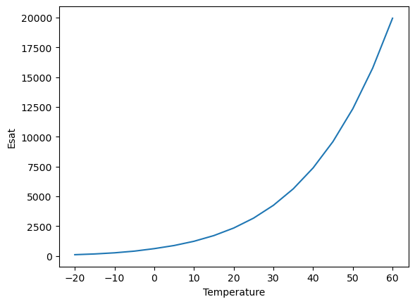
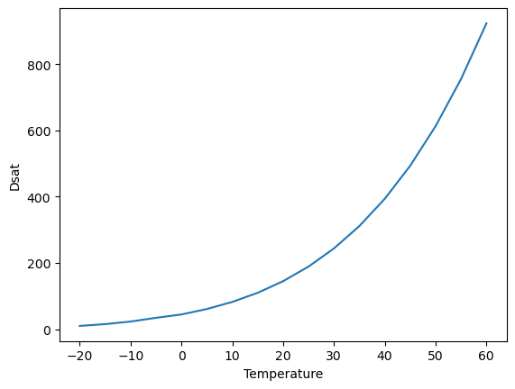
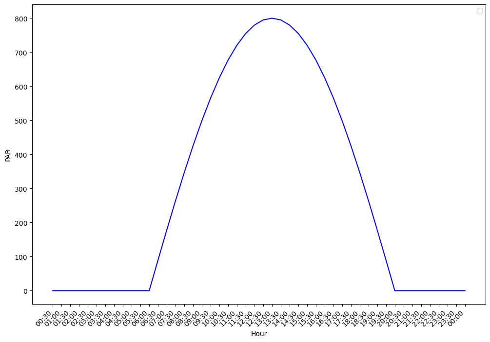
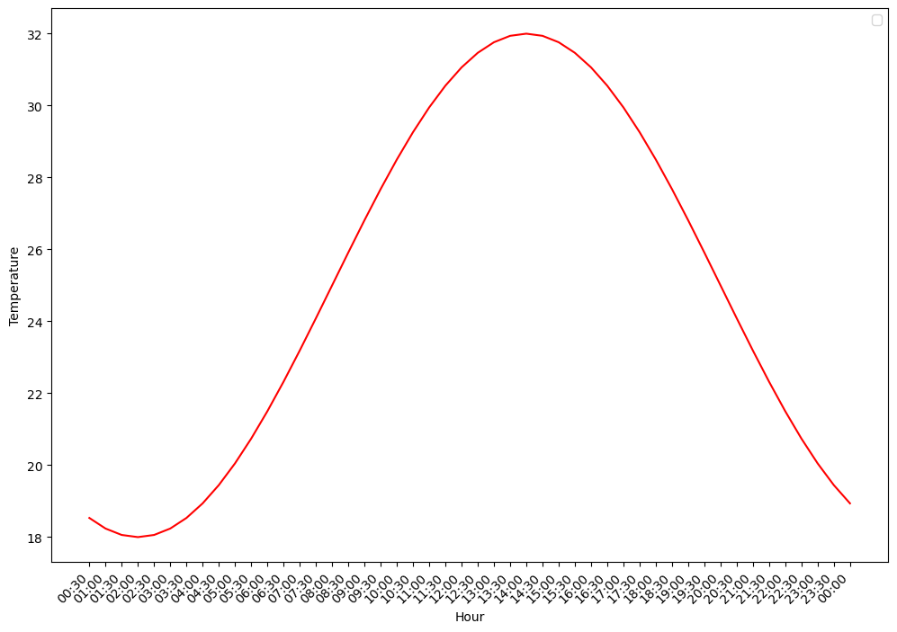
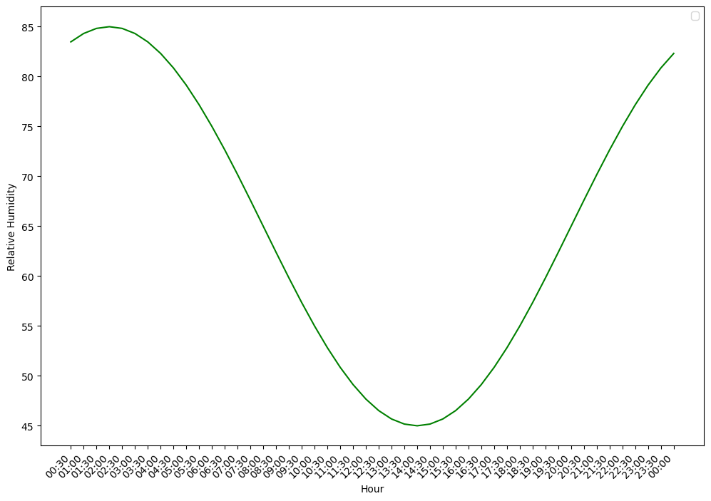

<!-- WARNING: THIS FILE WAS AUTOGENERATED! DO NOT EDIT! -->

---

[source](https://github.com/ecamo19/plant_hydraulics/blob/main/plant_hydraulics/utils.py#L20){target="_blank" style="float:right; font-size:smaller"}

### get_elevation

```python

def get_elevation(
    lat:float, lon:float
)->float:


```

*Query Open-Elevation API for elevation in meters.*
Used in Penman-Montieh ETP_h calculation


---

[source](https://github.com/ecamo19/plant_hydraulics/blob/main/plant_hydraulics/utils.py#L29){target="_blank" style="float:right; font-size:smaller"}

### list_example_data

```python

def list_example_data(
    
):


```

*List all available example data files in the package data folder.*


---

[source](https://github.com/ecamo19/plant_hydraulics/blob/main/plant_hydraulics/utils.py#L42){target="_blank" style="float:right; font-size:smaller"}

### load_example_data

```python

def load_example_data(
    filename, sep:str=','
):


```


---

[source](https://github.com/ecamo19/plant_hydraulics/blob/main/plant_hydraulics/utils.py#L47){target="_blank" style="float:right; font-size:smaller"}

### satvap

```python

def satvap(
    tc:float, # Temperature (degC)
)->tuple: # esat: Saturation vapor pressure (Pa), desat: d(esat)/dT (Pa/K).


```

*Compute saturation vapor pressure (esat) and the rate of change in*
saturation vapor pressure with respect to temperature (dsat = d(esat)/dT).

Polynomial approximations are from: Flatau et al. (1992) Polynomial fits to
saturation vapor pressure.
Journal of Applied Meteorology 31:1507-1513. Input temperature is Celsius.

__Parameters:__

- tc: Temperature (degC).

__Returns:__

- esat: Saturation vapor pressure (Pa)
- desat: d(esat)/dT (Pa/K).


#### Example satvap(): 

::: {#047184af .cell}
``` {.python .cell-code}
import matplotlib.pyplot as plt
```
:::


::: {#b16c7f88 .cell}
``` {.python .cell-code}
saturation_vapor_pressure_esat = []
saturation_vapor_pressure_dsat = []
temperature_range = []


for each_temperature in range(-20, 65, 5):
    temperature_range.append(each_temperature)
    saturation_vapor_pressure_esat.append(satvap(each_temperature)[0])
    saturation_vapor_pressure_dsat.append(satvap(each_temperature)[1])


plt.xlabel("Temperature")
plt.ylabel("Esat")
plt.plot(temperature_range, saturation_vapor_pressure_esat)
plt.show()
```

::: {.cell-output .cell-output-display}
{}
:::
:::


::: {#29e81adf .cell}
``` {.python .cell-code}
plt.xlabel("Temperature")
plt.ylabel("Dsat")
plt.plot(temperature_range, saturation_vapor_pressure_dsat)
plt.show()
```

::: {.cell-output .cell-output-display}
{}
:::
:::


---

[source](https://github.com/ecamo19/plant_hydraulics/blob/main/plant_hydraulics/utils.py#L165){target="_blank" style="float:right; font-size:smaller"}

### latvap

```python

def latvap(
    tc:float, # Temperature (degC).
    mmh2o:float, # Molecular mass of water (kg/mol).
)->float: # Latent heat of vaporization (J/mol).


```

*Latent heat of vaporization (J/mol) at temperature tc (degC).*

__Parameters:__

- tc: Temperature (degC).
- mmh2o: Molecular mass of water (kg/mol).

__Returns:__

- val: Latent heat of vaporization (J/mol).


---

[source](https://github.com/ecamo19/plant_hydraulics/blob/main/plant_hydraulics/utils.py#L196){target="_blank" style="float:right; font-size:smaller"}

### calc_radiative_forcing_qa

```python

def calc_radiative_forcing_qa(
    solar_down, # Total downward solar radiation incident on the leaf (W/m2).
Split equally between visible and near-infrared wavebands.
    leaf, # Leaf object with the following attributes:
- rho : list[float]
    Leaf reflectance for visible and near-infrared wavebands (-).
- tau : list[float]
    Leaf transmittance for visible and near-infrared wavebands (-).
- emiss : float
    Leaf emissivity (-).
    ground_albedo, # Ground surface albedo for visible and near-infrared wavebands (-).
    ground_lw, # Upward longwave radiation emitted by the ground surface (W/m2).
    irsky, # Downward atmospheric longwave radiation (W/m2).
): # Leaf radiative forcing (W/m2 leaf). Sum of absorbed solar radiation
across both wavebands and absorbed longwave radiation from sky and
ground.


```

*Calculate leaf radiative forcing Qa (Equation 10.3).*

Compute the total radiation absorbed by a leaf from solar (visible and
near-infrared wavebands) and longwave (sky and ground) sources. Solar
radiation is split equally between visible and near-infrared wavebands,
and includes both direct and ground-reflected components.

Implements Equation (10.3) from Bonan (2019):

    Qa = Σ_Λ S↓_Λ (1 + ρg_Λ)(1 - ρℓ_Λ - τℓ_Λ) + εℓ (L↓sky + L↑g)

where Λ denotes visible and near-infrared wavebands, ρg is ground
albedo, ρℓ and τℓ are leaf reflectance and transmittance, and εℓ is
leaf emissivity. The factor (1 + ρg) accounts for solar radiation
striking the upper leaf surface directly plus radiation reflected
from the ground striking the lower surface.

__Parameters:__

- solar_down: Total downward solar radiation incident on the leaf (W/m2).
            Split equally between visible and near-infrared wavebands.

- leaf: Leaf object with the following attributes:
    - rho: Leaf reflectance for visible and near-infrared wavebands (-).
    - tau: Leaf transmittance for visible and near-infrared wavebands (-).
    - emiss: Leaf emissivity (-).

- ground_albedo: Ground surface albedo for visible and near-infrared
wavebands (-).

- ground_lw: Upward longwave radiation emitted by the ground surface (W/m2).

- irsky: Downward atmospheric longwave radiation (W/m2).

__Returns:__

- qa: Leaf radiative forcing (W/m2 leaf). Sum of absorbed solar radiation
    across both wavebands and absorbed longwave radiation from sky and
    ground.


---

[source](https://github.com/ecamo19/plant_hydraulics/blob/main/plant_hydraulics/utils.py#L285){target="_blank" style="float:right; font-size:smaller"}

### arrhenius_function

```python

def arrhenius_function(
    tl, # Leaf Temperature (K)
    ha, # Activation Energy (J mol–1)
): # Scaling factor that equals 1.0 at 25°C, greater than 1.0 above 25°C, and less than 1.0 below 25°C.


```

*Temperature response function used in [`leaf_photosynthesis()`](https://ecamo19.github.io/plant_hydraulics/leaf_phosynthesis.html#leaf_photosynthesis)*

Follows Eq 11.34:

    f(t) = exp((deltaHa/298.15*r) * (1-298.15/Tl))

where deltaHa is the activation energy (J mol–1), Tl is the leaf temperature
and r is the Universal gas constant (J/K/mol)

__Parameters:__

- tl: Leaf Temperature (K)
- ha: Activation Energy (deltaHa). This parameter controls how sensible each
enzyme is to warming. A high deltaHa means the enzyme's speed changes
dramatically with temperature; a low deltaHa means it's more stable.

At 25°C (298.15 K), the function returns exactly 1.0, that's the reference
point. Above 25°C, it returns values greater than 1 (faster). Below 25°C,
values less than 1 (slower).


#### Example arrhenious_function()

::: {#92747cdf .cell}
``` {.python .cell-code}
for each_temperature in [10, 20, 30, 40]:
    print(each_temperature)
    print(arrhenius_function(tl=each_temperature, ha=9430.0))
```

::: {.cell-output .cell-output-stdout}
```
10
2.4874007435848738e-48
20
1.0565873380195099e-23
30
1.7111652386662447e-15
40
2.1776356758106435e-11
```
:::
:::


---

[source](https://github.com/ecamo19/plant_hydraulics/blob/main/plant_hydraulics/utils.py#L325){target="_blank" style="float:right; font-size:smaller"}

### inhibition_function

```python

def inhibition_function(
    tl, # Leaf Temperature (K)
    hd, # Deactivation Energy (J mol–1)
    se, # Entropy term (MISSING UNITS)
    fc, # Overheat Protection (MISSING UNITS)
):


```

*High-temperature inhibition function used in `leaf_photosysthesis()`.*
This function represents thermal breakdown of biochemical processes.

Follows Eq 11.36:

            1 + exp[(298.15·ΔS - ΔHd) / (298.15·R)]
fH(Tl) =  ──────────────────────────────────────────
              1 + exp[(ΔS·Tl - ΔHd) / (R·Tl)]

where deltaHd is the deactivation energy (J mol-1),
Tl is the leaf temperature, deltaS is an entropy term and r is the
Universal gas constant (J/K/mol).

The combination arrhenius_function() * inhibition_function() creates the
peaked response shown in the textbook's Figure 11.3 — activity rises,
peaks at an optimum, then falls.

__Parameters:__

- tl : Leaf Temperature (K)
- hd : Deactivation Energy (J mol–1)
- se : Entropy term (MISSING UNITS)
- fc : Overheat Protection (MISSING UNITS)


---

[source](https://github.com/ecamo19/plant_hydraulics/blob/main/plant_hydraulics/utils.py#L368){target="_blank" style="float:right; font-size:smaller"}

### brent_root

```python

def brent_root(
    func, # Function with signature func(physcon, atmos, leaf, flux, x) -> (flux, fx)
    physcon:PhysCon, atmos:Atmos, leaf:Leaf, flux:Flux, xa:float, xb:float, tol:float, # Tolerance for the root.
)->tuple: # Updated flux structure.


```

*Brent's root finder*

Use Brent's method to find the root of a function, which is known to exist
between xa and xb. The root is updated until its accuracy is tol. func is
the name of the function to solve. The variable root is returned as the root
of the function. The function being evaluated has the definition statement:

function [flux, fx] = func (physcon, atmos, leaf, flux, x)

The function func is exaluated at x and the returned value is fx. It uses
variables in the physcon, atmos, leaf, and flux structures. These are passed
in as input arguments. It also calculates values for variables in the flux
structure so this must be returned in the function call as an output
argument.


```
Input: bracket [a, b] where f(a) and f(b) have opposite signs
                    │
                    ▼
        ┌───────────────────────────┐
        │ Verify bracket:           │
        │ f(a) · f(b) < 0 ?         │
        │ If not → ERROR            │
        └───────────────────────────┘
                    │
                    ▼
        ┌───────────────────────────┐
        │ Initialize:               │
        │ c = b, fc = fb            │
        │ b = best guess            │
        └───────────────────────────┘
                    │
                    ▼
        ┌───────────────────────────┐
        │       Main loop           │
        │                           │
        │  1 Ensure b,c bracket root│
        │  2 Keep b as best guess   │
        │  3 Converged? → STOP      │
        │                           │
        │  4 Can we interpolate?    │
        │     ├─ YES: secant or     │
        │     │  inverse quadratic  │
        │     │    ├─ Step OK? USE  │
        │     │    └─ Step bad?     │
        │     │       BISECT        │
        │     └─ NO: BISECT         │
        │                           │
        │  5 Take step: b = b + d   │
        │  6 Evaluate f(b)          │
        │  7 Loop back to 1         │
        └───────────────────────────┘
                    │
                    ▼
            Return b as root
```

---

[source](https://github.com/ecamo19/plant_hydraulics/blob/main/plant_hydraulics/utils.py#L541){target="_blank" style="float:right; font-size:smaller"}

### time_to_float

```python

def time_to_float(
    time_str
):


```


---

[source](https://github.com/ecamo19/plant_hydraulics/blob/main/plant_hydraulics/utils.py#L546){target="_blank" style="float:right; font-size:smaller"}

### diurnal_par

```python

def diurnal_par(
    hour, # Hour of day (0-24). E.g., 6.5 = 6:30 AM.
    par_max:float=800.0, # Peak shortwave radiation at solar noon (W/m2).
    sunrise:float=6.0, sunset:float=20.0
):


```

*Shortwave radiation following a sinusoidal daytime curve.*

PAR = par_max * sin(π * (hour - sunrise) / daylength)

Returns total shortwave in W/m² (split 50/50 VIS/NIR later).
At night (before sunrise or after sunset): returns 0.


#### Example diurnal_par()

::: {#52a03cae .cell}
``` {.python .cell-code}
from datetime import datetime, timedelta
import matplotlib.pyplot as plt
```
:::


::: {#3950eb2c .cell}
``` {.python .cell-code}
# Initialize start time (00:00)
start_time = datetime.strptime("00:00", "%H:%M")

# Create list of times every 30 minutes
current_time = start_time

# Create storing objects
time = []
par = []

# 24 hours × 2 half-hour intervals
for _ in range(48):
    # Generate interval
    current_time += timedelta(minutes=30)
    time.append(current_time.strftime("%H:%M"))

    # Calulate PAR
    par.append(diurnal_par(hour=time_to_float(current_time.strftime("%H:%M"))))
```
:::


::: {#5496fbaf .cell}
``` {.python .cell-code}
# Plot
plt.figure(figsize=(12, 8))
plt.plot(time, par, color="blue")
plt.xticks(rotation=45, ha="right")
plt.legend()
plt.xlabel("Hour")
plt.ylabel("PAR")
plt.show()
```

::: {.cell-output .cell-output-stderr}
```
/var/folders/xw/8jb87np92s1_mncrtmpvkzb80000gn/T/ipykernel_5902/1713457667.py:5: UserWarning: No artists with labels found to put in legend.  Note that artists whose label start with an underscore are ignored when legend() is called with no argument.
  plt.legend()
```
:::

::: {.cell-output .cell-output-display}
{}
:::
:::


---

[source](https://github.com/ecamo19/plant_hydraulics/blob/main/plant_hydraulics/utils.py#L571){target="_blank" style="float:right; font-size:smaller"}

### diurnal_temperature

```python

def diurnal_temperature(
    hour, t_mean:float=25.0, t_amp:float=7.0, t_min_hour:float=5.5
):


```

*Air temperature following a sinusoidal curve with minimum at dawn.*

Tair = t_mean + t_amp * sin(2π * (hour - t_min_hour) / 24 - π/2)

This gives:
    Minimum at t_min_hour (dawn, ~5:30)
    Maximum at t_min_hour + 6 = 11:30... but real Tmax lags to ~14:00.

To get the ~2-hour lag, we shift the phase:
    Tair = t_mean + t_amp * sin(2π * (hour - t_max_hour) / 24)
where t_max_hour = 14.0 (2 PM), so minimum is at 14 - 12 = 2 AM...
That's too early for Tmin.

Better approach: use an asymmetric function.
Simpler: just use a sine with Tmax at 14:00.
    Tair = t_mean + t_amp * sin(2π * (hour - 8.0) / 24)
This gives Tmax at 14:00 and Tmin at 2:00 AM.
At dawn (6:00): T = 25 + 7*sin(2π*(-2)/24) = 25 + 7*sin(-π/6) = 25 - 3.5 = 21.5°C
At noon (12:00): T = 25 + 7*sin(2π*4/24) = 25 + 7*sin(π/3) = 25 + 6.06 = 31.1°C
At 14:00: T = 25 + 7*sin(2π*6/24) = 25 + 7*sin(π/2) = 32°C ← max
At 20:00: T = 25 + 7*sin(2π*12/24) = 25 + 0 = 25°C

That looks realistic!


#### Example diurnal_temperature()

::: {#8b936b6a .cell}
``` {.python .cell-code}
# Initialize start time (00:00)
start_time = datetime.strptime("00:00", "%H:%M")

# Create list of times every 30 minutes
current_time = start_time

# Create storing objects
time = []
temp = []

# 24 hours × 2 half-hour intervals
for _ in range(48):
    # Generate interval
    current_time += timedelta(minutes=30)
    time.append(current_time.strftime("%H:%M"))

    # Calulate PAR
    temp.append(diurnal_temperature(hour=time_to_float(current_time.strftime("%H:%M"))))
```
:::


::: {#50680137 .cell}
``` {.python .cell-code}
# Plot
plt.figure(figsize=(12, 8))
plt.plot(time, temp, color="red")
plt.xticks(rotation=45, ha="right")
plt.legend()
plt.xlabel("Hour")
plt.ylabel("Temperature")
plt.show()
```

::: {.cell-output .cell-output-stderr}
```
/var/folders/xw/8jb87np92s1_mncrtmpvkzb80000gn/T/ipykernel_5902/3388095162.py:5: UserWarning: No artists with labels found to put in legend.  Note that artists whose label start with an underscore are ignored when legend() is called with no argument.
  plt.legend()
```
:::

::: {.cell-output .cell-output-display}
{}
:::
:::


---

[source](https://github.com/ecamo19/plant_hydraulics/blob/main/plant_hydraulics/utils.py#L602){target="_blank" style="float:right; font-size:smaller"}

### diurnal_relhum

```python

def diurnal_relhum(
    hour, rh_mean:float=65.0, rh_amp:float=20.0
):


```

*Relative humidity, anti-correlated with temperature.*

RH is highest at dawn and lowest in the afternoon.
We use the OPPOSITE phase of temperature:
    RH = rh_mean - rh_amp * sin(2π * (hour - 8) / 24)

This gives:
    Maximum at 2:00 AM: 65 + 20 = 85%
    At dawn (6:00): 65 + 10 = 75%
    At noon (12:00): 65 - 17.3 = 47.7%
    Minimum at 14:00: 65 - 20 = 45%
    At sunset (20:00): 65%

The negative sign flips the phase relative to temperature.


#### Example diurnal_relhum()

::: {#4ccaa279 .cell}
``` {.python .cell-code}
# Initialize start time (00:00)
start_time = datetime.strptime("00:00", "%H:%M")

# Create list of times every 30 minutes
current_time = start_time

# Create storing objects
time = []
relative_humidity = []

# 24 hours × 2 half-hour intervals
for _ in range(48):
    # Generate interval
    current_time += timedelta(minutes=30)
    time.append(current_time.strftime("%H:%M"))

    # Calulate PAR
    relative_humidity.append(
        diurnal_relhum(hour=time_to_float(current_time.strftime("%H:%M")))
    )
```
:::


::: {#a51d6ab7 .cell}
``` {.python .cell-code}
# Plot
plt.figure(figsize=(12, 8))
plt.plot(time, relative_humidity, color="Green")
plt.xticks(rotation=45, ha="right")
plt.legend()
plt.xlabel("Hour")
plt.ylabel("Relative Humidity")
plt.show()
```

::: {.cell-output .cell-output-stderr}
```
/var/folders/xw/8jb87np92s1_mncrtmpvkzb80000gn/T/ipykernel_5902/1613661216.py:5: UserWarning: No artists with labels found to put in legend.  Note that artists whose label start with an underscore are ignored when legend() is called with no argument.
  plt.legend()
```
:::

::: {.cell-output .cell-output-display}
{}
:::
:::


# SurEau utilities

## Soil utilities

---

[source](https://github.com/ecamo19/plant_hydraulics/blob/main/plant_hydraulics/utils.py#L626){target="_blank" style="float:right; font-size:smaller"}

### compute_theta_at_psi_VG

```python

def compute_theta_at_psi_VG(
    PsiTarget:ArrayLike, # Target soil water potential in **MPa** (positive = suction).
For example, 1.5 MPa corresponds to the conventional wilting
point.
    thetaRes:ArrayLike, # Residual volumetric water content θ_r (m³/m³).
    thetaSat:ArrayLike, # Saturated volumetric water content θ_s (m³/m³).
    alpha_vg:ArrayLike, # Van Genuchten α parameter (cm⁻¹).
    n_vg:ArrayLike, # Van Genuchten n parameter (dimensionless).
)->ndarray: # Volumetric water content θ at the target potential (m³/m³).


```

*Compute volumetric water content at a given soil water potential*
using the van Genuchten (1980) water retention model.

The van Genuchten closed-form retention curve relates the
effective saturation *S_e* to the matric potential *ψ* (suction)
via two shape parameters α and n:

.. math::

    \theta(\psi) = \theta_r
        + \frac{\theta_s - \theta_r}
               {\bigl[1 + (\alpha \,|\psi|)^{n}\bigr]^{m}}

where:

- *θ_s* is the saturated water content (m³/m³),
- *θ_r* is the residual water content (m³/m³),
- *α* is related to the inverse of the air-entry pressure (cm⁻¹),
- *n* is the pore-size distribution index (dimensionless, n > 1),
- *m = 1 − 1/n* (Mualem constraint).

.. note::
   In SurEau-Ecos, *PsiTarget* is supplied in **MPa** (positive
   suction convention) and is converted internally to the hPa
   (≡ cm H₂O) domain expected by the VG α parameter via
   multiplication by 10 000.


---

[source](https://github.com/ecamo19/plant_hydraulics/blob/main/plant_hydraulics/utils.py#L699){target="_blank" style="float:right; font-size:smaller"}

### compute_theta_at_psi_Campbell

```python

def compute_theta_at_psi_Campbell(
    PsiTarget:ArrayLike, # Target soil water potential (MPa, **negative** = suction).
    thetaSat:ArrayLike, # Saturated volumetric water content θ_s (m³/m³).
    psie:ArrayLike, # Air-entry potential ψ_e (MPa, **negative**).
    b:ArrayLike, # Campbell shape parameter (positive, dimensionless).
)->ndarray: # Volumetric water content θ at the target potential (m³/m³).


```

*Compute volumetric water content at a given soil water potential*
using the inverse Campbell (1974) retention curve.

Starting from the Campbell retention equation:

.. math::

    \psi = \psi_e \left(\frac{\theta}{\theta_s}\right)^{-b}

algebraic inversion yields the water content at a target
potential *ψ_target*:

.. math::

    \theta(\psi_{\text{target}}) = \theta_s
        \left(
            \frac{-\psi_{\text{target}}}{-\psi_e}
        \right)^{-1/b}

The double negation ensures correct handling of the sign
convention (both *ψ_target* and *ψ_e* are negative / suction).


## Flux conversions

---

[source](https://github.com/ecamo19/plant_hydraulics/blob/main/plant_hydraulics/utils.py#L765){target="_blank" style="float:right; font-size:smaller"}

### flux_leaf_to_stand

```python

def flux_leaf_to_stand(
    x, dt, LAI:float=1.0
):


```

*mmol/m²leaf/s  →  mm/m²soil over dt hours.*


---

[source](https://github.com/ecamo19/plant_hydraulics/blob/main/plant_hydraulics/utils.py#L770){target="_blank" style="float:right; font-size:smaller"}

### flux_mm_to_mmol_m2leaf_s

```python

def flux_mm_to_mmol_m2leaf_s(
    x, dt, LAI
):


```

*mm/m²soil over dt hours → mmol/m²leaf/s.*


---

[source](https://github.com/ecamo19/plant_hydraulics/blob/main/plant_hydraulics/utils.py#L777){target="_blank" style="float:right; font-size:smaller"}

### convert_FtoV

```python

def convert_FtoV(
    x, RFC, layer_thickness
):


```

*Volumetric water content (m³/m³) → water height (mm).*


## Climate utilities

---

[source](https://github.com/ecamo19/plant_hydraulics/blob/main/plant_hydraulics/utils.py#L782){target="_blank" style="float:right; font-size:smaller"}

### compute_VPD

```python

def compute_VPD(
    RH, T
):


```

*Compute VPD [kPa] from relative humidity [%] and temperature [°C].*


---

[source](https://github.com/ecamo19/plant_hydraulics/blob/main/plant_hydraulics/utils.py#L793){target="_blank" style="float:right; font-size:smaller"}

### compute_slope_sat

```python

def compute_slope_sat(
    T
):


```

*Slope of saturation vapour pressure curve [kPa/°C].*


---

[source](https://github.com/ecamo19/plant_hydraulics/blob/main/plant_hydraulics/utils.py#L798){target="_blank" style="float:right; font-size:smaller"}

### compute_ETP_PT

```python

def compute_ETP_PT(
    T_mean, net_radiation, PT_coeff, G:float=0.0
):


```

*Priestley-Taylor PET [mm].*


---

[source](https://github.com/ecamo19/plant_hydraulics/blob/main/plant_hydraulics/utils.py#L806){target="_blank" style="float:right; font-size:smaller"}

### compute_ETP_PM

```python

def compute_ETP_PM(
    T_mean, net_radiation, u, vpd, G:float=0.0
):


```

*Penman-Monteith PET [mm].*


## Radiation conversions

---

[source](https://github.com/ecamo19/plant_hydraulics/blob/main/plant_hydraulics/utils.py#L822){target="_blank" style="float:right; font-size:smaller"}

### Rg_MJ_to_Watt

```python

def Rg_MJ_to_Watt(
    Rg_MJ, N_hours
):


```

*MJ → W/m² given N_hours.*


---

[source](https://github.com/ecamo19/plant_hydraulics/blob/main/plant_hydraulics/utils.py#L827){target="_blank" style="float:right; font-size:smaller"}

### Rg_Watt_to_PPFD

```python

def Rg_Watt_to_PPFD(
    Rg_W, J_to_mol:float=4.6, frac_PAR:float=0.5
):


```

*W/m² → µmol/m²/s PPFD.*


---

[source](https://github.com/ecamo19/plant_hydraulics/blob/main/plant_hydraulics/utils.py#L832){target="_blank" style="float:right; font-size:smaller"}

### declination

```python

def declination(
    DOY
):


```

*Solar declination [rad].*


---

[source](https://github.com/ecamo19/plant_hydraulics/blob/main/plant_hydraulics/utils.py#L841){target="_blank" style="float:right; font-size:smaller"}

### potential_PAR

```python

def potential_PAR(
    time_of_day, lat, DOY
):


```

*Potential PAR [W/m²] at given hours, latitude, and DOY.*


---

[source](https://github.com/ecamo19/plant_hydraulics/blob/main/plant_hydraulics/utils.py#L861){target="_blank" style="float:right; font-size:smaller"}

### daylength

```python

def daylength(
    latitude, JDay
):


```

*Compute sunrise [h], sunset [h], daylength [h].*


---

[source](https://github.com/ecamo19/plant_hydraulics/blob/main/plant_hydraulics/utils.py#L886){target="_blank" style="float:right; font-size:smaller"}

### radiation_diurnal_pattern

```python

def radiation_diurnal_pattern(
    time_sec, daylength_sec
):


```

*Fractional radiation at time_sec from sunrise, given daylength in seconds.*


---

[source](https://github.com/ecamo19/plant_hydraulics/blob/main/plant_hydraulics/utils.py#L899){target="_blank" style="float:right; font-size:smaller"}

### temperature_diurnal

```python

def temperature_diurnal(
    time_sec, tmin, tmax, tmin_prev, tmax_prev, tmin_next, daylength_sec
):


```

*Sinusoidal temperature disaggregation (McMurtrie et al. 1990).*


---

[source](https://github.com/ecamo19/plant_hydraulics/blob/main/plant_hydraulics/utils.py#L918){target="_blank" style="float:right; font-size:smaller"}

### rh_diurnal

```python

def rh_diurnal(
    temperature, tmin, tmax, rh_min, rh_max
):


```

*Linear RH disaggregation.*


