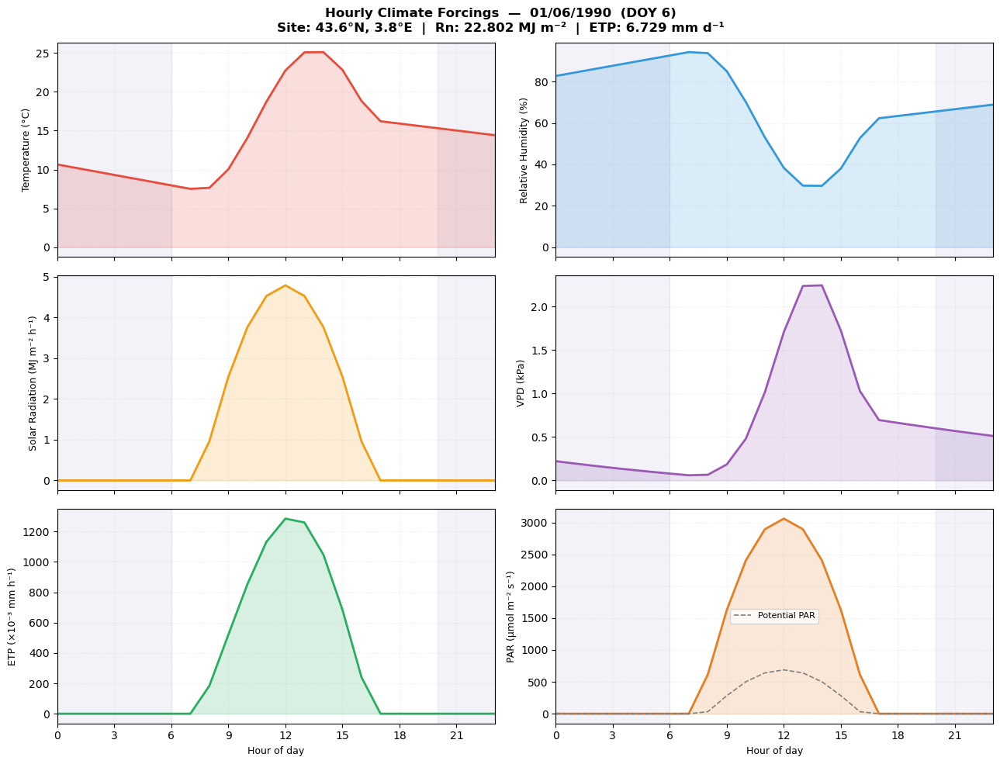
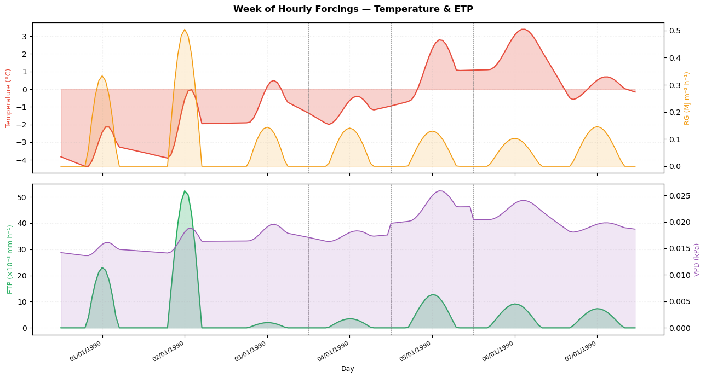
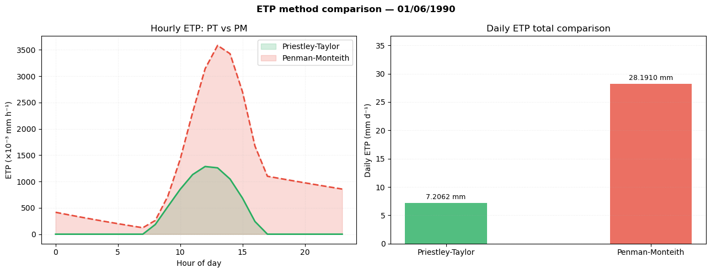

<!-- WARNING: THIS FILE WAS AUTOGENERATED! DO NOT EDIT! -->

The overall goal of SurEau Climate is to generate hourly forcings from daily 
climatic variables 

```
 Input: climate_df (DataFrame with daily records),
          date string (DD/MM/YYYY)
                         │
                         ▼
    ┌────────────────────────────────────────────┐
    │  new_climate_day(climate_df, date)         │
    │                                            │
    │  1. Parse date string → DOY, year          │
    │     (dateutil.parser handles any format)   │
    │                                            │
    │  2. Slice row where DATE == date           │
    │                                            │
    │  3. Assign met fields:                     │
    │     T_mean, T_min, T_max                   │
    │     RH_mean, RH_min, RH_max                │
    │     PPT, RG, WS_mean                       │
    │                                            │
    │  4. VPD = f(RH_mean, T_mean)               │
    │                                            │
    │                                            │
    │  5. Look up prev/next row by integer pos   │
    │     → T_min_prev, T_max_prev, T_min_next   │
    │     (needed for diurnal T model)           │
    └────────────────────────────────────────────┘
                          │
                          ▼  
                 SurEauClimate object
    ┌────────────────────────────────────────────┐
    │  compute_Rn_and_ETP(clim, params, opts)    │
    │                                            │
    │  Branch: opts.Rn_formulation               │
    │  ─────────────────────────────             │
    │  "Linacre":                                │
    │    nN = 0.25 if PPT > 0 else 0.75          │
    │    (cloud proxy: rainy=cloudy, dry=clear)  │
    │                                            │
    │    SW_abs = (1 − 0.17) × RG × 10⁶          │
    │    LW_loss = 1927.987 × (1+4·nN)           │
    │             × (100 − T_mean)               │
    │                                            │
    │    Rn = max(0,  SW_abs − LW_loss ) × 10⁻⁶  │
    │                                            │
    │  ETP_formulation                           │
    │  ─────────────────────────────             │
    │  "PT": Priestley-Taylor                    │
    │    ETP = α × Δ·Rn / [λ(Δ+γ)]               │
    │    via pyet.priestley_taylor()             │
    │    (α = params.PT_coeff ≈ 1.14)            │
    │                                            │
    │  "PM": Penman-Monteith                     │
    │    es = pyet.calc_es(T)                    │
    │    ea = es − VPD                           │
    │    ETP = pyet.pm(T, WS, Rn, ea, elev)      │
    └────────────────────────────────────────────┘
                         │
                         ▼  
            clim.net_radiation, clim.ETP set
    ┌────────────────────────────────────────────┐
    │ new_climate_hourly(clim, opts, veg_params) │
    │                                            │
    │  1. Daylength & solar geometry             │
    │     sunrise_h, sunset_h, daylen_h          │
    │     = daylength(opts.latitude, clim.DOY)   │
    │     Polar edge cases clamped to [0, 24]    │
    │                                            │
    │  2. Radiation disaggregation               │
    │     time_rel = hour × 3600 − sunrise_s     │
    │     io = π/daylen × sin(π·t_rel/daylen)    │
    │     io = 0 outside [sunrise, sunset]       │
    │     RG_h  = RG  × io × 3600  [MJ m⁻² h⁻¹]  │
    │     Rn_h  = Rn  × io × 3600                │
    │                                            │
    │  3. PAR                                    │
    │     PAR_h = PPFD(Watt(RG_h))               │
    │     pot_PAR_h = potential_PAR(h, lat, DOY) │
    │                                            │
    │  4. Temperature disaggregation             │
    │     Parton & Logan model per hour:         │
    │     • Daytime: sine ramp Tmin → Tmax       │
    │     • Evening: exp decay → T_min_next      │
    │     Uses T_min_prev, T_max_prev,           │
    │          T_min_next from adjacent days     │
    │                                            │
    │  5. Relative humidity disaggregation       │
    │     Dewpoint ≈ Tmin (RH_max at sunrise)    │
    │     ea = RH_max/100 × es(Tmin)             │
    │     RH_h = ea / es(T_h) × 100              │
    │     Clipped to [0.5, 100] %                │
    │                                            │
    │  6. Wind speed                             │
    │     WS_h = WS_mean (constant across hours) │
    │                                            │
    │  7. VPD_h = f(RH_h, T_h) per hour          │
    │                                            │
    │  8. ETP disaggregation                     │
    │     "PT": pyet.priestley_taylor(           │
    │              T_h, Rn_h, α, elev)           │
    │     "PM": pyet.pm(T_h, WS_h, Rn_h,         │
    │              ea_h, elev)                   │
    │                                            │
    │  9. Time-step duration n_h                 │
    │     n_h[0]   = ts[0] + (24 − ts[-1])       │
    │     n_h[i>0] = ts[i] − ts[i-1]             │
    │                                            │
    │  10. Subset to opts.time_steps             │
    │      (full 24 h or custom sub-hourly idx)  │
    │                                            │
    │  11. PPT assigned to first time step only  │
    └────────────────────────────────────────────┘
                          │
                          ▼  
                 SurEauClimateHourly 
                     object (ch)
      
                          │
                ┌─────────┴──────────┐
                │ Two parallel uses: │
                ▼                    ▼
    ┌───────────────┐  ┌──────────────────────────────────────┐
    │ get_hourly_   │  │  interpolate_climate_hourly(         │
    │ snapshot(     │  │      ch1_arrays, ch2_arrays, p=0.5)  │
    │   ch, idx)    │  │                                      │
    │               │  │  Linear blend between two snapshots: │
    │  Extracts one │  │  field = (1−p)·ch1[f] + p·ch2[f]     │
    │  timestep as  │  │                                      │
    │  a plain dict │  │  Interpolated fields:                │
    │  for passing  │  │  T_air_mean, RG, WS, VPD,            │
    │  into the     │  │  RH_air_mean, ETP, ETP_veg*          │
    │  hydraulic    │  │  (*if present in both snapshots)     │
    │  solver       │  │                                      │
    │               │  │  Non-interpolated fields copied      │
    │  Keys:        │  │  verbatim from ch1                   │
    │  T, RG, WS,   │  │                                      │
    │  VPD, RH,     │  │  Used to refine forcing between      │
    │  ETP, PAR,    │  │  two stored hourly time steps        │
    │  pot_PAR,     │  └──────────────────────────────────────┘
    │  n_hours,     │
    │  time         │
    └───────────────┘
                      │
                      ▼
       Returns:
       • new_climate_day()            → SurEauClimate object
       • compute_Rn_and_ETP()         → SurEauClimate object (Rn + ETP added)
       • new_climate_hourly()         → SurEauClimateHourly object
                                        (RG, Rn, PAR, T, RH, WS, VPD, ETP,
                                         time, n_hours, PPT arrays)
       • get_hourly_snapshot()        → dict (single timestep)
       • interpolate_climate_hourly() → dict (blended between two snapshots)
```

---

[source](https://github.com/ecamo19/plant_hydraulics/blob/main/plant_hydraulics/sureau_climate.py#L35){target="_blank" style="float:right; font-size:smaller"}

### new_climate_day

```python

def new_climate_day(
    climate_df:DataFrame, date:int
)->SurEauClimate:


```

*Extract daily climate from each row of a DataFrame*

The column names in the data frame __MUST__ be named as the following:

- DATE: Date with format DD/MM/YYYY
- Tair_mean: Air temperature mean (degress C)
- Tair_max: Maximum air temperature (degress C)
- Tair_min: Minimum air temperature (degress C)
- RHair_mean: Mean relative humidity of the day (%)
- RHair_max: Maximum relative humidity of the day (%)
- RHair_min: Minimum relative humidity of the day (%)
- PPT_sum: Precipitation (mm)
- RG_sum: Global radiation (MJ/m2)
- WS_mean: Mean wind speed of the day (m/s)


---

[source](https://github.com/ecamo19/plant_hydraulics/blob/main/plant_hydraulics/sureau_climate.py#L111){target="_blank" style="float:right; font-size:smaller"}

### compute_Rn_and_ETP

```python

def compute_Rn_and_ETP(
    clim:SurEauClimate, params:SurEauVegetationParams, opts:SurEauModelOptions
)->SurEauClimate:


```

*Compute daily net radiation and PET.*

Given today's solar radiation, precipitation, and temperature —
how much energy is available at the surface, and how much water
could potentially evaporate?"

Both outputs are stored back into clim and returned for use in the rest of
the model.

Physics notes:

-Rn: Linacre (1968) formulation:
        shortwave absorbed = (1 - 0.17) × RG
        longwave loss      = 1927.987 × (1 + 4·nN) × (100 - T_mean)
        nN = 0.25 if PPT > 0 else 0.75

-ETP: Priestley-Taylor: ETP = α × Δ·Rn / λ(Δ+γ)


---

[source](https://github.com/ecamo19/plant_hydraulics/blob/main/plant_hydraulics/sureau_climate.py#L173){target="_blank" style="float:right; font-size:smaller"}

### new_climate_hourly

```python

def new_climate_hourly(
    clim:SurEauClimate, opts:SurEauModelOptions, veg_params:SurEauVegetationParams
)->SurEauClimateHourly:


```

*Disaggregate daily climate to sub-daily time steps.*


---

[source](https://github.com/ecamo19/plant_hydraulics/blob/main/plant_hydraulics/sureau_climate.py#L338){target="_blank" style="float:right; font-size:smaller"}

### interpolate_climate_hourly

```python

def interpolate_climate_hourly(
    ch1_arrays:dict, ch2_arrays:dict, p:float=0.5
)->dict:


```

*Linearly interpolate between two hourly climate snapshots.*


---

[source](https://github.com/ecamo19/plant_hydraulics/blob/main/plant_hydraulics/sureau_climate.py#L356){target="_blank" style="float:right; font-size:smaller"}

### get_hourly_snapshot

```python

def get_hourly_snapshot(
    ch:SurEauClimateHourly, idx:int
)->dict:


```

*Extract a single timestep from ClimateHourly as a dict.*


### Example: Generate hourly forcings using daily values for SurEau

::: {#923c161a .cell}
``` {.python .cell-code}
# List available example files
#list_example_data()
```

::: {.cell-output .cell-output-error}

::: {.ansi-escaped-output}
```{=html}
<pre><span class="ansi-red-fg">---------------------------------------------------------------------------</span>
<span class="ansi-red-fg">ModuleNotFoundError</span>                       Traceback (most recent call last)
<span class="ansi-cyan-fg">Cell</span><span class="ansi-cyan-fg"> </span><span class="ansi-green-fg">In[16]</span><span class="ansi-green-fg">, line 2</span>
<span class="ansi-green-fg">      1</span> <span style="font-style:italic;color:rgb(95,135,135)"># List available example files</span>
<span class="ansi-green-fg">----&gt; </span><span class="ansi-green-fg">2</span> <span class="ansi-yellow-bg">list_example_data</span><span class="ansi-yellow-bg">(</span><span class="ansi-yellow-bg">)</span>

<span class="ansi-cyan-fg">File </span><span class="ansi-green-fg">~/Documents/projects/modeling/plant_hydraulics/plant_hydraulics/utils.py:31</span>, in <span class="ansi-cyan-fg">list_example_data</span><span class="ansi-blue-fg">()</span>
<span class="ansi-green-fg">     29</span> <span style="font-weight:bold;color:rgb(0,135,0)">def</span><span style="color:rgb(188,188,188)"> </span><span class="ansi-blue-fg">list_example_data</span>():
<span class="ansi-green-fg">     30</span> <span style="color:rgb(188,188,188)">    </span><span style="font-style:italic" class="ansi-yellow-fg">"""List all available example data files in the package data folder."""</span>
<span class="ansi-green-fg">---&gt; </span><span class="ansi-green-fg">31</span>     data_path = <span class="ansi-yellow-bg">files</span><span class="ansi-yellow-bg">(</span><span class="ansi-yellow-fg ansi-yellow-bg">"</span><span class="ansi-yellow-fg ansi-yellow-bg">bonan_hydraulics.data</span><span class="ansi-yellow-fg ansi-yellow-bg">"</span><span class="ansi-yellow-bg">)</span>
<span class="ansi-green-fg">     33</span>     files_found = [
<span class="ansi-green-fg">     34</span>         each_file.name <span style="font-weight:bold;color:rgb(0,135,0)">for</span> each_file <span style="font-weight:bold;color:rgb(175,0,255)">in</span> data_path.iterdir() <span style="font-weight:bold;color:rgb(0,135,0)">if</span> each_file.is_file()
<span class="ansi-green-fg">     35</span>     ]
<span class="ansi-green-fg">     37</span>     <span style="font-weight:bold;color:rgb(0,135,0)">for</span> each_file <span style="font-weight:bold;color:rgb(175,0,255)">in</span> <span style="color:rgb(0,135,0)">sorted</span>(files_found):

<span class="ansi-cyan-fg">File </span><span class="ansi-green-fg">~/Documents/projects/modeling/plant_hydraulics/.pixi/envs/default/lib/python3.14/importlib/resources/_common.py:46</span>, in <span class="ansi-cyan-fg">package_to_anchor.&lt;locals&gt;.wrapper</span><span class="ansi-blue-fg">(anchor, package)</span>
<span class="ansi-green-fg">     44</span> <span style="font-weight:bold;color:rgb(0,135,0)">elif</span> anchor <span style="font-weight:bold;color:rgb(175,0,255)">is</span> undefined:
<span class="ansi-green-fg">     45</span>     <span style="font-weight:bold;color:rgb(0,135,0)">return</span> func()
<span class="ansi-green-fg">---&gt; </span><span class="ansi-green-fg">46</span> <span style="font-weight:bold;color:rgb(0,135,0)">return</span> <span class="ansi-yellow-bg">func</span><span class="ansi-yellow-bg">(</span><span class="ansi-yellow-bg">anchor</span><span class="ansi-yellow-bg">)</span>

<span class="ansi-cyan-fg">File </span><span class="ansi-green-fg">~/Documents/projects/modeling/plant_hydraulics/.pixi/envs/default/lib/python3.14/importlib/resources/_common.py:56</span>, in <span class="ansi-cyan-fg">files</span><span class="ansi-blue-fg">(anchor)</span>
<span class="ansi-green-fg">     51</span> <span style="color:rgb(175,0,255)">@package_to_anchor</span>
<span class="ansi-green-fg">     52</span> <span style="font-weight:bold;color:rgb(0,135,0)">def</span><span style="color:rgb(188,188,188)"> </span><span class="ansi-blue-fg">files</span>(anchor: Optional[Anchor] = <span style="font-weight:bold;color:rgb(0,135,0)">None</span>) -&gt; Traversable:
<span class="ansi-green-fg">     53</span> <span style="color:rgb(188,188,188)">    </span><span style="font-style:italic" class="ansi-yellow-fg">"""</span>
<span class="ansi-green-fg">     54</span> <span style="font-style:italic" class="ansi-yellow-fg">    Get a Traversable resource for an anchor.</span>
<span class="ansi-green-fg">     55</span> <span style="font-style:italic" class="ansi-yellow-fg">    """</span>
<span class="ansi-green-fg">---&gt; </span><span class="ansi-green-fg">56</span>     <span style="font-weight:bold;color:rgb(0,135,0)">return</span> from_package(<span class="ansi-yellow-bg">resolve</span><span class="ansi-yellow-bg">(</span><span class="ansi-yellow-bg">anchor</span><span class="ansi-yellow-bg">)</span>)

<span class="ansi-cyan-fg">File </span><span class="ansi-green-fg">~/Documents/projects/modeling/plant_hydraulics/.pixi/envs/default/lib/python3.14/functools.py:982</span>, in <span class="ansi-cyan-fg">singledispatch.&lt;locals&gt;.wrapper</span><span class="ansi-blue-fg">(*args, **kw)</span>
<span class="ansi-green-fg">    979</span> <span style="font-weight:bold;color:rgb(0,135,0)">if</span> <span style="font-weight:bold;color:rgb(175,0,255)">not</span> args:
<span class="ansi-green-fg">    980</span>     <span style="font-weight:bold;color:rgb(0,135,0)">raise</span> <span style="font-weight:bold;color:rgb(215,95,95)">TypeError</span>(<span class="ansi-yellow-fg">f</span><span class="ansi-yellow-fg">'</span><span style="font-weight:bold;color:rgb(175,95,135)">{</span>funcname<span style="font-weight:bold;color:rgb(175,95,135)">}</span><span class="ansi-yellow-fg"> requires at least </span><span class="ansi-yellow-fg">'</span>
<span class="ansi-green-fg">    981</span>                     <span class="ansi-yellow-fg">'</span><span class="ansi-yellow-fg">1 positional argument</span><span class="ansi-yellow-fg">'</span>)
<span class="ansi-green-fg">--&gt; </span><span class="ansi-green-fg">982</span> <span style="font-weight:bold;color:rgb(0,135,0)">return</span> <span class="ansi-yellow-bg">dispatch</span><span class="ansi-yellow-bg">(</span><span class="ansi-yellow-bg">args</span><span class="ansi-yellow-bg">[</span><span class="ansi-green-fg ansi-yellow-bg">0</span><span class="ansi-yellow-bg">]</span><span class="ansi-yellow-bg">.</span><span class="ansi-blue-fg ansi-yellow-bg">__class__</span><span class="ansi-yellow-bg">)</span><span class="ansi-yellow-bg">(</span><span class="ansi-yellow-bg">*</span><span class="ansi-yellow-bg">args</span><span class="ansi-yellow-bg">,</span><span class="ansi-yellow-bg"> </span><span class="ansi-yellow-bg">*</span><span class="ansi-yellow-bg">*</span><span class="ansi-yellow-bg">kw</span><span class="ansi-yellow-bg">)</span>

<span class="ansi-cyan-fg">File </span><span class="ansi-green-fg">~/Documents/projects/modeling/plant_hydraulics/.pixi/envs/default/lib/python3.14/importlib/resources/_common.py:82</span>, in <span class="ansi-cyan-fg">_</span><span class="ansi-blue-fg">(cand)</span>
<span class="ansi-green-fg">     80</span> <span style="color:rgb(175,0,255)">@resolve</span>.register
<span class="ansi-green-fg">     81</span> <span style="font-weight:bold;color:rgb(0,135,0)">def</span><span style="color:rgb(188,188,188)"> </span><span class="ansi-blue-fg">_</span>(cand: <span style="color:rgb(0,135,0)">str</span>) -&gt; types.ModuleType:
<span class="ansi-green-fg">---&gt; </span><span class="ansi-green-fg">82</span>     <span style="font-weight:bold;color:rgb(0,135,0)">return</span> <span class="ansi-yellow-bg">importlib</span><span class="ansi-yellow-bg">.</span><span class="ansi-yellow-bg">import_module</span><span class="ansi-yellow-bg">(</span><span class="ansi-yellow-bg">cand</span><span class="ansi-yellow-bg">)</span>

<span class="ansi-cyan-fg">File </span><span class="ansi-green-fg">~/Documents/projects/modeling/plant_hydraulics/.pixi/envs/default/lib/python3.14/importlib/__init__.py:88</span>, in <span class="ansi-cyan-fg">import_module</span><span class="ansi-blue-fg">(name, package)</span>
<span class="ansi-green-fg">     86</span>             <span style="font-weight:bold;color:rgb(0,135,0)">break</span>
<span class="ansi-green-fg">     87</span>         level += <span class="ansi-green-fg">1</span>
<span class="ansi-green-fg">---&gt; </span><span class="ansi-green-fg">88</span> <span style="font-weight:bold;color:rgb(0,135,0)">return</span> <span class="ansi-yellow-bg">_bootstrap</span><span class="ansi-yellow-bg">.</span><span class="ansi-yellow-bg">_gcd_import</span><span class="ansi-yellow-bg">(</span><span class="ansi-yellow-bg">name</span><span class="ansi-yellow-bg">[</span><span class="ansi-yellow-bg">level</span><span class="ansi-yellow-bg">:</span><span class="ansi-yellow-bg">]</span><span class="ansi-yellow-bg">,</span><span class="ansi-yellow-bg"> </span><span class="ansi-yellow-bg">package</span><span class="ansi-yellow-bg">,</span><span class="ansi-yellow-bg"> </span><span class="ansi-yellow-bg">level</span><span class="ansi-yellow-bg">)</span>

<span class="ansi-cyan-fg">File </span><span class="ansi-green-fg">&lt;frozen importlib._bootstrap&gt;:1398</span>, in <span class="ansi-cyan-fg">_gcd_import</span><span class="ansi-blue-fg">(name, package, level)</span>
<span class="ansi-green-fg">   1396</span> <span style="font-weight:bold;color:rgb(0,135,0)">if</span> level &gt; <span class="ansi-green-fg">0</span>:
<span class="ansi-green-fg">   1397</span>     name = _resolve_name(name, package, level)
<span class="ansi-green-fg">-&gt; </span><span class="ansi-green-fg">1398</span> <span style="font-weight:bold;color:rgb(0,135,0)">return</span> <span class="ansi-yellow-bg">_find_and_load</span><span class="ansi-yellow-bg">(</span><span class="ansi-yellow-bg">name</span><span class="ansi-yellow-bg">,</span><span class="ansi-yellow-bg"> </span><span class="ansi-yellow-bg">_gcd_import</span><span class="ansi-yellow-bg">)</span>

<span class="ansi-cyan-fg">File </span><span class="ansi-green-fg">&lt;frozen importlib._bootstrap&gt;:1371</span>, in <span class="ansi-cyan-fg">_find_and_load</span><span class="ansi-blue-fg">(name, import_)</span>
<span class="ansi-green-fg">   1369</span>     module = sys.modules.get(name, _NEEDS_LOADING)
<span class="ansi-green-fg">   1370</span>     <span style="font-weight:bold;color:rgb(0,135,0)">if</span> module <span style="font-weight:bold;color:rgb(175,0,255)">is</span> _NEEDS_LOADING:
<span class="ansi-green-fg">-&gt; </span><span class="ansi-green-fg">1371</span>         <span style="font-weight:bold;color:rgb(0,135,0)">return</span> <span class="ansi-yellow-bg">_find_and_load_unlocked</span><span class="ansi-yellow-bg">(</span><span class="ansi-yellow-bg">name</span><span class="ansi-yellow-bg">,</span><span class="ansi-yellow-bg"> </span><span class="ansi-yellow-bg">import_</span><span class="ansi-yellow-bg">)</span>
<span class="ansi-green-fg">   1373</span> <span style="font-style:italic;color:rgb(95,135,135)"># Optimization: only call _bootstrap._lock_unlock_module() if</span>
<span class="ansi-green-fg">   1374</span> <span style="font-style:italic;color:rgb(95,135,135)"># module.__spec__._initializing is True.</span>
<span class="ansi-green-fg">   1375</span> <span style="font-style:italic;color:rgb(95,135,135)"># NOTE: because of this, initializing must be set *before*</span>
<span class="ansi-green-fg">   1376</span> <span style="font-style:italic;color:rgb(95,135,135)"># putting the new module in sys.modules.</span>
<span class="ansi-green-fg">   1377</span> _lock_unlock_module(name)

<span class="ansi-cyan-fg">File </span><span class="ansi-green-fg">&lt;frozen importlib._bootstrap&gt;:1314</span>, in <span class="ansi-cyan-fg">_find_and_load_unlocked</span><span class="ansi-blue-fg">(name, import_)</span>
<span class="ansi-green-fg">   1312</span> <span style="font-weight:bold;color:rgb(0,135,0)">if</span> parent:
<span class="ansi-green-fg">   1313</span>     <span style="font-weight:bold;color:rgb(0,135,0)">if</span> parent <span style="font-weight:bold;color:rgb(175,0,255)">not</span> <span style="font-weight:bold;color:rgb(175,0,255)">in</span> sys.modules:
<span class="ansi-green-fg">-&gt; </span><span class="ansi-green-fg">1314</span>         <span class="ansi-yellow-bg">_call_with_frames_removed</span><span class="ansi-yellow-bg">(</span><span class="ansi-yellow-bg">import_</span><span class="ansi-yellow-bg">,</span><span class="ansi-yellow-bg"> </span><span class="ansi-yellow-bg">parent</span><span class="ansi-yellow-bg">)</span>
<span class="ansi-green-fg">   1315</span>     <span style="font-style:italic;color:rgb(95,135,135)"># Crazy side-effects!</span>
<span class="ansi-green-fg">   1316</span>     module = sys.modules.get(name)

<span class="ansi-cyan-fg">File </span><span class="ansi-green-fg">&lt;frozen importlib._bootstrap&gt;:491</span>, in <span class="ansi-cyan-fg">_call_with_frames_removed</span><span class="ansi-blue-fg">(f, *args, **kwds)</span>
<span class="ansi-green-fg">    483</span> <span style="font-weight:bold;color:rgb(0,135,0)">def</span><span style="color:rgb(188,188,188)"> </span><span class="ansi-blue-fg">_call_with_frames_removed</span>(f, *args, **kwds):
<span class="ansi-green-fg">    484</span> <span style="color:rgb(188,188,188)">    </span><span style="font-style:italic" class="ansi-yellow-fg">"""remove_importlib_frames in import.c will always remove sequences</span>
<span class="ansi-green-fg">    485</span> <span style="font-style:italic" class="ansi-yellow-fg">    of importlib frames that end with a call to this function</span>
<span class="ansi-green-fg">    486</span> 
<span class="ansi-green-fg">   (...)</span><span class="ansi-green-fg">    489</span> <span style="font-style:italic" class="ansi-yellow-fg">    module code)</span>
<span class="ansi-green-fg">    490</span> <span style="font-style:italic" class="ansi-yellow-fg">    """</span>
<span class="ansi-green-fg">--&gt; </span><span class="ansi-green-fg">491</span>     <span style="font-weight:bold;color:rgb(0,135,0)">return</span> <span class="ansi-yellow-bg">f</span><span class="ansi-yellow-bg">(</span><span class="ansi-yellow-bg">*</span><span class="ansi-yellow-bg">args</span><span class="ansi-yellow-bg">,</span><span class="ansi-yellow-bg"> </span><span class="ansi-yellow-bg">*</span><span class="ansi-yellow-bg">*</span><span class="ansi-yellow-bg">kwds</span><span class="ansi-yellow-bg">)</span>

<span class="ansi-cyan-fg">File </span><span class="ansi-green-fg">&lt;frozen importlib._bootstrap&gt;:1398</span>, in <span class="ansi-cyan-fg">_gcd_import</span><span class="ansi-blue-fg">(name, package, level)</span>
<span class="ansi-green-fg">   1396</span> <span style="font-weight:bold;color:rgb(0,135,0)">if</span> level &gt; <span class="ansi-green-fg">0</span>:
<span class="ansi-green-fg">   1397</span>     name = _resolve_name(name, package, level)
<span class="ansi-green-fg">-&gt; </span><span class="ansi-green-fg">1398</span> <span style="font-weight:bold;color:rgb(0,135,0)">return</span> <span class="ansi-yellow-bg">_find_and_load</span><span class="ansi-yellow-bg">(</span><span class="ansi-yellow-bg">name</span><span class="ansi-yellow-bg">,</span><span class="ansi-yellow-bg"> </span><span class="ansi-yellow-bg">_gcd_import</span><span class="ansi-yellow-bg">)</span>

<span class="ansi-cyan-fg">File </span><span class="ansi-green-fg">&lt;frozen importlib._bootstrap&gt;:1371</span>, in <span class="ansi-cyan-fg">_find_and_load</span><span class="ansi-blue-fg">(name, import_)</span>
<span class="ansi-green-fg">   1369</span>     module = sys.modules.get(name, _NEEDS_LOADING)
<span class="ansi-green-fg">   1370</span>     <span style="font-weight:bold;color:rgb(0,135,0)">if</span> module <span style="font-weight:bold;color:rgb(175,0,255)">is</span> _NEEDS_LOADING:
<span class="ansi-green-fg">-&gt; </span><span class="ansi-green-fg">1371</span>         <span style="font-weight:bold;color:rgb(0,135,0)">return</span> <span class="ansi-yellow-bg">_find_and_load_unlocked</span><span class="ansi-yellow-bg">(</span><span class="ansi-yellow-bg">name</span><span class="ansi-yellow-bg">,</span><span class="ansi-yellow-bg"> </span><span class="ansi-yellow-bg">import_</span><span class="ansi-yellow-bg">)</span>
<span class="ansi-green-fg">   1373</span> <span style="font-style:italic;color:rgb(95,135,135)"># Optimization: only call _bootstrap._lock_unlock_module() if</span>
<span class="ansi-green-fg">   1374</span> <span style="font-style:italic;color:rgb(95,135,135)"># module.__spec__._initializing is True.</span>
<span class="ansi-green-fg">   1375</span> <span style="font-style:italic;color:rgb(95,135,135)"># NOTE: because of this, initializing must be set *before*</span>
<span class="ansi-green-fg">   1376</span> <span style="font-style:italic;color:rgb(95,135,135)"># putting the new module in sys.modules.</span>
<span class="ansi-green-fg">   1377</span> _lock_unlock_module(name)

<span class="ansi-cyan-fg">File </span><span class="ansi-green-fg">&lt;frozen importlib._bootstrap&gt;:1335</span>, in <span class="ansi-cyan-fg">_find_and_load_unlocked</span><span class="ansi-blue-fg">(name, import_)</span>
<span class="ansi-green-fg">   1333</span> spec = _find_spec(name, path)
<span class="ansi-green-fg">   1334</span> <span style="font-weight:bold;color:rgb(0,135,0)">if</span> spec <span style="font-weight:bold;color:rgb(175,0,255)">is</span> <span style="font-weight:bold;color:rgb(0,135,0)">None</span>:
<span class="ansi-green-fg">-&gt; </span><span class="ansi-green-fg">1335</span>     <span style="font-weight:bold;color:rgb(0,135,0)">raise</span> <span style="font-weight:bold;color:rgb(215,95,95)">ModuleNotFoundError</span>(<span class="ansi-yellow-fg">f</span><span class="ansi-yellow-fg">'</span><span style="font-weight:bold;color:rgb(175,95,135)">{</span>_ERR_MSG_PREFIX<span style="font-weight:bold;color:rgb(175,95,135)">}</span><span style="font-weight:bold;color:rgb(175,95,135)">{</span>name<span style="font-weight:bold;color:rgb(175,95,135)">!r}</span><span class="ansi-yellow-fg">'</span>, name=name)
<span class="ansi-green-fg">   1336</span> <span style="font-weight:bold;color:rgb(0,135,0)">else</span>:
<span class="ansi-green-fg">   1337</span>     <span style="font-weight:bold;color:rgb(0,135,0)">if</span> parent_spec:
<span class="ansi-green-fg">   1338</span>         <span style="font-style:italic;color:rgb(95,135,135)"># Temporarily add child we are currently importing to parent's</span>
<span class="ansi-green-fg">   1339</span>         <span style="font-style:italic;color:rgb(95,135,135)"># _uninitialized_submodules for circular import tracking.</span>

<span class="ansi-red-fg">ModuleNotFoundError</span>: No module named 'bonan_hydraulics'</pre>
```
:::

:::
:::


::: {#94a602e0 .cell}
``` {.python .cell-code}
# Load example data
climate_df = load_example_data("climat_example.csv", sep=";")
itables.show(climate_df)
```

::: {.cell-output .cell-output-error}

::: {.ansi-escaped-output}
```{=html}
<pre><span class="ansi-red-fg">---------------------------------------------------------------------------</span>
<span class="ansi-red-fg">ModuleNotFoundError</span>                       Traceback (most recent call last)
<span class="ansi-cyan-fg">Cell</span><span class="ansi-cyan-fg"> </span><span class="ansi-green-fg">In[18]</span><span class="ansi-green-fg">, line 2</span>
<span class="ansi-green-fg">      1</span> <span style="font-style:italic;color:rgb(95,135,135)"># Load example data</span>
<span class="ansi-green-fg">----&gt; </span><span class="ansi-green-fg">2</span> climate_df = <span class="ansi-yellow-bg">load_example_data</span><span class="ansi-yellow-bg">(</span><span class="ansi-yellow-fg ansi-yellow-bg">"</span><span class="ansi-yellow-fg ansi-yellow-bg">climat_example.csv</span><span class="ansi-yellow-fg ansi-yellow-bg">"</span><span class="ansi-yellow-bg">,</span><span class="ansi-yellow-bg"> </span><span class="ansi-yellow-bg">sep</span><span class="ansi-yellow-bg">=</span><span class="ansi-yellow-fg ansi-yellow-bg">"</span><span class="ansi-yellow-fg ansi-yellow-bg">;</span><span class="ansi-yellow-fg ansi-yellow-bg">"</span><span class="ansi-yellow-bg">)</span>
<span class="ansi-green-fg">      3</span> itables.show(climate_df)

<span class="ansi-cyan-fg">File </span><span class="ansi-green-fg">~/Documents/projects/modeling/plant_hydraulics/plant_hydraulics/utils.py:43</span>, in <span class="ansi-cyan-fg">load_example_data</span><span class="ansi-blue-fg">(filename, sep)</span>
<span class="ansi-green-fg">     42</span> <span style="font-weight:bold;color:rgb(0,135,0)">def</span><span style="color:rgb(188,188,188)"> </span><span class="ansi-blue-fg">load_example_data</span>(filename, sep=<span class="ansi-yellow-fg">"</span><span class="ansi-yellow-fg">,</span><span class="ansi-yellow-fg">"</span>):
<span class="ansi-green-fg">---&gt; </span><span class="ansi-green-fg">43</span>     data_path = <span class="ansi-yellow-bg">files</span><span class="ansi-yellow-bg">(</span><span class="ansi-yellow-fg ansi-yellow-bg">"</span><span class="ansi-yellow-fg ansi-yellow-bg">bonan_hydraulics.data</span><span class="ansi-yellow-fg ansi-yellow-bg">"</span><span class="ansi-yellow-bg">)</span>.joinpath(filename)
<span class="ansi-green-fg">     44</span>     <span style="font-weight:bold;color:rgb(0,135,0)">return</span> pd.read_csv(data_path, sep=sep)

<span class="ansi-cyan-fg">File </span><span class="ansi-green-fg">~/Documents/projects/modeling/plant_hydraulics/.pixi/envs/default/lib/python3.14/importlib/resources/_common.py:46</span>, in <span class="ansi-cyan-fg">package_to_anchor.&lt;locals&gt;.wrapper</span><span class="ansi-blue-fg">(anchor, package)</span>
<span class="ansi-green-fg">     44</span> <span style="font-weight:bold;color:rgb(0,135,0)">elif</span> anchor <span style="font-weight:bold;color:rgb(175,0,255)">is</span> undefined:
<span class="ansi-green-fg">     45</span>     <span style="font-weight:bold;color:rgb(0,135,0)">return</span> func()
<span class="ansi-green-fg">---&gt; </span><span class="ansi-green-fg">46</span> <span style="font-weight:bold;color:rgb(0,135,0)">return</span> <span class="ansi-yellow-bg">func</span><span class="ansi-yellow-bg">(</span><span class="ansi-yellow-bg">anchor</span><span class="ansi-yellow-bg">)</span>

<span class="ansi-cyan-fg">File </span><span class="ansi-green-fg">~/Documents/projects/modeling/plant_hydraulics/.pixi/envs/default/lib/python3.14/importlib/resources/_common.py:56</span>, in <span class="ansi-cyan-fg">files</span><span class="ansi-blue-fg">(anchor)</span>
<span class="ansi-green-fg">     51</span> <span style="color:rgb(175,0,255)">@package_to_anchor</span>
<span class="ansi-green-fg">     52</span> <span style="font-weight:bold;color:rgb(0,135,0)">def</span><span style="color:rgb(188,188,188)"> </span><span class="ansi-blue-fg">files</span>(anchor: Optional[Anchor] = <span style="font-weight:bold;color:rgb(0,135,0)">None</span>) -&gt; Traversable:
<span class="ansi-green-fg">     53</span> <span style="color:rgb(188,188,188)">    </span><span style="font-style:italic" class="ansi-yellow-fg">"""</span>
<span class="ansi-green-fg">     54</span> <span style="font-style:italic" class="ansi-yellow-fg">    Get a Traversable resource for an anchor.</span>
<span class="ansi-green-fg">     55</span> <span style="font-style:italic" class="ansi-yellow-fg">    """</span>
<span class="ansi-green-fg">---&gt; </span><span class="ansi-green-fg">56</span>     <span style="font-weight:bold;color:rgb(0,135,0)">return</span> from_package(<span class="ansi-yellow-bg">resolve</span><span class="ansi-yellow-bg">(</span><span class="ansi-yellow-bg">anchor</span><span class="ansi-yellow-bg">)</span>)

<span class="ansi-cyan-fg">File </span><span class="ansi-green-fg">~/Documents/projects/modeling/plant_hydraulics/.pixi/envs/default/lib/python3.14/functools.py:982</span>, in <span class="ansi-cyan-fg">singledispatch.&lt;locals&gt;.wrapper</span><span class="ansi-blue-fg">(*args, **kw)</span>
<span class="ansi-green-fg">    979</span> <span style="font-weight:bold;color:rgb(0,135,0)">if</span> <span style="font-weight:bold;color:rgb(175,0,255)">not</span> args:
<span class="ansi-green-fg">    980</span>     <span style="font-weight:bold;color:rgb(0,135,0)">raise</span> <span style="font-weight:bold;color:rgb(215,95,95)">TypeError</span>(<span class="ansi-yellow-fg">f</span><span class="ansi-yellow-fg">'</span><span style="font-weight:bold;color:rgb(175,95,135)">{</span>funcname<span style="font-weight:bold;color:rgb(175,95,135)">}</span><span class="ansi-yellow-fg"> requires at least </span><span class="ansi-yellow-fg">'</span>
<span class="ansi-green-fg">    981</span>                     <span class="ansi-yellow-fg">'</span><span class="ansi-yellow-fg">1 positional argument</span><span class="ansi-yellow-fg">'</span>)
<span class="ansi-green-fg">--&gt; </span><span class="ansi-green-fg">982</span> <span style="font-weight:bold;color:rgb(0,135,0)">return</span> <span class="ansi-yellow-bg">dispatch</span><span class="ansi-yellow-bg">(</span><span class="ansi-yellow-bg">args</span><span class="ansi-yellow-bg">[</span><span class="ansi-green-fg ansi-yellow-bg">0</span><span class="ansi-yellow-bg">]</span><span class="ansi-yellow-bg">.</span><span class="ansi-blue-fg ansi-yellow-bg">__class__</span><span class="ansi-yellow-bg">)</span><span class="ansi-yellow-bg">(</span><span class="ansi-yellow-bg">*</span><span class="ansi-yellow-bg">args</span><span class="ansi-yellow-bg">,</span><span class="ansi-yellow-bg"> </span><span class="ansi-yellow-bg">*</span><span class="ansi-yellow-bg">*</span><span class="ansi-yellow-bg">kw</span><span class="ansi-yellow-bg">)</span>

<span class="ansi-cyan-fg">File </span><span class="ansi-green-fg">~/Documents/projects/modeling/plant_hydraulics/.pixi/envs/default/lib/python3.14/importlib/resources/_common.py:82</span>, in <span class="ansi-cyan-fg">_</span><span class="ansi-blue-fg">(cand)</span>
<span class="ansi-green-fg">     80</span> <span style="color:rgb(175,0,255)">@resolve</span>.register
<span class="ansi-green-fg">     81</span> <span style="font-weight:bold;color:rgb(0,135,0)">def</span><span style="color:rgb(188,188,188)"> </span><span class="ansi-blue-fg">_</span>(cand: <span style="color:rgb(0,135,0)">str</span>) -&gt; types.ModuleType:
<span class="ansi-green-fg">---&gt; </span><span class="ansi-green-fg">82</span>     <span style="font-weight:bold;color:rgb(0,135,0)">return</span> <span class="ansi-yellow-bg">importlib</span><span class="ansi-yellow-bg">.</span><span class="ansi-yellow-bg">import_module</span><span class="ansi-yellow-bg">(</span><span class="ansi-yellow-bg">cand</span><span class="ansi-yellow-bg">)</span>

<span class="ansi-cyan-fg">File </span><span class="ansi-green-fg">~/Documents/projects/modeling/plant_hydraulics/.pixi/envs/default/lib/python3.14/importlib/__init__.py:88</span>, in <span class="ansi-cyan-fg">import_module</span><span class="ansi-blue-fg">(name, package)</span>
<span class="ansi-green-fg">     86</span>             <span style="font-weight:bold;color:rgb(0,135,0)">break</span>
<span class="ansi-green-fg">     87</span>         level += <span class="ansi-green-fg">1</span>
<span class="ansi-green-fg">---&gt; </span><span class="ansi-green-fg">88</span> <span style="font-weight:bold;color:rgb(0,135,0)">return</span> <span class="ansi-yellow-bg">_bootstrap</span><span class="ansi-yellow-bg">.</span><span class="ansi-yellow-bg">_gcd_import</span><span class="ansi-yellow-bg">(</span><span class="ansi-yellow-bg">name</span><span class="ansi-yellow-bg">[</span><span class="ansi-yellow-bg">level</span><span class="ansi-yellow-bg">:</span><span class="ansi-yellow-bg">]</span><span class="ansi-yellow-bg">,</span><span class="ansi-yellow-bg"> </span><span class="ansi-yellow-bg">package</span><span class="ansi-yellow-bg">,</span><span class="ansi-yellow-bg"> </span><span class="ansi-yellow-bg">level</span><span class="ansi-yellow-bg">)</span>

<span class="ansi-cyan-fg">File </span><span class="ansi-green-fg">&lt;frozen importlib._bootstrap&gt;:1398</span>, in <span class="ansi-cyan-fg">_gcd_import</span><span class="ansi-blue-fg">(name, package, level)</span>
<span class="ansi-green-fg">   1396</span> <span style="font-weight:bold;color:rgb(0,135,0)">if</span> level &gt; <span class="ansi-green-fg">0</span>:
<span class="ansi-green-fg">   1397</span>     name = _resolve_name(name, package, level)
<span class="ansi-green-fg">-&gt; </span><span class="ansi-green-fg">1398</span> <span style="font-weight:bold;color:rgb(0,135,0)">return</span> <span class="ansi-yellow-bg">_find_and_load</span><span class="ansi-yellow-bg">(</span><span class="ansi-yellow-bg">name</span><span class="ansi-yellow-bg">,</span><span class="ansi-yellow-bg"> </span><span class="ansi-yellow-bg">_gcd_import</span><span class="ansi-yellow-bg">)</span>

<span class="ansi-cyan-fg">File </span><span class="ansi-green-fg">&lt;frozen importlib._bootstrap&gt;:1371</span>, in <span class="ansi-cyan-fg">_find_and_load</span><span class="ansi-blue-fg">(name, import_)</span>
<span class="ansi-green-fg">   1369</span>     module = sys.modules.get(name, _NEEDS_LOADING)
<span class="ansi-green-fg">   1370</span>     <span style="font-weight:bold;color:rgb(0,135,0)">if</span> module <span style="font-weight:bold;color:rgb(175,0,255)">is</span> _NEEDS_LOADING:
<span class="ansi-green-fg">-&gt; </span><span class="ansi-green-fg">1371</span>         <span style="font-weight:bold;color:rgb(0,135,0)">return</span> <span class="ansi-yellow-bg">_find_and_load_unlocked</span><span class="ansi-yellow-bg">(</span><span class="ansi-yellow-bg">name</span><span class="ansi-yellow-bg">,</span><span class="ansi-yellow-bg"> </span><span class="ansi-yellow-bg">import_</span><span class="ansi-yellow-bg">)</span>
<span class="ansi-green-fg">   1373</span> <span style="font-style:italic;color:rgb(95,135,135)"># Optimization: only call _bootstrap._lock_unlock_module() if</span>
<span class="ansi-green-fg">   1374</span> <span style="font-style:italic;color:rgb(95,135,135)"># module.__spec__._initializing is True.</span>
<span class="ansi-green-fg">   1375</span> <span style="font-style:italic;color:rgb(95,135,135)"># NOTE: because of this, initializing must be set *before*</span>
<span class="ansi-green-fg">   1376</span> <span style="font-style:italic;color:rgb(95,135,135)"># putting the new module in sys.modules.</span>
<span class="ansi-green-fg">   1377</span> _lock_unlock_module(name)

<span class="ansi-cyan-fg">File </span><span class="ansi-green-fg">&lt;frozen importlib._bootstrap&gt;:1314</span>, in <span class="ansi-cyan-fg">_find_and_load_unlocked</span><span class="ansi-blue-fg">(name, import_)</span>
<span class="ansi-green-fg">   1312</span> <span style="font-weight:bold;color:rgb(0,135,0)">if</span> parent:
<span class="ansi-green-fg">   1313</span>     <span style="font-weight:bold;color:rgb(0,135,0)">if</span> parent <span style="font-weight:bold;color:rgb(175,0,255)">not</span> <span style="font-weight:bold;color:rgb(175,0,255)">in</span> sys.modules:
<span class="ansi-green-fg">-&gt; </span><span class="ansi-green-fg">1314</span>         <span class="ansi-yellow-bg">_call_with_frames_removed</span><span class="ansi-yellow-bg">(</span><span class="ansi-yellow-bg">import_</span><span class="ansi-yellow-bg">,</span><span class="ansi-yellow-bg"> </span><span class="ansi-yellow-bg">parent</span><span class="ansi-yellow-bg">)</span>
<span class="ansi-green-fg">   1315</span>     <span style="font-style:italic;color:rgb(95,135,135)"># Crazy side-effects!</span>
<span class="ansi-green-fg">   1316</span>     module = sys.modules.get(name)

<span class="ansi-cyan-fg">File </span><span class="ansi-green-fg">&lt;frozen importlib._bootstrap&gt;:491</span>, in <span class="ansi-cyan-fg">_call_with_frames_removed</span><span class="ansi-blue-fg">(f, *args, **kwds)</span>
<span class="ansi-green-fg">    483</span> <span style="font-weight:bold;color:rgb(0,135,0)">def</span><span style="color:rgb(188,188,188)"> </span><span class="ansi-blue-fg">_call_with_frames_removed</span>(f, *args, **kwds):
<span class="ansi-green-fg">    484</span> <span style="color:rgb(188,188,188)">    </span><span style="font-style:italic" class="ansi-yellow-fg">"""remove_importlib_frames in import.c will always remove sequences</span>
<span class="ansi-green-fg">    485</span> <span style="font-style:italic" class="ansi-yellow-fg">    of importlib frames that end with a call to this function</span>
<span class="ansi-green-fg">    486</span> 
<span class="ansi-green-fg">   (...)</span><span class="ansi-green-fg">    489</span> <span style="font-style:italic" class="ansi-yellow-fg">    module code)</span>
<span class="ansi-green-fg">    490</span> <span style="font-style:italic" class="ansi-yellow-fg">    """</span>
<span class="ansi-green-fg">--&gt; </span><span class="ansi-green-fg">491</span>     <span style="font-weight:bold;color:rgb(0,135,0)">return</span> <span class="ansi-yellow-bg">f</span><span class="ansi-yellow-bg">(</span><span class="ansi-yellow-bg">*</span><span class="ansi-yellow-bg">args</span><span class="ansi-yellow-bg">,</span><span class="ansi-yellow-bg"> </span><span class="ansi-yellow-bg">*</span><span class="ansi-yellow-bg">*</span><span class="ansi-yellow-bg">kwds</span><span class="ansi-yellow-bg">)</span>

<span class="ansi-cyan-fg">File </span><span class="ansi-green-fg">&lt;frozen importlib._bootstrap&gt;:1398</span>, in <span class="ansi-cyan-fg">_gcd_import</span><span class="ansi-blue-fg">(name, package, level)</span>
<span class="ansi-green-fg">   1396</span> <span style="font-weight:bold;color:rgb(0,135,0)">if</span> level &gt; <span class="ansi-green-fg">0</span>:
<span class="ansi-green-fg">   1397</span>     name = _resolve_name(name, package, level)
<span class="ansi-green-fg">-&gt; </span><span class="ansi-green-fg">1398</span> <span style="font-weight:bold;color:rgb(0,135,0)">return</span> <span class="ansi-yellow-bg">_find_and_load</span><span class="ansi-yellow-bg">(</span><span class="ansi-yellow-bg">name</span><span class="ansi-yellow-bg">,</span><span class="ansi-yellow-bg"> </span><span class="ansi-yellow-bg">_gcd_import</span><span class="ansi-yellow-bg">)</span>

<span class="ansi-cyan-fg">File </span><span class="ansi-green-fg">&lt;frozen importlib._bootstrap&gt;:1371</span>, in <span class="ansi-cyan-fg">_find_and_load</span><span class="ansi-blue-fg">(name, import_)</span>
<span class="ansi-green-fg">   1369</span>     module = sys.modules.get(name, _NEEDS_LOADING)
<span class="ansi-green-fg">   1370</span>     <span style="font-weight:bold;color:rgb(0,135,0)">if</span> module <span style="font-weight:bold;color:rgb(175,0,255)">is</span> _NEEDS_LOADING:
<span class="ansi-green-fg">-&gt; </span><span class="ansi-green-fg">1371</span>         <span style="font-weight:bold;color:rgb(0,135,0)">return</span> <span class="ansi-yellow-bg">_find_and_load_unlocked</span><span class="ansi-yellow-bg">(</span><span class="ansi-yellow-bg">name</span><span class="ansi-yellow-bg">,</span><span class="ansi-yellow-bg"> </span><span class="ansi-yellow-bg">import_</span><span class="ansi-yellow-bg">)</span>
<span class="ansi-green-fg">   1373</span> <span style="font-style:italic;color:rgb(95,135,135)"># Optimization: only call _bootstrap._lock_unlock_module() if</span>
<span class="ansi-green-fg">   1374</span> <span style="font-style:italic;color:rgb(95,135,135)"># module.__spec__._initializing is True.</span>
<span class="ansi-green-fg">   1375</span> <span style="font-style:italic;color:rgb(95,135,135)"># NOTE: because of this, initializing must be set *before*</span>
<span class="ansi-green-fg">   1376</span> <span style="font-style:italic;color:rgb(95,135,135)"># putting the new module in sys.modules.</span>
<span class="ansi-green-fg">   1377</span> _lock_unlock_module(name)

<span class="ansi-cyan-fg">File </span><span class="ansi-green-fg">&lt;frozen importlib._bootstrap&gt;:1335</span>, in <span class="ansi-cyan-fg">_find_and_load_unlocked</span><span class="ansi-blue-fg">(name, import_)</span>
<span class="ansi-green-fg">   1333</span> spec = _find_spec(name, path)
<span class="ansi-green-fg">   1334</span> <span style="font-weight:bold;color:rgb(0,135,0)">if</span> spec <span style="font-weight:bold;color:rgb(175,0,255)">is</span> <span style="font-weight:bold;color:rgb(0,135,0)">None</span>:
<span class="ansi-green-fg">-&gt; </span><span class="ansi-green-fg">1335</span>     <span style="font-weight:bold;color:rgb(0,135,0)">raise</span> <span style="font-weight:bold;color:rgb(215,95,95)">ModuleNotFoundError</span>(<span class="ansi-yellow-fg">f</span><span class="ansi-yellow-fg">'</span><span style="font-weight:bold;color:rgb(175,95,135)">{</span>_ERR_MSG_PREFIX<span style="font-weight:bold;color:rgb(175,95,135)">}</span><span style="font-weight:bold;color:rgb(175,95,135)">{</span>name<span style="font-weight:bold;color:rgb(175,95,135)">!r}</span><span class="ansi-yellow-fg">'</span>, name=name)
<span class="ansi-green-fg">   1336</span> <span style="font-weight:bold;color:rgb(0,135,0)">else</span>:
<span class="ansi-green-fg">   1337</span>     <span style="font-weight:bold;color:rgb(0,135,0)">if</span> parent_spec:
<span class="ansi-green-fg">   1338</span>         <span style="font-style:italic;color:rgb(95,135,135)"># Temporarily add child we are currently importing to parent's</span>
<span class="ansi-green-fg">   1339</span>         <span style="font-style:italic;color:rgb(95,135,135)"># _uninitialized_submodules for circular import tracking.</span>

<span class="ansi-red-fg">ModuleNotFoundError</span>: No module named 'bonan_hydraulics'</pre>
```
:::

:::
:::


::: {#1282ce69 .cell}
``` {.python .cell-code}
# Convert numeric columns (all except DATE)
for each_col in climate_df.columns:
    if each_col != "DATE":
        climate_df[each_col] = pd.to_numeric(climate_df[each_col], errors="coerce")
```
:::


#### Configure options and vegetation parameters

::: {#a9a4dcb0 .cell}
``` {.python .cell-code}
# Model options
opts = SurEauModelOptions(
    # ° N  (site location — adjust to your site)
    latitude=43.6,
    # ← metres above sea level
    # SurEauModelOptions.elevation
    # elevation = 150,
    # ° E
    longitude=3.8,
    # net radiation model: "Linacre" (only option currently)
    Rn_formulation="Linacre",
    # PET model: "PT" (Priestley-Taylor) or "PM" (Penman-Monteith)
    ETP_formulation="PT",
    # True → forces a fixed doy=116 (sunny day template)
    constant_climate=False,
    # which hours to output (0–23 → full day)
    time_steps=np.arange(24),
)
```
:::


::: {#0c5dc260 .cell}
``` {.python .cell-code}
# Vegetation parameters
veg_params = SurEauVegetationParams(
    # Priestley-Taylor α.  Standard = 1.26; tropical humid ≈ 1.1–1.3
    PT_coeff=1.14,
)
```
:::


#### Extract a single day with new_climate_day()

::: {#a7387d77 .cell}
``` {.python .cell-code}
target_date = "01/06/1990"  # ← change to any date in the CSV

clim = new_climate_day(climate_df, target_date)
```
:::


#### Compute Rn and ETP with compute_Rn_and_ETP()

::: {#2dee6143 .cell}
``` {.python .cell-code}
clim = compute_Rn_and_ETP(clim, veg_params, opts)
print(f"\n  Net radiation (Rn)  : {clim.net_radiation:.4f} MJ m⁻² day⁻¹")
print(f"  PET (ETP)           : {clim.ETP:.4f} mm day⁻¹")
```

::: {.cell-output .cell-output-stdout}
```

  Net radiation (Rn)  : 22.8024 MJ m⁻² day⁻¹
  PET (ETP)           : 6.7291 mm day⁻¹
```
:::
:::


#### Disaggregate to hourly with new_climate_hourly()

::: {#c024d743 .cell}
``` {.python .cell-code}
hourly_ch = new_climate_hourly(clim, opts, veg_params)
```
:::


::: {#f194357f .cell}
``` {.python .cell-code}
print(f"\n  Output arrays (24 h each):")
print(
    f"    ch.T_air_mean  [°C]         : {hourly_ch.T_air_mean.min():.1f} – {hourly_ch.T_air_mean.max():.1f}"
)
print(
    f"    ch.RH_air_mean [%]          : {hourly_ch.RH_air_mean.min():.1f} – {hourly_ch.RH_air_mean.max():.1f}"
)
print(
    f"    ch.RG          [MJ m⁻² h⁻¹]: {hourly_ch.RG.min():.3f} – {hourly_ch.RG.max():.3f}"
)
print(
    f"    ch.Rn          [MJ m⁻² h⁻¹]: {hourly_ch.Rn.min():.3f} – {hourly_ch.Rn.max():.3f}"
)
print(
    f"    ch.VPD         [kPa]        : {hourly_ch.VPD.min():.3f} – {hourly_ch.VPD.max():.3f}"
)
print(
    f"    ch.ETP         [mm h⁻¹]     : {hourly_ch.ETP.min():.4f} – {hourly_ch.ETP.max():.4f}"
)
print(
    f"    ch.PAR         [µmol m⁻² s⁻¹]: {hourly_ch.PAR.min():.0f} – {hourly_ch.PAR.max():.0f}"
)
```

::: {.cell-output .cell-output-stdout}
```

  Output arrays (24 h each):
    ch.T_air_mean  [°C]         : 7.5 – 25.1
    ch.RH_air_mean [%]          : 29.6 – 94.2
    ch.RG          [MJ m⁻² h⁻¹]: 0.000 – 4.791
    ch.Rn          [MJ m⁻² h⁻¹]: 0.000 – 3.867
    ch.VPD         [kPa]        : 0.060 – 2.245
    ch.ETP         [mm h⁻¹]     : 0.0000 – 1.2852
    ch.PAR         [µmol m⁻² s⁻¹]: 0 – 3061
```
:::
:::


#### Inspect a single timestep with get_hourly_snapshot()

::: {#47876f50 .cell}
``` {.python .cell-code}
# solar noon
hour = 12
snap = get_hourly_snapshot(hourly_ch, hour)
print(f"\n  Snapshot at hour {hour}:00")
for each_param, each_value in snap.items():
    print(f"    {each_param:<18} : {each_value:.4f}")
```

::: {.cell-output .cell-output-stdout}
```

  Snapshot at hour 12:00
    T_air_mean         : 22.7493
    RG                 : 4.7912
    WS                 : 1.7000
    VPD                : 1.7082
    RH_air_mean        : 38.3042
    ETP                : 1.2852
    PAR                : 3061.0603
    potential_PAR      : 687.4135
    n_hours            : 1.0000
    time               : 12.0000
```
:::
:::


#### Loop over multiple days

::: {#9f40d127 .cell}
``` {.python .cell-code}
week_dates = climate_df["DATE"].iloc[:7].tolist()
daily_summary = []

for date in week_dates:
    c = new_climate_day(climate_df, date)
    c = compute_Rn_and_ETP(c, veg_params, opts)
    h = new_climate_hourly(c, opts, veg_params)
    daily_summary.append(
        {
            "date": date,
            "Rn": c.net_radiation,
            "ETP": c.ETP,
            "T_mean": c.T_air_mean,
            "VPD": c.VPD,
            "ETP_sum_hourly": float(np.nansum(h.ETP)),
        }
    )

print(
    f"\n  {'Date':<12} {'Rn':>8} {'ETP_day':>9} {'ETP_Σh':>8} {'T_mean':>8} {'VPD':>8}"
)
print(f"  {'':12} {'MJ/m²':>8} {'mm/d':>9} {'mm/d':>8} {'°C':>8} {'kPa':>8}")
print("  " + "-" * 57)
for each_row in daily_summary:
    print(
        f"  {each_row['date']:<12} {each_row['Rn']:8.3f} {each_row['ETP']:9.4f} "
        f"{each_row['ETP_sum_hourly']:8.4f} {each_row['T_mean']:8.2f} {each_row['VPD']:8.4f}"
    )
```

::: {.cell-output .cell-output-stdout}
```

  Date               Rn   ETP_day   ETP_Σh   T_mean      VPD
                  MJ/m²      mm/d     mm/d       °C      kPa
  ---------------------------------------------------------
  01/01/1990      0.822    0.1300   0.1333    -3.25   0.0148
  02/01/1990      1.886    0.3155   0.3242    -1.95   0.0163
  03/01/1990      0.078    0.0138   0.0141    -0.70   0.0179
  04/01/1990      0.157    0.0272   0.0276    -1.20   0.0173
  05/01/1990      0.565    0.1066   0.1092     1.05   0.0228
  06/01/1990      0.420    0.0829   0.0845     2.25   0.0222
  07/01/1990      0.375    0.0680   0.0688     0.05   0.0189
```
:::
:::


#### Figure 1: Single-day full hourly profile

::: {#691b43bf .cell}
``` {.python .cell-code}
HOURS = np.arange(24)
COLORS = {
    "T": "#e74c3c",
    "RH": "#3498db",
    "Rg": "#f39c12",
    "VPD": "#9b59b6",
    "ETP": "#27ae60",
    "PAR": "#e67e22",
}
```
:::


::: {#c0248ef1 .cell}
``` {.python .cell-code}
fig1, axes = plt.subplots(3, 2, figsize=(13, 10), sharex=True)
fig1.suptitle(
    f"Hourly Climate Forcings  —  {target_date}  (DOY {clim.DOY})\n"
    f"Site: {opts.latitude}°N, {opts.longitude}°E  |  Rn: {clim.net_radiation:.3f} MJ m⁻²  |  "
    f"ETP: {clim.ETP:.3f} mm d⁻¹",
    fontsize=12,
    fontweight="bold",
)

panels = [
    (axes[0, 0], hourly_ch.T_air_mean, "Temperature (°C)", COLORS["T"], None),
    (axes[0, 1], hourly_ch.RH_air_mean, "Relative Humidity (%)", COLORS["RH"], None),
    (axes[1, 0], hourly_ch.RG, "Solar Radiation (MJ m⁻² h⁻¹)", COLORS["Rg"], None),
    (axes[1, 1], hourly_ch.VPD, "VPD (kPa)", COLORS["VPD"], None),
    (axes[2, 0], hourly_ch.ETP * 1000, "ETP (×10⁻³ mm h⁻¹)", COLORS["ETP"], None),
    (
        axes[2, 1],
        hourly_ch.PAR,
        "PAR (µmol m⁻² s⁻¹)",
        COLORS["PAR"],
        hourly_ch.potential_PAR,
    ),
]

for ax, y, ylabel, color, y2 in panels:
    ax.fill_between(HOURS, y, alpha=0.18, color=color)
    ax.plot(HOURS, y, color=color, lw=2)
    if y2 is not None:
        ax.plot(HOURS, y2, color="gray", lw=1.2, ls="--", label="Potential PAR")
        ax.legend(fontsize=8)
    ax.set_ylabel(ylabel, fontsize=9)
    ax.set_xlim(0, 23)
    ax.grid(True, alpha=0.25, ls=":")
    ax.axvspan(0, clim.DOY and 6, alpha=0.05, color="navy")  # night shading
    ax.axvspan(20, 23, alpha=0.05, color="navy")

for ax in axes[2, :]:
    ax.set_xlabel("Hour of day", fontsize=9)
    ax.set_xticks(range(0, 24, 3))

plt.tight_layout()
plt.show()
```

::: {.cell-output .cell-output-display}
{}
:::
:::


#### Figure 2: Multi-day comparison (week)

::: {#6486bcc9 .cell}
``` {.python .cell-code}
n_days = len(week_dates)
fig2, axes2 = plt.subplots(2, 1, figsize=(13, 7), sharex=True)
fig2.suptitle(
    "Week of Hourly Forcings — Temperature & ETP", fontsize=12, fontweight="bold"
)

all_T = []
all_ETP = []
all_VPD = []
all_RG = []
x_ticks = []
x_labels = []

for i, date in enumerate(week_dates):
    c = new_climate_day(climate_df, date)
    c = compute_Rn_and_ETP(c, veg_params, opts)
    h = new_climate_hourly(c, opts, veg_params)
    offset = i * 24
    x = np.arange(offset, offset + 24)
    all_T.extend(h.T_air_mean)
    all_ETP.extend(h.ETP)
    all_RG.extend(h.RG)
    all_VPD.extend(h.VPD)
    x_ticks.append(offset + 12)
    x_labels.append(date)

X = np.arange(len(all_T))

ax = axes2[0]
ax.fill_between(X, all_T, alpha=0.25, color=COLORS["T"])
ax.plot(X, all_T, color=COLORS["T"], lw=1.5, label="Temperature")
ax2r = ax.twinx()
ax2r.fill_between(X, all_RG, alpha=0.15, color=COLORS["Rg"])
ax2r.plot(X, all_RG, color=COLORS["Rg"], lw=1.2, label="Solar Rad.")
ax.set_ylabel("Temperature (°C)", color=COLORS["T"], fontsize=9)
ax2r.set_ylabel("RG (MJ m⁻² h⁻¹)", color=COLORS["Rg"], fontsize=9)
ax.grid(True, alpha=0.2, ls=":")
for d in range(n_days):
    ax.axvline(d * 24, color="gray", lw=0.5, ls="--")

ax = axes2[1]
ax.fill_between(X, [e * 1000 for e in all_ETP], alpha=0.25, color=COLORS["ETP"])
ax.plot(X, [e * 1000 for e in all_ETP], color=COLORS["ETP"], lw=1.5, label="ETP")
ax2r2 = ax.twinx()
ax2r2.fill_between(X, all_VPD, alpha=0.15, color=COLORS["VPD"])
ax2r2.plot(X, all_VPD, color=COLORS["VPD"], lw=1.2, label="VPD")
ax.set_ylabel("ETP (×10⁻³ mm h⁻¹)", color=COLORS["ETP"], fontsize=9)
ax2r2.set_ylabel("VPD (kPa)", color=COLORS["VPD"], fontsize=9)
ax.set_xlabel("Day", fontsize=9)
ax.set_xticks(x_ticks)
ax.set_xticklabels(x_labels, rotation=30, ha="right", fontsize=8)
ax.grid(True, alpha=0.2, ls=":")
for d in range(n_days):
    ax.axvline(d * 24, color="gray", lw=0.5, ls="--")

plt.tight_layout()
plt.show()
```

::: {.cell-output .cell-output-display}
{}
:::
:::


#### Figure 3: ETP_formulation comparison PT vs PM

::: {#d99d9580 .cell}
``` {.python .cell-code}
fig3, axes3 = plt.subplots(1, 2, figsize=(13, 5))
fig3.suptitle(f"ETP method comparison — {target_date}", fontsize=12, fontweight="bold")

# PT
opts_pt = SurEauModelOptions(**{**vars(opts), "ETP_formulation": "PT"})
c_pt = new_climate_day(climate_df, target_date)
c_pt = compute_Rn_and_ETP(c_pt, veg_params, opts_pt)
h_pt = new_climate_hourly(c_pt, opts_pt, veg_params)

# PM
opts_pm = SurEauModelOptions(**{**vars(opts), "ETP_formulation": "PM"})
c_pm = new_climate_day(climate_df, target_date)
c_pm = compute_Rn_and_ETP(c_pm, veg_params, opts_pm)
h_pm = new_climate_hourly(c_pm, opts_pm, veg_params)

ax = axes3[0]
ax.fill_between(
    HOURS, h_pt.ETP * 1000, alpha=0.2, color=COLORS["ETP"], label="Priestley-Taylor"
)
ax.plot(HOURS, h_pt.ETP * 1000, color=COLORS["ETP"], lw=2)
ax.fill_between(
    HOURS, h_pm.ETP * 1000, alpha=0.2, color="#e74c3c", label="Penman-Monteith"
)
ax.plot(HOURS, h_pm.ETP * 1000, color="#e74c3c", lw=2, ls="--")
ax.set_xlabel("Hour of day")
ax.set_ylabel("ETP (×10⁻³ mm h⁻¹)")
ax.set_title("Hourly ETP: PT vs PM")
ax.legend()
ax.grid(True, alpha=0.25, ls=":")

# Bar comparison daily totals
ax2 = axes3[1]
methods = ["Priestley-Taylor", "Penman-Monteith"]
daily_totals = [float(np.nansum(h_pt.ETP)), float(np.nansum(h_pm.ETP))]
bars = ax2.bar(
    methods, daily_totals, color=[COLORS["ETP"], "#e74c3c"], alpha=0.8, width=0.4
)
ax2.bar_label(bars, fmt="%.4f mm", padding=3, fontsize=9)
ax2.set_ylabel("Daily ETP (mm d⁻¹)")
ax2.set_title("Daily ETP total comparison")
ax2.set_ylim(0, max(daily_totals) * 1.3)
ax2.grid(True, alpha=0.25, ls=":", axis="y")

plt.tight_layout()
plt.show
```

::: {.cell-output .cell-output-stdout}
```
ETP_formulation is PM
Remember to adjust the lat/lon
```
:::

::: {.cell-output .cell-output-display}
{}
:::
:::


