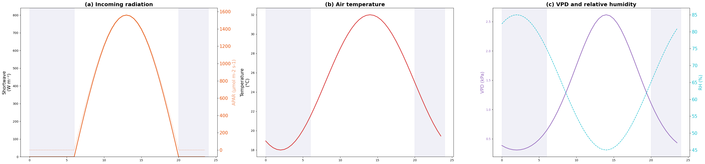
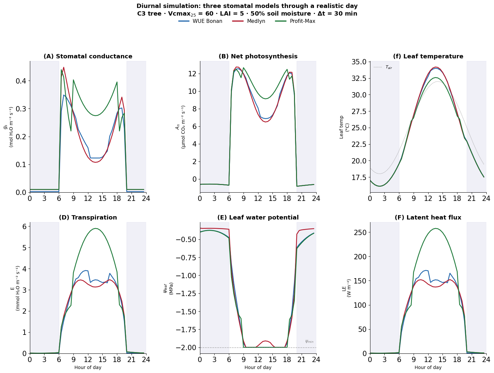

<!-- WARNING: THIS FILE WAS AUTOGENERATED! DO NOT EDIT! -->

::: {#5d006c0a .cell}
``` {.python .cell-code}
import copy
import numpy as np
import matplotlib.pyplot as plt
from pprint import pprint
from matplotlib.lines import Line2D
from plant_hydraulics.utils import satvap
from plant_hydraulics.root_parms import root_params
from plant_hydraulics.soil_params import soil_params
from plant_hydraulics.leaf_fluxes import leaf_fluxes
from plant_hydraulics.soil_resistance import soil_resistance
from plant_hydraulics.leaf_phys_params import leaf_phys_params
from plant_hydraulics.parameter_classes import (
    PhysCon,
    Params,
    Ground,
    Soil,
    RootVar,
    Leaf,
    Flux,
    Atmos,
)

from plant_hydraulics.utils import diurnal_temperature, diurnal_par, diurnal_relhum
```
:::


## 1. Set up soil and plant (time-invariant parts)

::: {#6530d41d .cell}
``` {.python .cell-code}
def setup_plant_and_soil():
    # General params ------------------------------------------------------------
    params = Params()
    physcon = PhysCon()

    # Root params ---------------------------------------------------------------
    rootvar = RootVar()
    rootvar = root_params(rootvar)

    # Soil params ---------------------------------------------------------------
    soil = Soil()

    # Loam
    soil.texture = 5
    soil = soil_params(soil)

    soil_frac = 0.50
    for each_soil_layer in range(soil.nlevsoi):
        vol = soil_frac * soil.watsat[each_soil_layer]
        soil.h2osoi_vol.append(vol)
        soil.psi.append(
            soil.psisat[each_soil_layer]
            * (vol / soil.watsat[each_soil_layer]) ** (-soil.bsw[each_soil_layer])
        )

    # Leaf params ---------------------------------------------------------------
    leaf = Leaf()
    leaf.c3psn = 1
    leaf.colim = 1
    leaf = leaf_phys_params(params, physcon, leaf)

    # Flux params ---------------------------------------------------------------
    flux = Flux()
    flux.height = 15.0
    rootvar.biomass = 500.0
    flux.lai = 5.0

    flux.rplant = 1.0 / leaf.gplant
    flux = soil_resistance(physcon, leaf, rootvar, soil, flux)
    flux.lsc = 1.0 / (flux.rsoil + flux.rplant)

    # Timestep = 30 minutes
    flux.dt = 30.0 * 60.0  # seconds

    return params, physcon, leaf, flux
```
:::


### Set up plant and soil objects

::: {#9bf98730 .cell}
``` {.python .cell-code}
pprint(setup_plant_and_soil())
```

::: {.cell-output .cell-output-stdout}
```
(Params(vis=0, nir=1),
 PhysCon(grav=9.80665,
         tfrz=273.15,
         sigma=5.67e-08,
         mmdry=0.02897,
         mmh2o=0.01802,
         cpd=1005.0,
         cpw=1846.0,
         rgas=8.31446,
         visc0=1.33e-05,
         Dh0=1.89e-05,
         Dv0=2.18e-05,
         Dc0=1.38e-05,
         denh2o=1000.0),
 Leaf(c3psn=1,
      colim=1,
      vcmax25=60.0,
      jmax25=100.19999999999999,
      rd25=0.8999999999999999,
      kc25=404.9,
      ko25=278.4,
      cp25=42.75,
      kcha=79430.0,
      koha=36380.0,
      cpha=37830.0,
      vcmaxha=65330.0,
      jmaxha=43540.0,
      rdha=46390.0,
      vcmaxhd=150000.0,
      jmaxhd=150000.0,
      rdhd=150000.0,
      vcmaxse=490.0,
      jmaxse=490.0,
      rdse=490.0,
      vcmaxc=np.float64(1.2068286010531608),
      jmaxc=np.float64(1.2068286010531608),
      rdc=np.float64(1.2068286010531608),
      phi_psii=0.85,
      theta_j=0.9,
      colim_c3=0.98,
      colim_c4a=0.8,
      colim_c4b=0.95,
      qe_c4=0.05,
      kp25_c4=0.0,
      dleaf=0.05,
      emiss=0.98,
      rho=[0.1, 0.4],
      tau=[0.1, 0.4],
      iota=750.0,
      capac=2500.0,
      minl_wp=-2.0,
      gplant=4.0,
      stomatal_model='optimization',
      g0=0.01,
      g1_medlyn=4.45,
      a_psi=4.0,
      psi_50=-2.5),
 Flux(height=15.0,
      lai=5.0,
      rplant=0.25,
      rsoil=np.float64(0.2501189655712912),
      lsc=np.float64(1.9995242509103597),
      psi_soil=np.float64(-0.19656231067350272),
      psi_leaf=0.0,
      et_loss=[np.float64(0.4095396351696566),
               np.float64(0.241817185048064),
               np.float64(0.22709106869325216),
               np.float64(0.07917398504781505),
               np.float64(0.0372269477272586),
               np.float64(0.004525039293622161),
               np.float64(0.0005500311641962397),
               np.float64(7.288256126632329e-05),
               np.float64(3.1776444437281276e-06),
               np.float64(4.6949970976737326e-08),
               np.float64(7.004544949034277e-10)],
      swinc=[0.0, 0.0],
      swflx=[0.0, 0.0],
      apar=0.0,
      qa=0.0,
      tleaf=0.0,
      rnet=0.0,
      lwrad=0.0,
      shflx=0.0,
      lhflx=0.0,
      etflx=0.0,
      gbh=0.0,
      gbv=0.0,
      gbc=0.0,
      gs=0.0,
      vcmax=0.0,
      jmax=0.0,
      cp=0.0,
      kc=0.0,
      ko=0.0,
      je=0.0,
      kp_c4=0.0,
      rd=0.0,
      ac=0.0,
      aj=0.0,
      ap=0.0,
      ag=0.0,
      an=0.0,
      cs=0.0,
      ci=0.0,
      hs=0.0,
      vpd=0.0,
      dt=1800.0))
```
:::
:::


::: {#78d6ccc9 .cell}
``` {.python .cell-code}
params, physcon, leaf, flux_template = setup_plant_and_soil()
```
:::


## 2. Set up atmosphere

::: {#7c1ac6d2 .cell}
``` {.python .cell-code}
def update_atmosphere(physcon, params, leaf, flux, hour):
    """
    Update atmospheric forcing for a given hour of the day.

    This is called at each timestep to set the time-varying boundary
    conditions: temperature, humidity, radiation.

    IMPORTANT: This modifies flux IN PLACE for radiation terms,
    and returns a new atmos object.
    """
    atmos = Atmos()

    # Constants -----------------------------------------------------------------

    # m/s
    atmos.wind = 1.0

    # Pa
    atmos.patm = 101325.0

    # µmol/mol
    atmos.co2air = 380.0

    # mmol/mol
    atmos.o2air = 209.0

    # Time-varying forcing ------------------------------------------------------
    tair_c = diurnal_temperature(hour)
    relhum = diurnal_relhum(hour)

    # W/m² total shortwave
    fsds = diurnal_par(hour)

    # K
    atmos.tair = physcon.tfrz + tair_c
    atmos.relhum = relhum

    # Vapor pressure from T and RH
    esat_air, _ = satvap(tair_c)
    atmos.eair = esat_air * (relhum / 100.0)

    # Derived atmospheric properties --------------------------------------------
    atmos.rhomol = atmos.patm / (physcon.rgas * atmos.tair)
    atmos.qair = (
        physcon.mmh2o
        / physcon.mmdry
        * atmos.eair
        / (atmos.patm - (1 - physcon.mmh2o / physcon.mmdry) * atmos.eair)
    )
    atmos.rhoair = (
        atmos.rhomol
        * physcon.mmdry
        * (1 - (1 - physcon.mmh2o / physcon.mmdry) * atmos.eair / atmos.patm)
    )
    atmos.mmair = atmos.rhoair / atmos.rhomol
    atmos.cpair = (
        physcon.cpd * (1 + (physcon.cpw / physcon.cpd - 1) * atmos.qair) * atmos.mmair
    )

    # Longwave sky radiation, varies with temperature ---------------------------

    # Simple approximation: clear-sky emissivity ≈ 0.7 + small T correction
    atmos.irsky = 0.70 * physcon.sigma * atmos.tair**4

    # Radiation absorbed by leaf ------------------------------------------------

    # VIS, NIR
    ground_albedo = [0.1, 0.2]

    atmos.swsky[params.vis] = 0.5 * fsds
    atmos.swsky[params.nir] = 0.5 * fsds

    tg = atmos.tair
    ground_lw = physcon.sigma * tg**4

    flux.swinc = [
        atmos.swsky[params.vis] * (1 + ground_albedo[params.vis]),
        atmos.swsky[params.nir] * (1 + ground_albedo[params.nir]),
    ]
    flux.swflx = [
        flux.swinc[0] * (1 - leaf.rho[0] - leaf.tau[0]),
        flux.swinc[1] * (1 - leaf.rho[1] - leaf.tau[1]),
    ]
    # µmol photons/m²/s
    flux.apar = flux.swflx[0] * 4.6

    flux.qa = flux.swflx[0] + flux.swflx[1] + leaf.emiss * (atmos.irsky + ground_lw)

    # Initial leaf temperature guess = air temperature
    flux.tleaf = atmos.tair

    return atmos
```
:::


## 3. Time-stepping loop

::: {#5687c879 .cell}
``` {.python .cell-code}
# Time axis: 0:00 to 23:30 in 30-min steps

# 30 minutes
dt_hours = 0.5

hours = np.arange(0.0, 24.0, dt_hours)

# 48 timesteps
n_steps = len(hours)
```
:::


## 4. Define gs models and create empty objects for storing results 

::: {#3e77741d .cell}
``` {.python .cell-code}
# Model definitions
models = {
    "optimization": {"label": "WUE Bonan", "color": "#2166ac", "marker": "o"},
    "medlyn": {"label": "Medlyn", "color": "#b2182b", "marker": "s"},
    "profit_max": {"label": "Profit-Max", "color": "#1b7837", "marker": "D"},
}
```
:::


::: {#fa27ec9a .cell}
``` {.python .cell-code}
# Storage for forcings (same for all models)
forcings = {
    # W/m²
    "par": np.zeros(n_steps),
    # °C
    "tair": np.zeros(n_steps),
    # %
    "rh": np.zeros(n_steps),
    # kPa
    "vpd": np.zeros(n_steps),
}

print(forcings)
```

::: {.cell-output .cell-output-stdout}
```
{'par': array([0., 0., 0., 0., 0., 0., 0., 0., 0., 0., 0., 0., 0., 0., 0., 0., 0.,
       0., 0., 0., 0., 0., 0., 0., 0., 0., 0., 0., 0., 0., 0., 0., 0., 0.,
       0., 0., 0., 0., 0., 0., 0., 0., 0., 0., 0., 0., 0., 0.]), 'tair': array([0., 0., 0., 0., 0., 0., 0., 0., 0., 0., 0., 0., 0., 0., 0., 0., 0.,
       0., 0., 0., 0., 0., 0., 0., 0., 0., 0., 0., 0., 0., 0., 0., 0., 0.,
       0., 0., 0., 0., 0., 0., 0., 0., 0., 0., 0., 0., 0., 0.]), 'rh': array([0., 0., 0., 0., 0., 0., 0., 0., 0., 0., 0., 0., 0., 0., 0., 0., 0.,
       0., 0., 0., 0., 0., 0., 0., 0., 0., 0., 0., 0., 0., 0., 0., 0., 0.,
       0., 0., 0., 0., 0., 0., 0., 0., 0., 0., 0., 0., 0., 0.]), 'vpd': array([0., 0., 0., 0., 0., 0., 0., 0., 0., 0., 0., 0., 0., 0., 0., 0., 0.,
       0., 0., 0., 0., 0., 0., 0., 0., 0., 0., 0., 0., 0., 0., 0., 0., 0.,
       0., 0., 0., 0., 0., 0., 0., 0., 0., 0., 0., 0., 0., 0.])}
```
:::
:::


::: {#49bfdccb .cell}
``` {.python .cell-code}
# Storage for model outputs
results = {}
for each_gs_model in models:
    results[each_gs_model] = {
        "gs": np.zeros(n_steps),
        "an": np.zeros(n_steps),
        "tleaf": np.zeros(n_steps),
        "etflx": np.zeros(n_steps),
        "psi_leaf": np.zeros(n_steps),
        "lhflx": np.zeros(n_steps),
        "gplant": np.zeros(n_steps),
    }
```
:::


## 5. Create forcings 

::: {#23637567 .cell}
``` {.python .cell-code}
# Record forcing first (for plotting)
for each_i, hour in enumerate(hours):
    tair_c = diurnal_temperature(hour)

    rh = diurnal_relhum(hour)

    # VPD
    esat, _ = satvap(tair_c)
    forcings["vpd"][each_i] = esat * (1.0 - rh / 100.0) / 1000.0

    # PAR
    forcings["par"][each_i] = diurnal_par(hour)

    # Temperature air
    forcings["tair"][each_i] = tair_c

    # Relative humidity
    forcings["rh"][each_i] = rh
```
:::


::: {#41b51118 .cell}
``` {.python .cell-code}
print("Forcing summary:")
print(f"  Temperature: {forcings['tair'].min():.1f} - {forcings['tair'].max():.1f} °C")
print(f"  RH:          {forcings['rh'].min():.1f} - {forcings['rh'].max():.1f} %")
print(f"  VPD:         {forcings['vpd'].min():.2f} - {forcings['vpd'].max():.2f} kPa")
print(f"  PAR peak:    {forcings['par'].max():.0f} W/m²")
```

::: {.cell-output .cell-output-stdout}
```
Forcing summary:
  Temperature: 18.0 - 32.0 °C
  RH:          45.0 - 85.0 %
  VPD:         0.31 - 2.62 kPa
  PAR peak:    800 W/m²
```
:::
:::


### Plot forcings

::: {#0c8b2548 .cell}

::: {.cell-output .cell-output-display}
{}
:::
:::


## 6. Run the models

::: {#30b839f1 .cell}
``` {.python .cell-code}
for each_model in models:
    print(f"  Running {each_model} model...", end="", flush=True)

    # Fresh flux for this model's run -------------------------------------------
    flux = copy.deepcopy(flux_template)
    leaf_m = copy.deepcopy(leaf)

    # Initial conditions at midnight --------------------------------------------
    # psi_leaf at midnight: equilibrated with soil (near psi_soil)
    # This is the predawn water potential,  Slightly below psi_soil
    flux.psi_leaf = flux.psi_soil - 0.05

    # Edit leaf model string ----------------------------------------------------
    leaf_m.stomatal_model = each_model

    # Run the model -------------------------------------------------------------
    for each_i, each_half_hour in enumerate(hours):
        # a) Update atmospheric forcing for this timestep
        atmos = update_atmosphere(physcon, params, leaf_m, flux, each_half_hour)

        # b) Run the stomatal model
        #    This internally solves:
        #    boundary layer → energy balance → photosynthesis → water potential

        #    The water potential calculation uses flux.psi_leaf (from previous
        #    timestep) and flux.dt (30 min) to compute the new psi_leaf.
        flux = leaf_fluxes(physcon, atmos, leaf_m, flux)

        # c) Store results
        results[each_model]["gs"][each_i] = flux.gs
        results[each_model]["an"][each_i] = flux.an

        # Convert from C to K
        results[each_model]["tleaf"][each_i] = flux.tleaf - physcon.tfrz

        # Convert to mmol/m²/s
        results[each_model]["etflx"][each_i] = flux.etflx * 1000
        results[each_model]["lhflx"][each_i] = flux.lhflx

        # d) psi_leaf carries over to next timestep
        #
        #    The flux object already has
        #    the updated psi_leaf from leaf_fluxes(). When the next
        #    timestep calls leaf_water_potential(), it will use this
        #    value as y0 (the "current water level in the bathtub").
        #
        #    Similarly, tleaf carries over as the initial guess for
        #    the Newton-Raphson energy balance solver.
        results[each_model]["psi_leaf"][each_i] = flux.psi_leaf
```

::: {.cell-output .cell-output-stdout}
```
  Running optimization model...  Running medlyn model...  Running profit_max model...
```
:::
:::


### Plot model results

::: {#18c4fe3d .cell}

::: {.cell-output .cell-output-display}
{}
:::
:::


