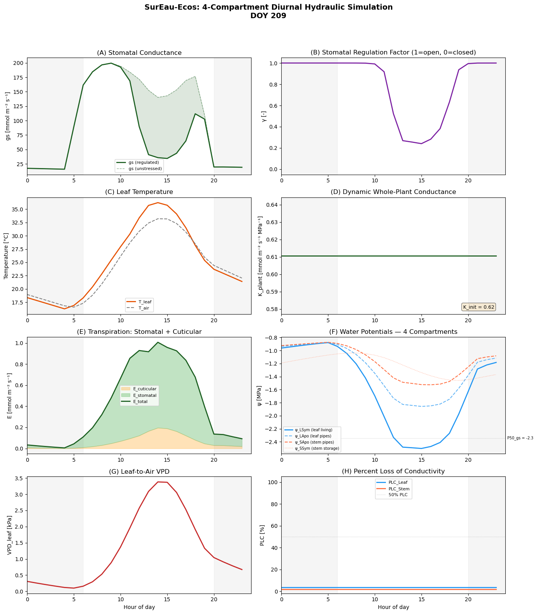

<!-- WARNING: THIS FILE WAS AUTOGENERATED! DO NOT EDIT! -->

## Load modules

::: {#00deb99d .cell}
``` {.python .cell-code}
import copy
import numpy as np
import matplotlib.pyplot as plt
```
:::


::: {#3aea328b .cell}
``` {.python .cell-code}
from plant_hydraulics.run_sureau import run_sureau
from plant_hydraulics.parameter_classes import (
    SurEauVegetationParams,
    SurEauSoilParams,
    SurEauModelOptions,
)
```

::: {.cell-output .cell-output-error}

::: {.ansi-escaped-output}
```{=html}
<pre><span class="ansi-red-fg">---------------------------------------------------------------------------</span>
<span class="ansi-red-fg">ModuleNotFoundError</span>                       Traceback (most recent call last)
<span class="ansi-cyan-fg">Cell</span><span class="ansi-cyan-fg"> </span><span class="ansi-green-fg">In[2]</span><span class="ansi-green-fg">, line 1</span>
<span class="ansi-green-fg">----&gt; </span><span class="ansi-green-fg">1</span> <span style="font-weight:bold;color:rgb(0,135,0)">from</span><span style="color:rgb(188,188,188)"> </span><span class="ansi-blue-fg ansi-bold">plant_hydraulics</span><span class="ansi-blue-fg ansi-bold">.</span><span class="ansi-blue-fg ansi-bold">run_sureau</span><span style="color:rgb(188,188,188)"> </span><span style="font-weight:bold;color:rgb(0,135,0)">import</span> run_sureau
<span class="ansi-green-fg">      2</span> <span style="font-weight:bold;color:rgb(0,135,0)">from</span><span style="color:rgb(188,188,188)"> </span><span class="ansi-blue-fg ansi-bold">plant_hydraulics</span><span class="ansi-blue-fg ansi-bold">.</span><span class="ansi-blue-fg ansi-bold">parameter_classes</span><span style="color:rgb(188,188,188)"> </span><span style="font-weight:bold;color:rgb(0,135,0)">import</span> (
<span class="ansi-green-fg">      3</span>     SurEauVegetationParams,
<span class="ansi-green-fg">      4</span>     SurEauSoilParams,
<span class="ansi-green-fg">      5</span>     SurEauModelOptions,
<span class="ansi-green-fg">      6</span> )

<span class="ansi-red-fg">ModuleNotFoundError</span>: No module named 'plant_hydraulics'</pre>
```
:::

:::
:::


## Climate

::: {#7804bfc4 .cell}
``` {.python .cell-code}
from plant_hydraulics.utils import (
    load_example_data,
)
```
:::


::: {#1f8aa1e4 .cell}
``` {.python .cell-code}
climate_df = load_example_data("climat_example.csv", sep=";")
```
:::


## Initialize soil parameters

::: {#b7d96900 .cell}
``` {.python .cell-code}
soil_params = SurEauSoilParams()
 

soil_params.depth = np.array([0.2, 0.8, 2.0])
soil_params.RFC = np.array([75, 75, 75])
```
:::


## Initialize vegetation parameters

::: {#3cbc301a .cell}
``` {.python .cell-code}
# Create with defaults (Q. ilex)
veg_params = SurEauVegetationParams()
```
:::


::: {#d4e6b9da .cell}
``` {.python .cell-code}
# Leaf area index (m²/m²). Higher = more transpiration.
veg_params.LAI_max = 4.5       
veg_params.foliage = "Evergreen"  
veg_params.transpiration_model = "Jarvis"  

# ψ at 50% loss of leaf conductance (MPa) 
veg_params.P50_VC_leaf = -3.4

# ψ at 50% loss of stem conductance (MPa)   
veg_params.P50_VC_stem = -3.4

# Steepness of vulnerability sigmoid (%/MPa)   
veg_params.slope_VC_leaf = 60   

# ψ at 12% stomatal closure (MPa)
veg_params.P12_gs = -2.07

# ψ at 88% stomatal closure (MPa)       
veg_params.P88_gs = -2.62       

# Whole-plant conductance (mmol/m²/s/MPa)
veg_params.k_plant_init = 0.62  

# At 20°C (mmol/m²/s)
veg_params.gmin20 = 4.0

# Temperature where cuticle melts (°C)         
veg_params.TPhase_gmin = 37.5

# Q10 above TPhase    
veg_params.Q10_2_gmin = 4.8
```
:::


## Set modeling options

::: {#bedbf66e .cell}
``` {.python .cell-code}
opts = SurEauModelOptions(
    # Simulation period — must match years in the climate DataFrame
    year_start=1990,
    year_end=1990,
 
    # Site location — used for daylength and solar geometry
    # 43.9°N = southern France (Montpellier area)
    latitude=43.9,
 
    # Elevation affects psychrometric constant in ETP calculation
    elevation=0,
 
    # Print progress to console
    print_progress=True,
)
```
:::


## Run the model

::: {#bc1401ed .cell}
``` {.python .cell-code}
results = run_sureau(
    climate_df=climate_df,
    veg_params=veg_params,
    soil_params=soil_params,
    opts=opts,
    deep_water=False,  # Set True to keep deepest layer at field capacity
)
```

::: {.cell-output .cell-output-stdout}
```
Year 1990 Day   2Year 1990 complete. 
```
:::
:::


##  Plot results 

::: {#1771f210 .cell}

::: {.cell-output .cell-output-stdout}
```
  Plotting DOY 209 (July 28, 1990)
  Hours available: 24
  Min ψ_LSym this day: -2.503 MPa
  Min regul_fact: 0.241
```
:::

::: {.cell-output .cell-output-display}
{}
:::
:::


