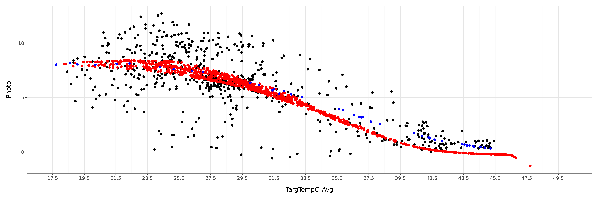
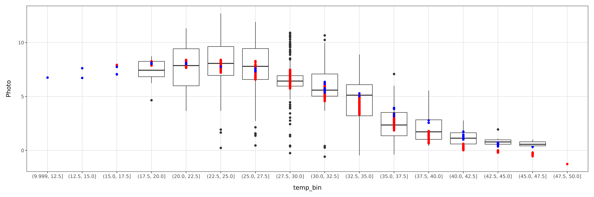
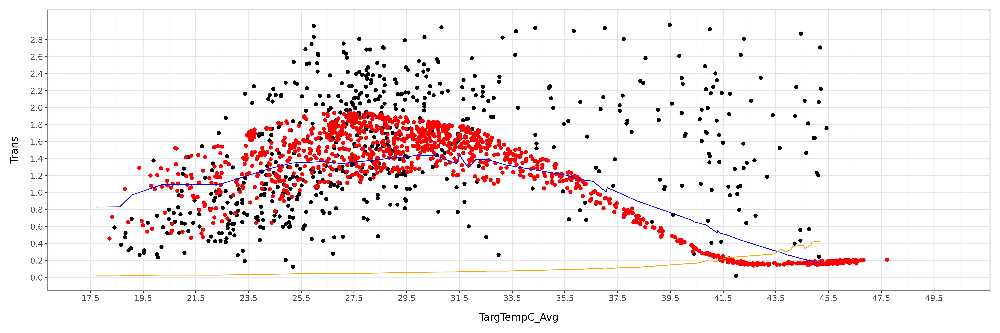
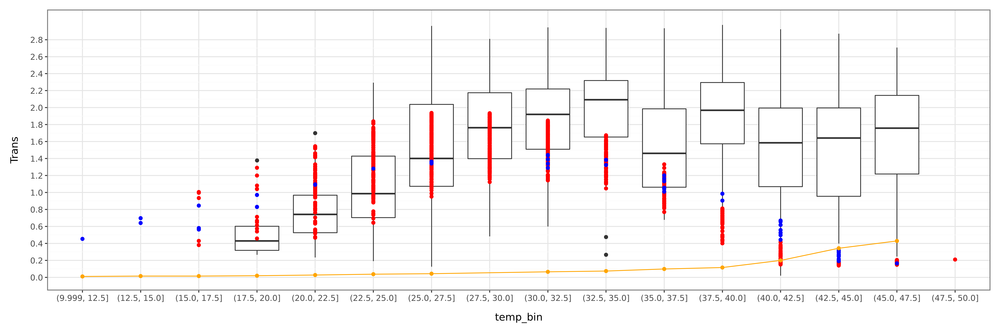
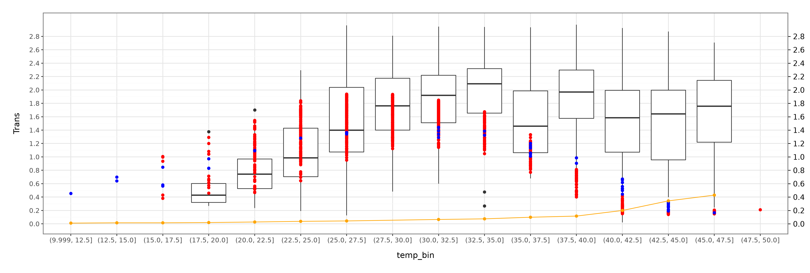
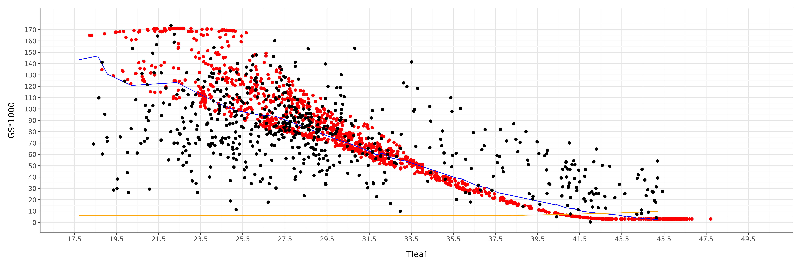

<!-- WARNING: THIS FILE WAS AUTOGENERATED! DO NOT EDIT! -->

## Load modules

::: {#00deb99d .cell execution_count=3}
``` {.python .cell-code}
from siuba import *
from plotnine import *
from plotnine import *
import numpy as np, pandas as pd
from itables import to_html_datatable
from IPython.display import HTML, display
```
:::


::: {#3aea328b .cell execution_count=4}
``` {.python .cell-code}
from plant_hydraulics.run_sureau import run_sureau
from plant_hydraulics.sureau_climate import *  
from plant_hydraulics.utils import potential_PAR
from plant_hydraulics.parameter_classes import (
    SurEauVegetationParams,
    SurEauSoilParams,
    SurEauModelOptions,
)

from plant_hydraulics.utils import (
    load_example_data,
)
```
:::


# Object initialization

::: {#fc94ce6e .cell execution_count=5}
``` {.python .cell-code}
# Model options
opts = SurEauModelOptions(
    
    # Richmond
    latitude=-33.5996,
    
    # Meters above sea level
    elevation = 24,
    
    # net radiation model: "Linacre" (only option currently)
    Rn_formulation="Linacre",
    
    # PET model: "PT" (Priestley-Taylor) or "PM" (Penman-Monteith)
    ETP_formulation="PT",
    
    # True → forces a fixed doy=116 (sunny day template)
    constant_climate = False,
    # which hours to output (0–23 → full day)
    time_steps=np.arange(24),
    
    # Print progress to console
    print_progress=True,
    
    year_start=2016,
    year_end=2016
)
```
:::


::: {#6644693f .cell execution_count=6}
``` {.python .cell-code}
# Vegetation parameters
veg_params = SurEauVegetationParams()

# Leaf area index (m²/m²). Higher = more transpiration.
veg_params.LAI_max = 6
  
veg_params.foliage = "Evergreen"  

veg_params.transpiration_model = "Medlyn"

veg_params.g_crown0 = 1e6 


# Params from Drake 
veg_params.vcmax25 = 34
veg_params.vcmaxha = 51780
veg_params.vcmaxhd = 2e5
veg_params.vcmaxse = 640

veg_params.jmax25 = 60
veg_params.jmaxha = 21640
veg_params.jmaxhd = 2e5
veg_params.jmaxse = 633

veg_params.g1_medlyn = 2.9
veg_params.g0_medlyn = 0.00000001

# ψ at 50% loss of leaf conductance (MPa) 
veg_params.P50_VC_leaf = -3.89

# ψ at 50% loss of stem conductance (MPa)   
veg_params.P50_VC_stem = -3.89

# Steepness of vulnerability sigmoid (%/MPa)   
veg_params.slope_VC_leaf = 50   

# ψ at 12% stomatal closure (MPa)
veg_params.P12_gs = -2.18

# ψ at 88% stomatal closure (MPa)       
veg_params.P88_gs = -4       

# Whole-plant conductance (mmol/m²/s/MPa)
veg_params.k_plant_init = 100  

# At 20°C (mmol/m²/s)
veg_params.gmin20 = 4.0

# Temperature where cuticle melts (°C)         
veg_params.TPhase_gmin = 38


!!! Calculate DEhydration Q10
veg_params.Q10_1_gmin = 1
# Q10 above TPhase    
veg_params.Q10_2_gmin = 3
veg_params.gmin20 = 3
```
:::


::: {#3789b8ee .cell execution_count=7}
``` {.python .cell-code}
soil_params = SurEauSoilParams()
```
:::


## Climate

SurEau takes daily climatic data and then creates a hourly dataset 

::: {#1f8aa1e4 .cell execution_count=8}
``` {.python .cell-code}
climate_df = load_example_data("sureau_medlyn_daily_climate.csv", sep=",")
#climate_df["DATE"] = pd.to_datetime(climate_df["DATE"], format="%d/%m/%Y").dt.strftime("%Y-%m-%d")
html_str = to_html_datatable(climate_df)
display(HTML(html_str))
```

::: {.cell-output .cell-output-display}
```{=html}
<!--| quarto-html-table-processing: none -->
<table id="itables_326f3f9e_c8a6_47d3_900c_e6d5502238a9">
  <tbody>
    <tr>
      <td style="vertical-align:middle; text-align:left"><a href=https://mwouts.github.io/itables/><svg class="main-svg" xmlns="http://www.w3.org/2000/svg" xmlns:xlink="http://www.w3.org/1999/xlink"
width="64" viewBox="0 0 500 400" style="font-family: 'Droid Sans', sans-serif;">
    <g style="fill:#d9d7fc">
        <path d="M100,400H500V357H100Z" />
        <path d="M100,300H400V257H100Z" />
        <path d="M0,200H400V157H0Z" />
        <path d="M100,100H500V57H100Z" />
        <path d="M100,350H500V307H100Z" />
        <path d="M100,250H400V207H100Z" />
        <path d="M0,150H400V107H0Z" />
        <path d="M100,50H500V7H100Z" />
    </g>
    <g style="fill:#1a1366;stroke:#1a1366;">
   <rect x="100" y="7" width="400" height="43">
    <animate
      attributeName="width"
      values="0;400;0"
      dur="5s"
      repeatCount="indefinite" />
      <animate
      attributeName="x"
      values="100;100;500"
      dur="5s"
      repeatCount="indefinite" />
  </rect>
        <rect x="0" y="107" width="400" height="43">
    <animate
      attributeName="width"
      values="0;400;0"
      dur="3.5s"
      repeatCount="indefinite" />
    <animate
      attributeName="x"
      values="0;0;400"
      dur="3.5s"
      repeatCount="indefinite" />
  </rect>
        <rect x="100" y="207" width="300" height="43">
    <animate
      attributeName="width"
      values="0;300;0"
      dur="3s"
      repeatCount="indefinite" />
    <animate
      attributeName="x"
      values="100;100;400"
      dur="3s"
      repeatCount="indefinite" />
  </rect>
        <rect x="100" y="307" width="400" height="43">
    <animate
      attributeName="width"
      values="0;400;0"
      dur="4s"
      repeatCount="indefinite" />
      <animate
      attributeName="x"
      values="100;100;500"
      dur="4s"
      repeatCount="indefinite" />
  </rect>
        <g style="fill:transparent;stroke-width:8; stroke-linejoin:round" rx="5">
            <g transform="translate(45 50) rotate(-45)">
                <circle r="33" cx="0" cy="0" />
                <rect x="-8" y="32" width="16" height="30" />
            </g>

            <g transform="translate(450 152)">
                <polyline points="-15,-20 -35,-20 -35,40 25,40 25,20" />
                <rect x="-15" y="-40" width="60" height="60" />
            </g>

            <g transform="translate(50 352)">
                <polygon points="-35,-5 0,-40 35,-5" />
                <polygon points="-35,10 0,45 35,10" />
            </g>

            <g transform="translate(75 250)">
                <polyline points="-30,30 -60,0 -30,-30" />
                <polyline points="0,30 -30,0 0,-30" />
            </g>

            <g transform="translate(425 250) rotate(180)">
                <polyline points="-30,30 -60,0 -30,-30" />
                <polyline points="0,30 -30,0 0,-30" />
            </g>
        </g>
    </g>
</svg>
</a>
        Loading ITables v2.8.1 from the internet...
        (need <a href=https://mwouts.github.io/itables/troubleshooting.html>help</a>?)
      </td>
    </tr>
  </tbody>
</table>
<link href="https://www.unpkg.com/dt_for_itables@2.5.5/dt_bundle.css" rel="stylesheet">
<script type="module">
    import { ITable, jQuery as $ } from 'https://www.unpkg.com/dt_for_itables@2.5.5/dt_bundle.js';

    document.querySelectorAll("#itables_326f3f9e_c8a6_47d3_900c_e6d5502238a9:not(.dataTable)").forEach(table => {
        if (!(table instanceof HTMLTableElement))
            return;

        let dt_args = {
          "classes": ["display", "nowrap", "compact"],
          "columnDefs": [{"render": "function (data, type, row, meta) { return type === 'sort' || type === 'type' ? data[1] : data[0]; }", "targets": [6, 7, 8, 9, 10, 11, 12, 13, 14]}],
          "data_json": "[[0, \"2016-10-31\", 2016, 305, 31, 10, [\"25.518748\", 25.51874826369701], [\"43.147285\", 43.1472845077515], [\"13.218052\", 13.218052307764664], [\"53.935986\", 53.935985816029216], [\"68.834596\", 68.83459564824898], [\"43.711676\", 43.71167632717755], [\"21.237586\", 21.237585714285714], [\"0.0\", 0.0], [\"8.0\", 8.0]], [1, \"2016-11-01\", 2016, 306, 1, 11, [\"24.538532\", 24.53853201634355], [\"43.321539\", 43.321539402008085], [\"11.559534\", 11.559533635775251], [\"58.624663\", 58.62466338743184], [\"76.932580\", 76.93257971236761], [\"38.805203\", 38.80520251869937], [\"22.283031\", 22.283031428571427], [\"0.0\", 0.0], [\"8.0\", 8.0]], [2, \"2016-11-02\", 2016, 307, 2, 11, [\"26.874244\", 26.874243713481714], [\"43.284559\", 43.28455946180555], [\"14.650036\", 14.6500355667538], [\"56.231498\", 56.23149841936749], [\"76.952202\", 76.95220211037558], [\"33.007275\", 33.00727536307161], [\"23.161671\", 23.161671428571427], [\"0.0\", 0.0], [\"8.0\", 8.0]], [3, \"2016-11-03\", 2016, 308, 3, 11, [\"28.133112\", 28.13311202355005], [\"43.679960\", 43.679959721035424], [\"15.558231\", 15.558231009377366], [\"57.316386\", 57.31638575664254], [\"79.238667\", 79.23866708246983], [\"34.797509\", 34.79750892380154], [\"22.657393\", 22.657392857142856], [\"0.0\", 0.0], [\"8.0\", 8.0]]]",
          "keys_to_be_evaluated": [["columnDefs", 0, "render"]],
          "layout": {"bottomEnd": null, "bottomStart": null, "topEnd": null, "topStart": null},
          "order": [],
          "style": {"caption-side": "bottom", "margin": "auto", "table-layout": "auto", "width": "auto"},
          "table_html": "<table><thead>\n    <tr style=\"text-align: right;\">\n      \n      <th>Unnamed: 0</th>\n      <th>DATE</th>\n      <th>Year</th>\n      <th>DOY</th>\n      <th>Day</th>\n      <th>Month</th>\n      <th>Tair_mean</th>\n      <th>Tair_max</th>\n      <th>Tair_min</th>\n      <th>RHair_mean</th>\n      <th>RHair_max</th>\n      <th>RHair_min</th>\n      <th>RG_sum</th>\n      <th>PPT_sum</th>\n      <th>WS_mean</th>\n    </tr>\n  </thead></table>",
          "text_in_header_can_be_selected": true
        };
        new ITable(table, dt_args);
    });
</script>
```
:::
:::


### Explore climatic data

::: {#4ea0b3df .cell execution_count=9}
``` {.python .cell-code}
hourly_data_from_daily = []
for each_day in range(len(climate_df)):
    
    # Get date 
    date_str = str(climate_df.iloc[each_day]["DATE"])              
   
    # Calculate climate for that day
    clim = new_climate_day(climate_df, date_str)
    
    # Compute PET for that day
    clim = compute_Rn_and_ETP(clim, veg_params, opts)
    
    # Create hourly climate from daily conditions     
    ch   = new_climate_hourly(clim, opts, veg_params)    
    
    #Show data in ch
    #print("ch.__dict__ keys:", list(vars(ch).keys()))
    
    # Put everything into frame that works for Sureau
    hourly_data_from_daily.append(pd.DataFrame({
        "Doy":    int(climate_df.iloc[each_day]["DOY"]),
        "hour":   np.asarray(ch.time, float),
        "RG":     np.asarray(ch.RG, float), 
        "RH":     np.asarray(ch.RH_air_mean, float),           
        "PAR_d":  np.asarray(ch.PAR, float),
        "Tair_d": np.asarray(ch.T_air_mean, float),
        "VPD_d":  np.asarray(ch.VPD, float),
    }))
hourly_data_from_daily = pd.concat(hourly_data_from_daily, ignore_index=True)
```
:::


## Run the model

::: {#bc1401ed .cell execution_count=10}
``` {.python .cell-code}
results = run_sureau(
    climate_df=climate_df,
    veg_params=veg_params,
    soil_params=soil_params,
    opts=opts,
    
    # Set True to keep deepest layer at field capacity
    deep_water=False,  
)
```

::: {.cell-output .cell-output-stdout}
```
Year 2016 Day 305
Year 2016 Day 306
Year 2016 Day 307
Year 2016 Day 308
Year 2016 complete. 
```
:::
:::


::: {#8e04cd52 .cell execution_count=11}
``` {.python .cell-code}
results = results  >> filter(_.PAR > 0) >> mutate(e_total = _["E_lim"] + _["E_min"]) >> \
    mutate(gres = _["gmin"] + _["gmin_S"])
```
:::


::: {#48af42d7 .cell execution_count=12}
``` {.python .cell-code}
html_str = to_html_datatable(results)
display(HTML(html_str))
```

::: {.cell-output .cell-output-display}
```{=html}
<!--| quarto-html-table-processing: none -->
<table id="itables_1ec59b95_5d2a_4169_b2fd_990ab97e0b07">
  <tbody>
    <tr>
      <td style="vertical-align:middle; text-align:left"><a href=https://mwouts.github.io/itables/><svg class="main-svg" xmlns="http://www.w3.org/2000/svg" xmlns:xlink="http://www.w3.org/1999/xlink"
width="64" viewBox="0 0 500 400" style="font-family: 'Droid Sans', sans-serif;">
    <g style="fill:#d9d7fc">
        <path d="M100,400H500V357H100Z" />
        <path d="M100,300H400V257H100Z" />
        <path d="M0,200H400V157H0Z" />
        <path d="M100,100H500V57H100Z" />
        <path d="M100,350H500V307H100Z" />
        <path d="M100,250H400V207H100Z" />
        <path d="M0,150H400V107H0Z" />
        <path d="M100,50H500V7H100Z" />
    </g>
    <g style="fill:#1a1366;stroke:#1a1366;">
   <rect x="100" y="7" width="400" height="43">
    <animate
      attributeName="width"
      values="0;400;0"
      dur="5s"
      repeatCount="indefinite" />
      <animate
      attributeName="x"
      values="100;100;500"
      dur="5s"
      repeatCount="indefinite" />
  </rect>
        <rect x="0" y="107" width="400" height="43">
    <animate
      attributeName="width"
      values="0;400;0"
      dur="3.5s"
      repeatCount="indefinite" />
    <animate
      attributeName="x"
      values="0;0;400"
      dur="3.5s"
      repeatCount="indefinite" />
  </rect>
        <rect x="100" y="207" width="300" height="43">
    <animate
      attributeName="width"
      values="0;300;0"
      dur="3s"
      repeatCount="indefinite" />
    <animate
      attributeName="x"
      values="100;100;400"
      dur="3s"
      repeatCount="indefinite" />
  </rect>
        <rect x="100" y="307" width="400" height="43">
    <animate
      attributeName="width"
      values="0;400;0"
      dur="4s"
      repeatCount="indefinite" />
      <animate
      attributeName="x"
      values="100;100;500"
      dur="4s"
      repeatCount="indefinite" />
  </rect>
        <g style="fill:transparent;stroke-width:8; stroke-linejoin:round" rx="5">
            <g transform="translate(45 50) rotate(-45)">
                <circle r="33" cx="0" cy="0" />
                <rect x="-8" y="32" width="16" height="30" />
            </g>

            <g transform="translate(450 152)">
                <polyline points="-15,-20 -35,-20 -35,40 25,40 25,20" />
                <rect x="-15" y="-40" width="60" height="60" />
            </g>

            <g transform="translate(50 352)">
                <polygon points="-35,-5 0,-40 35,-5" />
                <polygon points="-35,10 0,45 35,10" />
            </g>

            <g transform="translate(75 250)">
                <polyline points="-30,30 -60,0 -30,-30" />
                <polyline points="0,30 -30,0 0,-30" />
            </g>

            <g transform="translate(425 250) rotate(180)">
                <polyline points="-30,30 -60,0 -30,-30" />
                <polyline points="0,30 -30,0 0,-30" />
            </g>
        </g>
    </g>
</svg>
</a>
        Loading ITables v2.8.1 from the internet...
        (need <a href=https://mwouts.github.io/itables/troubleshooting.html>help</a>?)
      </td>
    </tr>
  </tbody>
</table>
<link href="https://www.unpkg.com/dt_for_itables@2.5.5/dt_bundle.css" rel="stylesheet">
<script type="module">
    import { ITable, jQuery as $ } from 'https://www.unpkg.com/dt_for_itables@2.5.5/dt_bundle.js';

    document.querySelectorAll("#itables_1ec59b95_5d2a_4169_b2fd_990ab97e0b07:not(.dataTable)").forEach(table => {
        if (!(table instanceof HTMLTableElement))
            return;

        let dt_args = {
          "classes": ["display", "nowrap", "compact"],
          "columnDefs": [{"render": "function (data, type, row, meta) { return type === 'sort' || type === 'type' ? data[1] : data[0]; }", "targets": [3, 4, 5, 6, 7, 8, 9, 10, 11, 12, 13, 14, 15, 16, 17, 18, 19, 20, 21, 22, 23, 24, 25, 26, 27, 28, 29, 30, 31, 32, 33, 34, 35, 36, 37, 38, 39]}],
          "data_json": "[[6, 2016, 305, [\"6.0\", 6.0], [\"13.686079\", 13.6860793219662], [\"0.494492\", 0.4944916915930005], [\"252.266514\", 252.2665143173277], [\"-0.033614\", -0.03361368139934798], [\"-0.033587\", -0.03358659906635872], [\"-0.033668\", -0.03366782204532849], [\"-0.058308\", -0.058308002935652394], [\"-0.033507\", -0.03350674166285918], [\"0.044688\", 0.04468803746244365], [\"0.009559\", 0.009558565968351791], [\"6.0\", 6.0], [\"99.987236\", 99.98723623413862], [\"127.078450\", 127.07845025085668], [\"3.000000\", 3.0], [\"3.0\", 3.0], [\"5024.226746\", 5024.2267464755205], [\"3.482202e+06\", 3482202.2531844964], [\"0.503476\", 0.5034764946746638], [\"0.640411\", 0.6404111582799957], [\"0.015492\", 0.01549216543754842], [\"0.641167\", 0.6411668307686346], [\"0.259563\", 0.25956337215708175], [\"0.998792\", 0.9987915572737884], [\"13.780309\", 13.780309389328302], [\"75.299229\", 75.29922947340827], [\"1.0\", 1.0], [\"245.744863\", 245.7448633477127], [\"0.978733\", 0.9787326248283884], [\"0.002150\", 0.0021496111596145773], [\"0.0\", 0.0], [\"6.715044\", 6.715044103142563], [\"332.138751\", 332.1387511372374], [\"415.0\", 415.0], [\"127.232203\", 127.23220308121003], [\"0.655903\", 0.6559033237175441], [\"6.000000\", 6.0]], [7, 2016, 305, [\"7.0\", 7.0], [\"15.845921\", 15.845921166146127], [\"0.601096\", 0.6010959952688723], [\"603.307786\", 603.3077859036506], [\"-0.037818\", -0.037818442430666906], [\"-0.036452\", -0.03645234274280789], [\"-0.040549\", -0.04054942825688874], [\"-0.062025\", -0.0620249169647047], [\"-0.033695\", -0.03369451064349068], [\"0.045065\", 0.045065257037001545], [\"0.009625\", 0.009624527977199131], [\"6.0\", 6.0], [\"99.987134\", 99.9871343587141], [\"133.818698\", 133.81869820478954], [\"3.000000\", 3.0], [\"3.0\", 3.0], [\"5024.226746\", 5024.2267464755205], [\"3.482202e+06\", 3482202.2531844964], [\"0.649526\", 0.6495261064098777], [\"0.845541\", 0.8455409284302303], [\"0.019450\", 0.019449644203177678], [\"0.846553\", 0.8465525270840639], [\"0.341837\", 0.3418370032618654], [\"0.998773\", 0.998773163970993], [\"16.268969\", 16.2689685378252], [\"75.273401\", 75.27340071614475], [\"1.0\", 1.0], [\"245.469290\", 245.46929027153726], [\"0.975969\", 0.9759685113926156], [\"0.007548\", 0.007547619159860202], [\"0.0\", 0.0], [\"7.737112\", 7.7371120744678565], [\"324.337309\", 324.33730921591103], [\"415.0\", 415.0], [\"133.983073\", 133.98307346659544], [\"0.864991\", 0.864990572633408], [\"6.000000\", 6.0]], [8, 2016, 305, [\"8.0\", 8.0], [\"19.509324\", 19.509324374957703], [\"0.827097\", 0.8270968574427838], [\"930.426175\", 930.4261749544959], [\"-0.043375\", -0.043375278747589154], [\"-0.041437\", -0.04143735460109896], [\"-0.047249\", -0.04724939026398615], [\"-0.067920\", -0.0679204247382671], [\"-0.037535\", -0.03753537863176054], [\"0.045569\", 0.04556866147920347], [\"0.009740\", 0.009740356393611586], [\"6.0\", 6.0], [\"99.986987\", 99.98698728424051], [\"120.734066\", 120.73406591278214], [\"3.000000\", 3.0], [\"3.0\", 3.0], [\"5024.226746\", 5024.2267464755205], [\"3.482202e+06\", 3482202.2531844964], [\"0.925860\", 0.9258600848900435], [\"1.091296\", 1.0912960624783328], [\"0.027752\", 0.027752489306757465], [\"1.092624\", 1.092624426328314], [\"0.442693\", 0.4426934216495079], [\"0.998755\", 0.9987549875704527], [\"20.205152\", 20.20515210326797], [\"75.248218\", 75.24821755779533], [\"1.0\", 1.0], [\"245.079505\", 245.07950453741176], [\"0.973226\", 0.9732262577557232], [\"0.010565\", 0.010565443171991843], [\"0.0\", 0.0], [\"7.998716\", 7.998715701148111], [\"311.115908\", 311.1159080312657], [\"415.0\", 415.0], [\"120.884569\", 120.8845687033583], [\"1.119049\", 1.1190485517850903], [\"6.000000\", 6.0]], [9, 2016, 305, [\"9.0\", 9.0], [\"24.229806\", 24.229805655847308], [\"1.223245\", 1.2232453426585037], [\"1211.329104\", 1211.329103844747], [\"-0.048609\", -0.04860864185499961], [\"-0.046116\", -0.046115608473862306], [\"-0.053592\", -0.05359244594635234], [\"-0.077415\", -0.07741508144988728], [\"-0.041099\", -0.04109875359828759], [\"0.046048\", 0.04604790021041529], [\"0.009850\", 0.009850324681296546], [\"6.0\", 6.0], [\"99.986847\", 99.9868473892989], [\"98.736140\", 98.73614047401115], [\"3.000000\", 3.0], [\"3.0\", 3.0], [\"5024.226746\", 5024.2267464755205], [\"3.482202e+06\", 3482202.2531844964], [\"1.393227\", 1.393226509792852], [\"1.347513\", 1.3475130953792513], [\"0.041724\", 0.04172367373268071], [\"1.349184\", 1.3491835222769475], [\"0.551386\", 0.5513862343702355], [\"0.998738\", 0.9987375316439742], [\"25.153617\", 25.15361715306072], [\"75.224380\", 75.2243795769897], [\"1.0\", 1.0], [\"244.578313\", 244.57831330927718], [\"0.969360\", 0.9693604924977923], [\"0.013622\", 0.013621592260735116], [\"0.0\", 0.0], [\"7.591026\", 7.591025816321892], [\"294.447743\", 294.44774334289554], [\"415.0\", 415.0], [\"98.860949\", 98.86094929414168], [\"1.389237\", 1.389236769111932], [\"6.000000\", 6.0]], [10, 2016, 305, [\"10.0\", 10.0], [\"29.432049\", 29.43204858728103], [\"1.840152\", 1.8401519118204965], [\"1426.873502\", 1426.8735021845707], [\"-0.054747\", -0.05474685525205338], [\"-0.051808\", -0.05180752684233513], [\"-0.060623\", -0.060622816229987254], [\"-0.092531\", -0.09253061442771278], [\"-0.045889\", -0.04588861240893811], [\"0.046616\", 0.046616422935642145], [\"0.009986\", 0.009985795832015596], [\"6.0\", 6.0], [\"99.986679\", 99.98667942458069], [\"69.514123\", 69.51412299200219], [\"3.000000\", 3.0], [\"3.0\", 3.0], [\"5024.226746\", 5024.2267464755205], [\"3.482202e+06\", 3482202.2531844964], [\"2.115890\", 2.115890355638974], [\"1.438220\", 1.4382202387239533], [\"0.062891\", 0.06289123942596363], [\"1.440041\", 1.4400412858353175], [\"0.600557\", 0.600557209939644], [\"0.998718\", 0.9987178985078187], [\"30.572967\", 30.57296745410155], [\"75.197952\", 75.19795240033534], [\"1.0\", 1.0], [\"243.984989\", 243.98498897108914], [\"0.965183\", 0.9651829823268679], [\"0.018089\", 0.018089386478242243], [\"0.0\", 0.0], [\"6.154460\", 6.154460265916352], [\"276.177644\", 276.17764428821107], [\"415.0\", 415.0], [\"69.603362\", 69.60336156572644], [\"1.501111\", 1.5011114781499169], [\"6.000000\", 6.0]], [11, 2016, 305, [\"11.0\", 11.0], [\"34.482021\", 34.482021254043126], [\"2.680169\", 2.6801686758740915], [\"1562.370375\", 1562.3703754310693], [\"-0.059473\", -0.05947309887284514], [\"-0.056606\", -0.056606437028889046], [\"-0.065204\", -0.06520375858654051], [\"-0.115091\", -0.1150910020815293], [\"-0.050814\", -0.05081430691104621], [\"0.047059\", 0.04705894488925529], [\"0.010101\", 0.010101459255411508], [\"6.0\", 6.0], [\"99.986545\", 99.98654459866887], [\"38.467785\", 38.467784567170305], [\"3.000000\", 3.0], [\"3.0\", 3.0], [\"5024.226746\", 5024.2267464755205], [\"3.482202e+06\", 3482202.2531844964], [\"3.113781\", 3.113781096555878], [\"1.163705\", 1.1637049525850813], [\"0.091395\", 0.09139545504793208], [\"1.165202\", 1.165202475218359], [\"0.512634\", 0.5126342831750714], [\"0.998705\", 0.9987049419061081], [\"35.872699\", 35.87269888005304], [\"75.180714\", 75.18071376073237], [\"1.0\", 1.0], [\"243.398166\", 243.3981659226436], [\"0.961384\", 0.9613842692069375], [\"0.023913\", 0.023912586198971863], [\"0.0\", 0.0], [\"3.841616\", 3.841616070188519], [\"258.413746\", 258.41374565369637], [\"415.0\", 415.0], [\"38.517667\", 38.51766718381454], [\"1.255100\", 1.2551004076330134], [\"6.000000\", 6.0]], [12, 2016, 305, [\"12.0\", 12.0], [\"38.764250\", 38.764249929916815], [\"3.635051\", 3.6350510326429397], [\"1608.585836\", 1608.5858355916644], [\"-0.061357\", -0.06135722007423562], [\"-0.059294\", -0.059294328335257884], [\"-0.065481\", -0.06548106550166007], [\"-0.145882\", -0.1458816876721678], [\"-0.055080\", -0.05507990714893687], [\"0.047237\", 0.04723652500885509], [\"0.010167\", 0.010166827144593901], [\"6.0\", 6.0], [\"99.986483\", 99.98648291331664], [\"15.907169\", 15.907168714418503], [\"3.831123\", 3.8311232251146485], [\"3.0\", 3.0], [\"5024.226746\", 5024.2267464755205], [\"3.482202e+06\", 3482202.2531844964], [\"4.251757\", 4.251756929781701], [\"0.656490\", 0.6564904645330361], [\"0.158491\", 0.15849113095585762], [\"0.657340\", 0.6573395835320833], [\"0.350299\", 0.35029875961034374], [\"0.998704\", 0.9987041533951014], [\"40.370933\", 40.37093300862811], [\"75.179625\", 75.17962479216246], [\"1.0\", 1.0], [\"242.958084\", 242.9580838823224], [\"0.959159\", 0.959159378299224], [\"0.030504\", 0.030503575309954574], [\"0.0\", 0.0], [\"1.742580\", 1.7425799484214273], [\"243.234344\", 243.2343435442391], [\"415.0\", 415.0], [\"15.927809\", 15.927808711260464], [\"0.814982\", 0.8149815954888937], [\"6.831123\", 6.8311232251146485]], [13, 2016, 305, [\"13.0\", 13.0], [\"41.756831\", 41.75683095055176], [\"4.466078\", 4.46607825225777], [\"1562.370375\", 1562.3703754310693], [\"-0.061578\", -0.06157816465884791], [\"-0.060220\", -0.06021994957038418], [\"-0.064293\", -0.06429331210049474], [\"-0.183536\", -0.18353586672467598], [\"-0.057376\", -0.05737615019683293], [\"0.047257\", 0.04725739306381086], [\"0.010189\", 0.010189435460682048], [\"6.0\", 6.0], [\"99.986470\", 99.9864696941676], [\"6.279371\", 6.279371053410753], [\"5.385553\", 5.385552675192458], [\"3.0\", 3.0], [\"5024.226746\", 5024.2267464755205], [\"3.482202e+06\", 3482202.2531844964], [\"5.189824\", 5.1898241177000655], [\"0.319214\", 0.31921422597377924], [\"0.273825\", 0.27382535060621294], [\"0.319627\", 0.31962681848315033], [\"0.271651\", 0.2716511974568509], [\"0.998708\", 0.9987075273562428], [\"43.399500\", 43.399500457420885], [\"75.184053\", 75.18405327789984], [\"1.0\", 1.0], [\"242.644989\", 242.64498925436814], [\"0.957801\", 0.9578007898797122], [\"0.036721\", 0.03672088381787601], [\"0.0\", 0.0], [\"0.729854\", 0.7298536517252429], [\"232.754164\", 232.75416396195894], [\"415.0\", 415.0], [\"6.287497\", 6.287497471890865], [\"0.593040\", 0.5930395765799922], [\"8.385553\", 8.385552675192457]], [14, 2016, 305, [\"14.0\", 14.0], [\"43.095039\", 43.095038581114075], [\"4.888054\", 4.888054424342918], [\"1426.873502\", 1426.8735021845703], [\"-0.062087\", -0.06208730225846852], [\"-0.060954\", -0.060954024529524], [\"-0.064353\", -0.06435278755101446], [\"-0.223902\", -0.22390224592402946], [\"-0.058519\", -0.058518720386960585], [\"0.047306\", 0.047305515828197045], [\"0.010207\", 0.010207400991911843], [\"6.0\", 6.0], [\"99.986453\", 99.98645287738302], [\"3.859940\", 3.8599397623461376], [\"6.189651\", 6.189650785709674], [\"3.0\", 3.0], [\"5024.226746\", 5024.2267464755205], [\"3.482202e+06\", 3482202.2531844964], [\"5.592382\", 5.592381797823358], [\"0.212689\", 0.2126892247993957], [\"0.340902\", 0.34090207071957135], [\"0.212964\", 0.21296429963065472], [\"0.260195\", 0.26019489354434155], [\"0.998707\", 0.9987073586176829], [\"44.605530\", 44.605530074056404], [\"75.183817\", 75.18381668611708], [\"1.0\", 1.0], [\"242.371713\", 242.37171338055515], [\"0.956517\", 0.9565171368947122], [\"0.036602\", 0.03660199196388946], [\"0.0\", 0.0], [\"0.458743\", 0.45874337553567385], [\"228.650951\", 228.65095087756814], [\"415.0\", 415.0], [\"3.864936\", 3.8649357382213587], [\"0.553591\", 0.553591295518967], [\"9.189651\", 9.189650785709674]], [15, 2016, 305, [\"15.0\", 15.0], [\"42.615777\", 42.61577656521116], [\"4.733118\", 4.733117946533879], [\"1211.329104\", 1211.329103844747], [\"-0.063055\", -0.06305549358015194], [\"-0.061939\", -0.06193904421457276], [\"-0.065287\", -0.06528733783482311], [\"-0.260679\", -0.26067857134488204], [\"-0.059500\", -0.05950016556251168], [\"0.047397\", 0.047397162694496654], [\"0.010232\", 0.010231557843860985], [\"6.0\", 6.0], [\"99.986425\", 99.98642487351977], [\"5.148538\", 5.148538462698984], [\"5.726331\", 5.7263313939187], [\"3.0\", 3.0], [\"5024.226746\", 5024.2267464755205], [\"3.482202e+06\", 3482202.2531844964], [\"5.305914\", 5.305913564681542], [\"0.269515\", 0.26951524612452593], [\"0.299727\", 0.2997270171507111], [\"0.269864\", 0.2698644420230666], [\"0.264855\", 0.26485493881777544], [\"0.998705\", 0.9987047043023537], [\"43.879303\", 43.87930326746308], [\"75.180300\", 75.18029964065761], [\"1.0\", 1.0], [\"242.102318\", 242.10231846187702], [\"0.955194\", 0.9551941736961463], [\"0.032374\", 0.03237389697372037], [\"0.0\", 0.0], [\"0.603305\", 0.6033046607856207], [\"231.266027\", 231.26602666403534], [\"415.0\", 415.0], [\"5.155216\", 5.155215991793592], [\"0.569242\", 0.569242263275237], [\"8.726331\", 8.7263313939187]], [16, 2016, 305, [\"16.0\", 16.0], [\"40.377456\", 40.377455749440934], [\"4.064567\", 4.064566640684679], [\"930.426175\", 930.4261749544958], [\"-0.064440\", -0.06443962876258688], [\"-0.063201\", -0.06320053042370403], [\"-0.066917\", -0.06691665343485821], [\"-0.287747\", -0.2877473306173449], [\"-0.060490\", -0.06048959756674451], [\"0.047528\", 0.04752849018523823], [\"0.010263\", 0.010262578325329947], [\"6.0\", 6.0], [\"99.986386\", 99.98638618285699], [\"11.996329\", 11.996329047726322], [\"4.321119\", 4.32111869258764], [\"3.0\", 3.0], [\"5024.226746\", 5024.2267464755205], [\"3.482202e+06\", 3482202.2531844964], [\"4.428317\", 4.428316724394099], [\"0.525426\", 0.5254261926239668], [\"0.189550\", 0.18954959863742984], [\"0.526108\", 0.5261084687086343], [\"0.315367\", 0.3153670357592663], [\"0.998700\", 0.99870006368631], [\"41.275693\", 41.27569346923485], [\"75.174177\", 75.1741767578876], [\"1.0\", 1.0], [\"241.812844\", 241.8128441506064], [\"0.953645\", 0.9536453662869798], [\"0.026014\", 0.026014155609385543], [\"0.0\", 0.0], [\"1.336825\", 1.33682461327412], [\"240.272689\", 240.27268889572454], [\"415.0\", 415.0], [\"12.011944\", 12.011943809682531], [\"0.714976\", 0.7149757912613967], [\"7.321119\", 7.32111869258764]], [17, 2016, 305, [\"17.0\", 17.0], [\"36.652875\", 36.65287516537398], [\"3.132740\", 3.132739771117154], [\"603.307786\", 603.3077859036506], [\"-0.067278\", -0.06727793092029594], [\"-0.065503\", -0.06550323894537584], [\"-0.070826\", -0.07082563322608736], [\"-0.301800\", -0.3017998098019118], [\"-0.061709\", -0.061709276098246495], [\"0.047799\", 0.047798928515496476], [\"0.010319\", 0.010319445610091927], [\"6.0\", 6.0], [\"99.986309\", 99.98630931299049], [\"31.095983\", 31.09598280827946], [\"3.000000\", 3.0], [\"3.0\", 3.0], [\"5024.226746\", 5024.2267464755205], [\"3.482202e+06\", 3482202.2531844964], [\"3.268977\", 3.26897691346919], [\"1.009658\", 1.009658093431188], [\"0.097952\", 0.09795242462049727], [\"1.010975\", 1.0109754562543742], [\"0.459453\", 0.45945280316514714], [\"0.998689\", 0.998688862314987], [\"37.063190\", 37.06319023271927], [\"75.159502\", 75.1595016600259], [\"1.0\", 1.0], [\"241.425927\", 241.4259273789919], [\"0.951152\", 0.951152034946343], [\"0.018204\", 0.018203636975646385], [\"0.0\", 0.0], [\"3.172744\", 3.172744473107492], [\"255.021851\", 255.0218509535491], [\"415.0\", 415.0], [\"31.136807\", 31.13680744991804], [\"1.107611\", 1.1076105180516853], [\"6.000000\", 6.0]], [18, 2016, 305, [\"18.0\", 18.0], [\"31.895974\", 31.895974198812983], [\"2.215945\", 2.2159446932927103], [\"252.266514\", 252.2665143173274], [\"-0.072155\", -0.07215503365375046], [\"-0.069508\", -0.06950842783171592], [\"-0.077446\", -0.07744572440067456], [\"-0.303275\", -0.30327497458206915], [\"-0.063974\", -0.06397389191123595], [\"0.048267\", 0.048267224257420915], [\"0.010419\", 0.010419108700129328], [\"6.0\", 6.0], [\"99.986176\", 99.98617572706142], [\"59.676183\", 59.67618302463303], [\"3.000000\", 3.0], [\"3.0\", 3.0], [\"5024.226746\", 5024.2267464755205], [\"3.482202e+06\", 3482202.2531844964], [\"2.196992\", 2.1969918016580325], [\"1.289880\", 1.2898797451045685], [\"0.065576\", 0.06557604161142046], [\"1.291578\", 1.2915777696959698], [\"0.547383\", 0.5473826863619843], [\"0.998670\", 0.9986696718285768], [\"31.836286\", 31.836286234338928], [\"75.134649\", 75.13464918153119], [\"1.0\", 1.0], [\"240.878266\", 240.87826597005628], [\"0.947351\", 0.9473507805001168], [\"0.009794\", 0.009793583859539202], [\"0.0\", 0.0], [\"5.357458\", 5.35745756761815], [\"274.240014\", 274.2400135062681], [\"415.0\", 415.0], [\"59.755678\", 59.75567768606128], [\"1.355456\", 1.3554557867159889], [\"6.000000\", 6.0]], [30, 2016, 306, [\"6.0\", 6.0], [\"12.075630\", 12.075629593017561], [\"0.333997\", 0.33399699588798604], [\"268.941798\", 268.9417975679738], [\"-0.062900\", -0.06290019429229281], [\"-0.062882\", -0.06288234844841203], [\"-0.062936\", -0.06293586863307045], [\"-0.158922\", -0.15892193110433708], [\"-0.062747\", -0.06274677040937708], [\"0.048602\", 0.04860229758929796], [\"0.010508\", 0.0105079076285797], [\"6.0\", 6.0], [\"99.986073\", 99.98607314889784], [\"130.068684\", 130.06868440923594], [\"3.000000\", 3.0], [\"3.0\", 3.0], [\"5024.226746\", 5024.2267464755205], [\"3.482202e+06\", 3482202.2531844964], [\"0.348844\", 0.34884428308505405], [\"0.453207\", 0.45320662514078486], [\"0.010718\", 0.010717685996256403], [\"0.453777\", 0.45377659719983215], [\"0.183446\", 0.18344575855086095], [\"0.998711\", 0.9987113726014176], [\"12.243630\", 12.243630136186958], [\"75.188716\", 75.18871599863618], [\"1.0\", 1.0], [\"240.083779\", 240.08377933804724], [\"0.948991\", 0.9489909541433924], [\"0.002134\", 0.002133784016066384], [\"0.0\", 0.0], [\"6.748499\", 6.748498666709789], [\"333.646907\", 333.64690747491824], [\"415.0\", 415.0], [\"130.236511\", 130.23651074527808], [\"0.463924\", 0.46392431113704125], [\"6.000000\", 6.0]], [31, 2016, 306, [\"7.0\", 7.0], [\"14.384978\", 14.384978121342957], [\"0.433830\", 0.43383040954183955], [\"635.289158\", 635.2891579427992], [\"-0.065705\", -0.06570507771038427], [\"-0.064677\", -0.06467660682945786], [\"-0.067761\", -0.06776101975131188], [\"-0.151024\", -0.1510240998082126], [\"-0.062531\", -0.06253050732706904], [\"0.048602\", 0.04860229758929796], [\"0.010508\", 0.0105079076285797], [\"6.0\", 6.0], [\"99.986073\", 99.98607314889784], [\"146.803295\", 146.80329496608962], [\"3.000000\", 3.0], [\"3.0\", 3.0], [\"5024.226746\", 5024.2267464755205], [\"3.482202e+06\", 3482202.2531844964], [\"0.486585\", 0.4865849194794421], [\"0.697382\", 0.6973820363641057], [\"0.014660\", 0.014659603012038848], [\"0.698266\", 0.6982655677420427], [\"0.280832\", 0.28083200824197446], [\"0.998698\", 0.9986976522341996], [\"14.885494\", 14.88549379381594], [\"75.170700\", 75.1707002975433], [\"1.0\", 1.0], [\"239.869011\", 239.86901079233022], [\"0.947058\", 0.9470575514270614], [\"0.006202\", 0.006202275831839671], [\"0.0\", 0.0], [\"7.616864\", 7.61686384419257], [\"333.646907\", 333.6469067637989], [\"415.0\", 415.0], [\"146.994733\", 146.99473322849417], [\"0.712042\", 0.7120416393761445], [\"6.000000\", 6.0]], [32, 2016, 306, [\"8.0\", 8.0], [\"18.278204\", 18.278204179158983], [\"0.654216\", 0.6542156838163666], [\"976.670551\", 976.6705511257185], [\"-0.069670\", -0.06966984634082131], [\"-0.068018\", -0.06801764969547183], [\"-0.072973\", -0.07297263362050366], [\"-0.146563\", -0.146563383669668], [\"-0.064633\", -0.06463261388996165], [\"0.048602\", 0.04860229758929796], [\"0.010508\", 0.0105079076285797], [\"6.0\", 6.0], [\"99.986073\", 99.98607314889784], [\"130.682158\", 130.68215767981877], [\"3.000000\", 3.0], [\"3.0\", 3.0], [\"5024.226746\", 5024.2267464755205], [\"3.482202e+06\", 3482202.2531844964], [\"0.759362\", 0.7593621093365014], [\"0.970813\", 0.9708131592679569], [\"0.022853\", 0.022853285482692023], [\"0.972061\", 0.9720611772821633], [\"0.392355\", 0.39235475847130785], [\"0.998683\", 0.9986826690224707], [\"19.069934\", 19.06993449126637], [\"75.151244\", 75.15124449527603], [\"1.0\", 1.0], [\"239.532024\", 239.53202418720346], [\"0.944598\", 0.9445983414019467], [\"0.008016\", 0.008016077007319974], [\"0.0\", 0.0], [\"8.043429\", 8.043429128540525], [\"318.494490\", 318.4944902950279], [\"415.0\", 415.0], [\"130.854536\", 130.8545364141874], [\"0.993666\", 0.9936664447506489], [\"6.000000\", 6.0]], [33, 2016, 306, [\"9.0\", 9.0], [\"23.282988\", 23.282988384756163], [\"1.062058\", 1.0620577629393366], [\"1269.821399\", 1269.8213993307422], [\"-0.074216\", -0.07421605465448153], [\"-0.071930\", -0.07193033276431522], [\"-0.078785\", -0.0787852766081544], [\"-0.147022\", -0.14702205879005859], [\"-0.067282\", -0.06728223641933899], [\"0.048602\", 0.04860229758929796], [\"0.010508\", 0.0105079076285797], [\"6.0\", 6.0], [\"99.986073\", 99.98607314889784], [\"105.201273\", 105.20127300015034], [\"3.000000\", 3.0], [\"3.0\", 3.0], [\"5024.226746\", 5024.2267464755205], [\"3.482202e+06\", 3482202.2531844964], [\"1.239821\", 1.2398206702534722], [\"1.280896\", 1.280896451903366], [\"0.037271\", 0.03727067218766134], [\"1.282573\", 1.2825725717419179], [\"0.522272\", 0.5222718099687916], [\"0.998666\", 0.9986657547106439], [\"24.297876\", 24.297876284652354], [\"75.129548\", 75.12954843268666], [\"1.0\", 1.0], [\"239.069059\", 239.06905865316207], [\"0.941164\", 0.9411644853629406], [\"0.011247\", 0.011247263498149375], [\"0.0\", 0.0], [\"7.768670\", 7.768669608195305], [\"299.216822\", 299.2168217109646], [\"415.0\", 415.0], [\"105.341825\", 105.34182483370688], [\"1.318167\", 1.3181671240910275], [\"6.000000\", 6.0]], [34, 2016, 306, [\"10.0\", 10.0], [\"28.792159\", 28.79215906444466], [\"1.732904\", 1.7329043070001995], [\"1494.763957\", 1494.7639567073804], [\"-0.079635\", -0.07963463458960332], [\"-0.076772\", -0.0767716185705972], [\"-0.085358\", -0.08535789135405233], [\"-0.154596\", -0.1545963083281484], [\"-0.070967\", -0.07096659893959884], [\"0.048994\", 0.048994334586487526], [\"0.010602\", 0.010602303839807368], [\"6.0\", 6.0], [\"99.985957\", 99.98595693097562], [\"72.799633\", 72.79963322606228], [\"3.000000\", 3.0], [\"3.0\", 3.0], [\"5024.226746\", 5024.2267464755205], [\"3.482202e+06\", 3482202.2531844964], [\"2.018452\", 2.0184521127356327], [\"1.440066\", 1.4400662453896957], [\"0.060169\", 0.06016882317361149], [\"1.441990\", 1.4419902516857759], [\"0.599230\", 0.5992300363093997], [\"0.998646\", 0.9986463675272061], [\"30.012288\", 30.012288222888838], [\"75.104902\", 75.10490185178844], [\"1.0\", 1.0], [\"238.488737\", 238.48873730871384], [\"0.937007\", 0.9370067788124224], [\"0.016172\", 0.016171671953121834], [\"0.0\", 0.0], [\"6.351243\", 6.351242991559739], [\"278.214231\", 278.21423095862696], [\"415.0\", 415.0], [\"72.898311\", 72.89831074670083], [\"1.500235\", 1.5002350685633072], [\"6.000000\", 6.0]], [35, 2016, 306, [\"11.0\", 11.0], [\"34.137353\", 34.137353258940756], [\"2.691305\", 2.6913045103217113], [\"1636.168760\", 1636.1687597055682], [\"-0.084214\", -0.08421360585939322], [\"-0.081295\", -0.08129534810248573], [\"-0.090047\", -0.09004727066605138], [\"-0.171634\", -0.1716339974241412], [\"-0.075367\", -0.07536689355950828], [\"0.049445\", 0.0494448598280126], [\"0.010718\", 0.01071802725941051], [\"6.0\", 6.0], [\"99.985820\", 99.98582047644379], [\"39.329040\", 39.32904045270247], [\"3.000000\", 3.0], [\"3.0\", 3.0], [\"5024.226746\", 5024.2267464755205], [\"3.482202e+06\", 3482202.2531844964], [\"3.140005\", 3.140004822534142], [\"1.201314\", 1.2013135134590371], [\"0.092299\", 0.09229876386443994], [\"1.202946\", 1.202945909453376], [\"0.527710\", 0.5277101215821407], [\"0.998632\", 0.9986323635859563], [\"35.600730\", 35.60072982729999], [\"75.087269\", 75.08726852393087], [\"1.0\", 1.0], [\"237.889798\", 237.88979812682962], [\"0.933106\", 0.9331059839879071], [\"0.022797\", 0.022796904273111027], [\"0.0\", 0.0], [\"3.939946\", 3.9399462332675785], [\"257.933982\", 257.9339819754952], [\"415.0\", 415.0], [\"39.382902\", 39.382901943491106], [\"1.293612\", 1.293612277323477], [\"6.000000\", 6.0]], [36, 2016, 306, [\"12.0\", 12.0], [\"38.670101\", 38.67010134958639], [\"3.823060\", 3.823059797536386], [\"1684.399305\", 1684.3993046834637], [\"-0.085905\", -0.08590471582498371], [\"-0.083774\", -0.08377369319531976], [\"-0.090165\", -0.09016465702232024], [\"-0.199405\", -0.1994051949467955], [\"-0.079393\", -0.07939281276629302], [\"0.049612\", 0.04961229323879525], [\"0.010782\", 0.010781961467162047], [\"6.0\", 6.0], [\"99.985761\", 99.98576139417735], [\"15.429142\", 15.429142189756492], [\"3.821957\", 3.8219570625655406], [\"3.0\", 3.0], [\"5024.226746\", 5024.2267464755205], [\"3.482202e+06\", 3482202.2531844964], [\"4.467067\", 4.467067367455609], [\"0.669164\", 0.6691637691114959], [\"0.166142\", 0.16614194518531897], [\"0.670078\", 0.6700776173677765], [\"0.359930\", 0.35993001520659124], [\"0.998632\", 0.9986320111839374], [\"40.355105\", 40.355105236555026], [\"75.086780\", 75.08678002969656], [\"1.0\", 1.0], [\"237.433532\", 237.43353233014267], [\"0.930796\", 0.9307962399207076], [\"0.030523\", 0.03052288153366621], [\"0.0\", 0.0], [\"1.714926\", 1.7149257196766814], [\"240.735603\", 240.73560291011393], [\"415.0\", 415.0], [\"15.450278\", 15.450277997261804], [\"0.835306\", 0.8353057142968149], [\"6.821957\", 6.821957062565541]], [37, 2016, 306, [\"13.0\", 13.0], [\"41.840498\", 41.84049825924883], [\"4.835379\", 4.835378908996653], [\"1636.168760\", 1636.1687597055682], [\"-0.085930\", -0.08592963055516213], [\"-0.084544\", -0.08454436047446832], [\"-0.088699\", -0.08869879623682789], [\"-0.236599\", -0.23659866191990755], [\"-0.081617\", -0.0816165477868646], [\"0.049615\", 0.0496147642276046], [\"0.010802\", 0.01080192009685147], [\"6.0\", 6.0], [\"99.985753\", 99.98575291672893], [\"5.597860\", 5.597860402353729], [\"5.478901\", 5.478900717384326], [\"3.0\", 3.0], [\"5024.226746\", 5024.2267464755205], [\"3.482202e+06\", 3482202.2531844964], [\"5.594804\", 5.5948038140305085], [\"0.306904\", 0.3069040930409145], [\"0.300389\", 0.30038921333872276], [\"0.307323\", 0.3073226895683994], [\"0.280590\", 0.2805897445849077], [\"0.998636\", 0.9986364053036222], [\"43.557700\", 43.557699703045984], [\"75.092249\", 75.09224854290036], [\"1.0\", 1.0], [\"237.111025\", 237.11102529648542], [\"0.929445\", 0.9294448451546918], [\"0.037977\", 0.037977321521378025], [\"0.0\", 0.0], [\"0.664480\", 0.6644799930230529], [\"228.891207\", 228.89120726109502], [\"415.0\", 415.0], [\"5.605504\", 5.605504037930375], [\"0.607293\", 0.6072933063796373], [\"8.478901\", 8.478900717384326]], [38, 2016, 306, [\"14.0\", 14.0], [\"43.263917\", 43.26391697528925], [\"5.359218\", 5.359217611884427], [\"1494.763957\", 1494.7639567073809], [\"-0.086348\", -0.0863484144704178], [\"-0.085180\", -0.08517978599644223], [\"-0.088685\", -0.08868451261393628], [\"-0.278274\", -0.2782744410498681], [\"-0.082642\", -0.08264241920410224], [\"0.049656\", 0.04965631672208209], [\"0.010818\", 0.01081840403842268], [\"6.0\", 6.0], [\"99.985738\", 99.98573800722302], [\"3.229284\", 3.2292837718265686], [\"6.351625\", 6.351625391380688], [\"3.0\", 3.0], [\"5024.226746\", 5024.2267464755205], [\"3.482202e+06\", 3482202.2531844964], [\"6.098430\", 6.098429740330767], [\"0.194122\", 0.1941219214468791], [\"0.381578\", 0.38157790605217884], [\"0.194387\", 0.19438680745785447], [\"0.273124\", 0.2731242833346366], [\"0.998636\", 0.9986364480513346], [\"44.838036\", 44.83803556953724], [\"75.092289\", 75.09228929888938], [\"1.0\", 1.0], [\"236.827217\", 236.82721741089972], [\"0.928110\", 0.9281104048841513], [\"0.037223\", 0.037222846705089754], [\"0.0\", 0.0], [\"0.393028\", 0.39302813759317046], [\"224.179733\", 224.17973325051963], [\"415.0\", 415.0], [\"3.233693\", 3.2336930803276354], [\"0.575700\", 0.5756998274990579], [\"9.351625\", 9.351625391380688]], [39, 2016, 306, [\"15.0\", 15.0], [\"42.767671\", 42.767670826579405], [\"5.171359\", 5.17135885147292], [\"1269.821399\", 1269.8213993307425], [\"-0.087305\", -0.08730484231429748], [\"-0.086148\", -0.08614821783283809], [\"-0.089617\", -0.08961694447749528], [\"-0.316600\", -0.3166000415436477], [\"-0.083596\", -0.08359600438907626], [\"0.049751\", 0.049751345692835944], [\"0.010844\", 0.010843575080787596], [\"6.0\", 6.0], [\"99.985709\", 99.98570892023025], [\"4.440022\", 4.440022315066073], [\"5.857617\", 5.85761655211603], [\"3.0\", 3.0], [\"5024.226746\", 5024.2267464755205], [\"3.482202e+06\", 3482202.2531844964], [\"5.773077\", 5.773076655176996], [\"0.252884\", 0.25288419240836657], [\"0.333530\", 0.33352998256692645], [\"0.253230\", 0.2532298859399652], [\"0.275562\", 0.2755621631179036], [\"0.998634\", 0.9986336546800022], [\"44.087240\", 44.08723980903417], [\"75.088782\", 75.08878160755077], [\"1.0\", 1.0], [\"236.546245\", 236.54624543715505], [\"0.926731\", 0.9267309869621535], [\"0.032944\", 0.032944409201497195], [\"0.0\", 0.0], [\"0.532555\", 0.5325553465848744], [\"226.944757\", 226.94475670101147], [\"415.0\", 415.0], [\"4.446097\", 4.446097219193773], [\"0.586414\", 0.586414174975293], [\"8.857617\", 8.857616552116031]], [40, 2016, 306, [\"16.0\", 16.0], [\"40.411964\", 40.41196352866359], [\"4.354158\", 4.354158073655945], [\"976.670551\", 976.6705511257187], [\"-0.088622\", -0.08862187084604967], [\"-0.087358\", -0.0873576772927306], [\"-0.091149\", -0.09114900263227006], [\"-0.343889\", -0.34388869624824697], [\"-0.084563\", -0.08456327304201425], [\"0.049883\", 0.04988250086568776], [\"0.010875\", 0.01087509305400691], [\"6.0\", 6.0], [\"99.985670\", 99.98567006423666], [\"11.191922\", 11.191921849493376], [\"4.359632\", 4.359632042039454], [\"3.0\", 3.0], [\"5024.226746\", 5024.2267464755205], [\"3.482202e+06\", 3482202.2531844964], [\"4.736976\", 4.736975813620469], [\"0.524255\", 0.5242548080354306], [\"0.204493\", 0.20449284148747493], [\"0.524973\", 0.524972916362482], [\"0.323385\", 0.3233850939510708], [\"0.998629\", 0.9986290525392274], [\"41.357561\", 41.357561484030484], [\"75.083026\", 75.08302594238975], [\"1.0\", 1.0], [\"236.248197\", 236.24819702138348], [\"0.925161\", 0.9251613402485037], [\"0.026485\", 0.02648480120849902], [\"0.0\", 0.0], [\"1.271533\", 1.271532581707922], [\"236.874263\", 236.87426347320348], [\"415.0\", 415.0], [\"11.207286\", 11.207286450394696], [\"0.728748\", 0.7287476495229055], [\"7.359632\", 7.359632042039454]], [41, 2016, 306, [\"17.0\", 17.0], [\"36.482585\", 36.48258537419805], [\"3.234883\", 3.2348832205214557], [\"635.289158\", 635.2891579427992], [\"-0.091442\", -0.09144218964457453], [\"-0.089624\", -0.0896236075374004], [\"-0.095078\", -0.09507754510318285], [\"-0.356062\", -0.35606215234734084], [\"-0.085711\", -0.08571050439207477], [\"0.050165\", 0.050164523473941965], [\"0.010934\", 0.010934388959028901], [\"6.0\", 6.0], [\"99.985590\", 99.98558990274931], [\"31.061467\", 31.06146734644179], [\"3.000000\", 3.0], [\"3.0\", 3.0], [\"5024.226746\", 5024.2267464755205], [\"3.482202e+06\", 3482202.2531844964], [\"3.376374\", 3.376374495289177], [\"1.041877\", 1.041877102818606], [\"0.101190\", 0.10118979205857566], [\"1.043311\", 1.0433109360321666], [\"0.474178\", 0.47417772183944223], [\"0.998617\", 0.9986171807511908], [\"36.914697\", 36.91469674186371], [\"75.068285\", 75.06828466960032], [\"1.0\", 1.0], [\"235.849369\", 235.84936936015112], [\"0.922601\", 0.9226012351930546], [\"0.018548\", 0.018548201442666567], [\"0.0\", 0.0], [\"3.201174\", 3.201173728893994], [\"253.420611\", 253.4206107663895], [\"415.0\", 415.0], [\"31.104479\", 31.104479219030054], [\"1.143067\", 1.1430668948771816], [\"6.000000\", 6.0]], [42, 2016, 306, [\"18.0\", 18.0], [\"31.456242\", 31.456241654080006], [\"2.166384\", 2.1663840457353345], [\"268.941798\", 268.94179756797416], [\"-0.096328\", -0.09632843612315825], [\"-0.093610\", -0.0936099195602152], [\"-0.101763\", -0.10176275146184112], [\"-0.353823\", -0.35382289535677786], [\"-0.087904\", -0.08790405298861048], [\"0.050657\", 0.050656909590978], [\"0.011039\", 0.011039490295726963], [\"6.0\", 6.0], [\"99.985449\", 99.98544931711403], [\"63.395399\", 63.39539892348766], [\"3.000000\", 3.0], [\"3.0\", 3.0], [\"5024.226746\", 5024.2267464755205], [\"3.482202e+06\", 3482202.2531844964], [\"2.147822\", 2.147822340835968], [\"1.339189\", 1.3391885389917764], [\"0.064136\", 0.06413558327191704], [\"1.341047\", 1.3410468912958862], [\"0.565538\", 0.5655380538944369], [\"0.998597\", 0.9985967420459244], [\"31.399638\", 31.399637693070623], [\"75.043200\", 75.04319952896444], [\"1.0\", 1.0], [\"235.284858\", 235.2848581614766], [\"0.918687\", 0.9186866865025136], [\"0.010011\", 0.010010900371547886], [\"0.0\", 0.0], [\"5.650072\", 5.650072055324822], [\"275.271163\", 275.2711628378403], [\"415.0\", 415.0], [\"63.484484\", 63.48448403066408], [\"1.403324\", 1.4033241222636934], [\"6.000000\", 6.0]], [54, 2016, 307, [\"6.0\", 6.0], [\"15.132907\", 15.132906876768157], [\"0.409335\", 0.40933452063493087], [\"283.880698\", 283.8806978239028], [\"-0.086420\", -0.08642000093370601], [\"-0.086398\", -0.08639799600937127], [\"-0.086464\", -0.08646398833990832], [\"-0.190224\", -0.19022357162515116], [\"-0.086246\", -0.0862459998643405], [\"0.050994\", 0.05099418427348636], [\"0.011130\", 0.011130423312294808], [\"6.0\", 6.0], [\"99.985345\", 99.9853454426281], [\"135.674741\", 135.67474144739063], [\"3.000000\", 3.0], [\"3.0\", 3.0], [\"5024.226746\", 5024.2267464755205], [\"3.482202e+06\", 3482202.2531844964], [\"0.425107\", 0.4251071201576076], [\"0.580618\", 0.580617761949658], [\"0.013178\", 0.01317776042572459], [\"0.581386\", 0.5813858852239854], [\"0.234633\", 0.23463261341930228], [\"0.998643\", 0.9986430773380981], [\"15.286900\", 15.286900156331015], [\"75.100171\", 75.10017101686434], [\"1.0\", 1.0], [\"234.463900\", 234.46390041343213], [\"0.920671\", 0.9206707135956567], [\"0.002353\", 0.0023533231087385464], [\"0.0\", 0.0], [\"7.039845\", 7.03984540934152], [\"333.646907\", 333.6469072252658], [\"415.0\", 415.0], [\"135.859092\", 135.85909172778148], [\"0.593796\", 0.5937955223753826], [\"6.000000\", 6.0]], [55, 2016, 307, [\"7.0\", 7.0], [\"17.230075\", 17.23007491652691], [\"0.531252\", 0.531252406384882], [\"662.657128\", 662.6571279401891], [\"-0.090006\", -0.09000618312456955], [\"-0.088707\", -0.08870739367462276], [\"-0.092602\", -0.09260243741033215], [\"-0.182398\", -0.18239781112902803], [\"-0.086013\", -0.08601316815867055], [\"0.050994\", 0.05099418427348636], [\"0.011130\", 0.011130423312294808], [\"6.0\", 6.0], [\"99.985345\", 99.9853454426281], [\"143.383248\", 143.38324824077327], [\"3.000000\", 3.0], [\"3.0\", 3.0], [\"5024.226746\", 5024.2267464755205], [\"3.482202e+06\", 3482202.2531844964], [\"0.592155\", 0.5921550030091127], [\"0.829009\", 0.8290088898665533], [\"0.017830\", 0.017830367534573968], [\"0.830119\", 0.8301188531000439], [\"0.334137\", 0.3341373752418664], [\"0.998625\", 0.9986246722671631], [\"17.726174\", 17.72617374705533], [\"75.077268\", 75.07726797757789], [\"1.0\", 1.0], [\"234.195228\", 234.19522816168882], [\"0.918216\", 0.9182164441699977], [\"0.006845\", 0.0068453371417322535], [\"0.0\", 0.0], [\"8.013156\", 8.01315592138484], [\"327.379218\", 327.3792184153403], [\"415.0\", 415.0], [\"143.580719\", 143.58071878521923], [\"0.846839\", 0.8468392574011273], [\"6.000000\", 6.0]], [56, 2016, 307, [\"8.0\", 8.0], [\"20.744728\", 20.7447277559411], [\"0.793698\", 0.7936981838125707], [\"1015.620570\", 1015.6205703016976], [\"-0.094390\", -0.09438993335799567], [\"-0.092474\", -0.0924737210865584], [\"-0.098220\", -0.09822040358728538], [\"-0.178448\", -0.1784477676293999], [\"-0.088553\", -0.0885530630247971], [\"0.050994\", 0.05099418427348636], [\"0.011130\", 0.011130423312294808], [\"6.0\", 6.0], [\"99.985345\", 99.9853454426281], [\"122.300340\", 122.3003403402912], [\"3.000000\", 3.0], [\"3.0\", 3.0], [\"5024.226746\", 5024.2267464755205], [\"3.482202e+06\", 3482202.2531844964], [\"0.915350\", 0.9153499228288383], [\"1.095500\", 1.0954997243935165], [\"0.027511\", 0.027510986710832255], [\"1.096991\", 1.0969908154339458], [\"0.443927\", 0.4439267199911623], [\"0.998608\", 0.998607609372509], [\"21.548780\", 21.5487795504849], [\"75.056310\", 75.05631049827248], [\"1.0\", 1.0], [\"233.805337\", 233.80533669705667], [\"0.915400\", 0.9153995244685484], [\"0.008880\", 0.008879584298148072], [\"0.0\", 0.0], [\"8.077159\", 8.07715858642822], [\"311.455874\", 311.45587372706393], [\"415.0\", 415.0], [\"122.470868\", 122.47086762851784], [\"1.123011\", 1.1230107111043488], [\"6.000000\", 6.0]], [57, 2016, 307, [\"9.0\", 9.0], [\"25.252407\", 25.252406632774306], [\"1.265191\", 1.2651910299081235], [\"1318.717150\", 1318.7171496111591], [\"-0.099076\", -0.09907643068181664], [\"-0.096560\", -0.09656013722721506], [\"-0.104106\", -0.10410645126442968], [\"-0.180017\", -0.18001681538147624], [\"-0.091442\", -0.09144229505794112], [\"0.050994\", 0.05099418427348636], [\"0.011130\", 0.011130423312294808], [\"6.0\", 6.0], [\"99.985345\", 99.9853454426281], [\"94.549065\", 94.54906500154165], [\"3.000000\", 3.0], [\"3.0\", 3.0], [\"5024.226746\", 5024.2267464755205], [\"3.482202e+06\", 3482202.2531844964], [\"1.469751\", 1.4697510770448927], [\"1.363627\", 1.3636266080352066], [\"0.044056\", 0.0440563301859031], [\"1.365517\", 1.3655170357774298], [\"0.558944\", 0.5589439065335201], [\"0.998590\", 0.9985895054537192], [\"26.307935\", 26.307934835208712], [\"75.034357\", 75.03435664867916], [\"1.0\", 1.0], [\"233.295540\", 233.29554009073988], [\"0.911675\", 0.9116753564943793], [\"0.012444\", 0.012443676643400108], [\"0.0\", 0.0], [\"7.411295\", 7.411294776274263], [\"292.108032\", 292.1080320910843], [\"415.0\", 415.0], [\"94.682614\", 94.68261431265726], [\"1.407683\", 1.4076829382211098], [\"6.000000\", 6.0]], [58, 2016, 307, [\"10.0\", 10.0], [\"30.208727\", 30.20872668626208], [\"2.016510\", 2.0165097890793233], [\"1551.291335\", 1551.2913348794143], [\"-0.104298\", -0.10429781087707558], [\"-0.101319\", -0.10131929093505998], [\"-0.110252\", -0.11025182237562471], [\"-0.189422\", -0.1894221522120421], [\"-0.095273\", -0.09527261552650762], [\"0.051470\", 0.05147036733657308], [\"0.011246\", 0.011245626535035746], [\"6.0\", 6.0], [\"99.985204\", 99.98520405840223], [\"62.924564\", 62.924563637668925], [\"3.000000\", 3.0], [\"3.0\", 3.0], [\"5024.226746\", 5024.2267464755205], [\"3.482202e+06\", 3482202.2531844964], [\"2.340870\", 2.3408697036090156], [\"1.441468\", 1.4414682270401662], [\"0.069544\", 0.06954400124310682], [\"1.443506\", 1.4435063685167082], [\"0.606029\", 0.6060286990465366], [\"0.998570\", 0.9985703530646274], [\"31.500235\", 31.500234532036945], [\"75.011296\", 75.01129591568281], [\"1.0\", 1.0], [\"232.690165\", 232.69016473360801], [\"0.907439\", 0.9074389309761614], [\"0.017762\", 0.017761643666314848], [\"0.0\", 0.0], [\"5.759824\", 5.759824002258717], [\"271.494905\", 271.4949047898971], [\"415.0\", 415.0], [\"63.014652\", 63.01465234227363], [\"1.511012\", 1.511012228283273], [\"6.000000\", 6.0]], [59, 2016, 307, [\"11.0\", 11.0], [\"35.015121\", 35.015121408907895], [\"3.058261\", 3.0582611253837775], [\"1697.493580\", 1697.4935797274456], [\"-0.108297\", -0.10829650167663642], [\"-0.105434\", -0.10543425466918471], [\"-0.114018\", -0.11401805739666399], [\"-0.208995\", -0.2089948770017825], [\"-0.099604\", -0.09960396016237352], [\"0.051883\", 0.051883431452507504], [\"0.011357\", 0.011357224911346893], [\"6.0\", 6.0], [\"99.985077\", 99.9850767485312], [\"32.730429\", 32.73042905741906], [\"3.000000\", 3.0], [\"3.0\", 3.0], [\"5024.226746\", 5024.2267464755205], [\"3.482202e+06\", 3482202.2531844964], [\"3.556624\", 3.556624054773361], [\"1.132105\", 1.1321052975861212], [\"0.104381\", 0.1043808580369303], [\"1.133729\", 1.1337289895255247], [\"0.508875\", 0.5088746227796802], [\"0.998558\", 0.9985584872655899], [\"36.572444\", 36.57244370016304], [\"74.997128\", 74.99712843550829], [\"1.0\", 1.0], [\"232.098809\", 232.0988094907741], [\"0.903735\", 0.9037348882990073], [\"0.024773\", 0.024773199819095162], [\"0.0\", 0.0], [\"3.405408\", 3.4054077137177066], [\"251.886248\", 251.88624833343158], [\"415.0\", 415.0], [\"32.777678\", 32.77767849837887], [\"1.236486\", 1.2364861556230515], [\"6.000000\", 6.0]], [60, 2016, 307, [\"12.0\", 12.0], [\"39.091131\", 39.09113052539933], [\"4.258353\", 4.258352792153681], [\"1747.360443\", 1747.3604427794928], [\"-0.109545\", -0.10954451268299654], [\"-0.107513\", -0.10751252862681901], [\"-0.113606\", -0.11360637482487497], [\"-0.239843\", -0.23984261218771646], [\"-0.103312\", -0.10331222555493486], [\"0.052013\", 0.05201302795207402], [\"0.011414\", 0.011414008160601981], [\"6.0\", 6.0], [\"99.985028\", 99.98502809835568], [\"12.833068\", 12.833068307220124], [\"4.042598\", 4.0425976885650865], [\"3.0\", 3.0], [\"5024.226746\", 5024.2267464755205], [\"3.482202e+06\", 3482202.2531844964], [\"4.945728\", 4.945728279637314], [\"0.617764\", 0.6177635764400295], [\"0.194945\", 0.19494494745746502], [\"0.618652\", 0.6186522929632714], [\"0.355148\", 0.3551478987727178], [\"0.998560\", 0.9985597890743293], [\"40.854377\", 40.85437744159346], [\"74.998624\", 74.99862425909788], [\"1.0\", 1.0], [\"231.657816\", 231.65781554849966], [\"0.901602\", 0.9016015755080472], [\"0.032815\", 0.032815306397381054], [\"0.0\", 0.0], [\"1.469592\", 1.469592160857329], [\"235.468753\", 235.46875330672944], [\"415.0\", 415.0], [\"12.851577\", 12.851577289244196], [\"0.812709\", 0.8127085238974946], [\"7.042598\", 7.0425976885650865]], [61, 2016, 307, [\"13.0\", 13.0], [\"41.944501\", 41.944501212058185], [\"5.313519\", 5.313518873318144], [\"1697.493580\", 1697.4935797274456], [\"-0.109607\", -0.109606519109321], [\"-0.108220\", -0.10821989209866394], [\"-0.112378\", -0.11237833080453746], [\"-0.280383\", -0.280383260079989], [\"-0.105268\", -0.10526840305977461], [\"0.052019\", 0.05201947528040893], [\"0.011433\", 0.011433399646517612], [\"6.0\", 6.0], [\"99.985019\", 99.98501905189093], [\"4.874559\", 4.874558749879913], [\"5.585533\", 5.585533430454184], [\"3.0\", 3.0], [\"5024.226746\", 5024.2267464755205], [\"3.482202e+06\", 3482202.2531844964], [\"6.101747\", 6.101747118518061], [\"0.291961\", 0.2919610801013594], [\"0.334497\", 0.3344974619393389], [\"0.292381\", 0.2923806288816691], [\"0.292439\", 0.292438950694578], [\"0.998564\", 0.9985636653838742], [\"43.719035\", 43.71903476131364], [\"75.003201\", 75.00320110054297], [\"1.0\", 1.0], [\"231.331844\", 231.33184385675608], [\"0.900209\", 0.9002091392053645], [\"0.039152\", 0.03915209720451097], [\"0.0\", 0.0], [\"0.592784\", 0.5927843559645845], [\"224.349988\", 224.34998815358927], [\"415.0\", 415.0], [\"4.881570\", 4.881570318309153], [\"0.626459\", 0.6264585420406983], [\"8.585533\", 8.585533430454184]], [62, 2016, 307, [\"14.0\", 14.0], [\"43.230637\", 43.23063664945498], [\"5.856203\", 5.85620278139275], [\"1551.291335\", 1551.2913348794152], [\"-0.110173\", -0.11017330932217034], [\"-0.108953\", -0.1089531041520243], [\"-0.112612\", -0.11261245133750357], [\"-0.325359\", -0.3253592450267837], [\"-0.106288\", -0.10628833002421087], [\"0.052078\", 0.05207844624744097], [\"0.011454\", 0.011453534508117048], [\"6.0\", 6.0], [\"99.984999\", 99.98499919557679], [\"2.924263\", 2.924262563458654], [\"6.363276\", 6.363276131734981], [\"3.0\", 3.0], [\"5024.226746\", 5024.2267464755205], [\"3.482202e+06\", 3482202.2531844964], [\"6.615500\", 6.6154997485494516], [\"0.190765\", 0.1907647479701231], [\"0.414825\", 0.41482517605066527], [\"0.191039\", 0.19103912517588537], [\"0.289317\", 0.28931664688700803], [\"0.998563\", 0.9985629271891941], [\"44.851163\", 44.85116281825067], [\"75.002310\", 75.00231036993983], [\"1.0\", 1.0], [\"231.035422\", 231.03542232279358], [\"0.898799\", 0.8987992933394849], [\"0.037465\", 0.03746489638999283], [\"0.0\", 0.0], [\"0.363798\", 0.3637980636089305], [\"219.962056\", 219.96205628312683], [\"415.0\", 415.0], [\"2.928471\", 2.928470989494891], [\"0.605590\", 0.6055899240207884], [\"9.363276\", 9.363276131734981]], [63, 2016, 307, [\"15.0\", 15.0], [\"42.794212\", 42.79421240562766], [\"5.667069\", 5.66706891852665], [\"1318.717150\", 1318.71714961116], [\"-0.111199\", -0.11119852983890739], [\"-0.109985\", -0.10998481361145543], [\"-0.113625\", -0.11362470023200262], [\"-0.366663\", -0.36666278181127], [\"-0.107291\", -0.10729113138000661], [\"0.052185\", 0.05218528379978515], [\"0.011482\", 0.01148192651583565], [\"6.0\", 6.0], [\"99.984966\", 99.98496645619731], [\"3.982696\", 3.9826963155055743], [\"5.900368\", 5.900367888356837], [\"3.0\", 3.0], [\"5024.226746\", 5024.2267464755205], [\"3.482202e+06\", 3482202.2531844964], [\"6.287360\", 6.28736023999266], [\"0.247040\", 0.24704048401006876], [\"0.365851\", 0.3658509512217709], [\"0.247397\", 0.24739651887401423], [\"0.290416\", 0.2904158879884353], [\"0.998560\", 0.9985597311513181], [\"44.154543\", 44.15454278632832], [\"74.998504\", 74.99850395473752], [\"1.0\", 1.0], [\"230.740499\", 230.74049891983356], [\"0.897351\", 0.8973513571700674], [\"0.033158\", 0.03315795615181876], [\"0.0\", 0.0], [\"0.488891\", 0.48889077110261603], [\"222.554240\", 222.55423977769811], [\"415.0\", 415.0], [\"3.988441\", 3.9884407424617554], [\"0.612891\", 0.6128914352318396], [\"8.900368\", 8.900367888356836]], [64, 2016, 307, [\"16.0\", 16.0], [\"40.687935\", 40.68793470870424], [\"4.824702\", 4.8247021014290965], [\"1015.620570\", 1015.6205703016982], [\"-0.112485\", -0.112484612514758], [\"-0.111189\", -0.11118868080608248], [\"-0.115075\", -0.11507512600973789], [\"-0.396361\", -0.3963608433381492], [\"-0.108301\", -0.10830098025322338], [\"0.052320\", 0.052319615437984274], [\"0.011515\", 0.011515145176853083], [\"6.0\", 6.0], [\"99.984926\", 99.98492628334805], [\"9.629007\", 9.629007326673939], [\"4.508892\", 4.508891932144838], [\"3.0\", 3.0], [\"5024.226746\", 5024.2267464755205], [\"3.482202e+06\", 3482202.2531844964], [\"5.227327\", 5.227327363237214], [\"0.497413\", 0.4974132815118651], [\"0.233157\", 0.2331569065304175], [\"0.498132\", 0.4981316336362141], [\"0.328422\", 0.32842159467101467], [\"0.998555\", 0.9985551392544391], [\"41.671847\", 41.67184651300054], [\"74.993056\", 74.99305569296084], [\"1.0\", 1.0], [\"230.433174\", 230.4331740878303], [\"0.895764\", 0.8957637726277926], [\"0.026706\", 0.026705679972033058], [\"0.0\", 0.0], [\"1.124604\", 1.1246039951881783], [\"231.899383\", 231.89938268709375], [\"415.0\", 415.0], [\"9.642940\", 9.642940032198261], [\"0.730570\", 0.7305701880422826], [\"7.508892\", 7.508891932144838]], [65, 2016, 307, [\"17.0\", 17.0], [\"37.166175\", 37.16617520362683], [\"3.650432\", 3.6504319623275494], [\"662.657128\", 662.6571279401894], [\"-0.115056\", -0.11505630498157962], [\"-0.113286\", -0.1132856796317559], [\"-0.118596\", -0.11859570822295064], [\"-0.410092\", -0.41009231110335354], [\"-0.109437\", -0.10943680404877919], [\"0.052589\", 0.052589266707770484], [\"0.011573\", 0.011573237921843517], [\"6.0\", 6.0], [\"99.984849\", 99.98484907734846], [\"26.066870\", 26.066869962909397], [\"3.000000\", 3.0], [\"3.0\", 3.0], [\"5024.226746\", 5024.2267464755205], [\"3.482202e+06\", 3482202.2531844964], [\"3.809809\", 3.8098086888727822], [\"0.985316\", 0.9853161037276554], [\"0.113920\", 0.11391973460762989], [\"0.986745\", 0.9867454451827011], [\"0.460958\", 0.4609582775868101], [\"0.998544\", 0.9985439325599474], [\"37.638852\", 37.63885227992838], [\"74.979849\", 74.97984924169286], [\"1.0\", 1.0], [\"230.040363\", 230.04036347929173], [\"0.893328\", 0.8933277688640603], [\"0.018788\", 0.018787804912441315], [\"0.0\", 0.0], [\"2.784446\", 2.784445712348995], [\"247.537836\", 247.53783596235996], [\"415.0\", 415.0], [\"26.104880\", 26.104880429329008], [\"1.099236\", 1.0992358383352854], [\"6.000000\", 6.0]], [66, 2016, 307, [\"18.0\", 18.0], [\"32.654251\", 32.65425091279261], [\"2.502119\", 2.5021188618842563], [\"283.880698\", 283.8806978239034], [\"-0.119710\", -0.11971001111243475], [\"-0.117063\", -0.11706273299047444], [\"-0.125002\", -0.1250017926473229], [\"-0.408332\", -0.4083324693357247], [\"-0.111467\", -0.11146689989464148], [\"0.053081\", 0.05308076059921919], [\"0.011679\", 0.011678613126681744], [\"6.0\", 6.0], [\"99.984709\", 99.98470855751845], [\"56.512760\", 56.512760392057025], [\"3.000000\", 3.0], [\"3.0\", 3.0], [\"5024.226746\", 5024.2267464755205], [\"3.482202e+06\", 3482202.2531844964], [\"2.481857\", 2.4818567842664705], [\"1.384689\", 1.384688676930644], [\"0.074290\", 0.0742902680188881], [\"1.386714\", 1.3867136031222174], [\"0.590265\", 0.5902646191923299], [\"0.998523\", 0.998523317631476], [\"32.598376\", 32.59837623355685], [\"74.955822\", 74.95582188598925], [\"1.0\", 1.0], [\"229.486337\", 229.4863367949186], [\"0.889530\", 0.8895303106848038], [\"0.010242\", 0.010241502737457957], [\"0.0\", 0.0], [\"5.285438\", 5.285438468134856], [\"268.380287\", 268.38028745680924], [\"415.0\", 415.0], [\"56.596335\", 56.596335202373446], [\"1.458979\", 1.458978944949532], [\"6.000000\", 6.0]], [78, 2016, 308, [\"6.0\", 6.0], [\"16.049810\", 16.049809966767267], [\"0.393043\", 0.39304334513822503], [\"281.851427\", 281.8514266125565], [\"-0.109946\", -0.10994582102341906], [\"-0.109925\", -0.10992478894376272], [\"-0.109988\", -0.10998786266880327], [\"-0.222231\", -0.22223113572235256], [\"-0.109766\", -0.10976591079621943], [\"0.053523\", 0.053522820073418936], [\"0.011789\", 0.011789076446853473], [\"6.0\", 6.0], [\"99.984576\", 99.98457589635576], [\"136.163022\", 136.1630222529887], [\"3.000000\", 3.0], [\"3.0\", 3.0], [\"5024.226746\", 5024.2267464755205], [\"3.482202e+06\", 3482202.2531844964], [\"0.410040\", 0.410040020765329], [\"0.563666\", 0.5636655696112015], [\"0.012748\", 0.012748343920191993], [\"0.564451\", 0.5644507572646483], [\"0.227725\", 0.22772480342354273], [\"0.998571\", 0.9985711810222304], [\"16.209782\", 16.209782190232904], [\"75.011661\", 75.01166084101654], [\"1.0\", 1.0], [\"228.584758\", 228.58475773619574], [\"0.891253\", 0.8912528638767054], [\"0.002306\", 0.002306452352032531], [\"0.0\", 0.0], [\"7.065690\", 7.065689848983342], [\"333.646907\", 333.6469072045552], [\"415.0\", 415.0], [\"136.357853\", 136.35785294103877], [\"0.576414\", 0.5764139135313935], [\"6.000000\", 6.0]], [79, 2016, 308, [\"7.0\", 7.0], [\"18.124034\", 18.124033658103393], [\"0.516458\", 0.5164577747135058], [\"650.443873\", 650.4438731327624], [\"-0.113393\", -0.11339315144052461], [\"-0.112130\", -0.11212987862037095], [\"-0.115918\", -0.11591834480239312], [\"-0.213065\", -0.21306529525102758], [\"-0.109499\", -0.10949908627005876], [\"0.053523\", 0.053522820073418936], [\"0.011789\", 0.011789076446853473], [\"6.0\", 6.0], [\"99.984576\", 99.98457589635576], [\"146.731814\", 146.73181444963774], [\"3.000000\", 3.0], [\"3.0\", 3.0], [\"5024.226746\", 5024.2267464755205], [\"3.482202e+06\", 3482202.2531844964], [\"0.578475\", 0.5784753002171817], [\"0.830451\", 0.8304509840420083], [\"0.017465\", 0.017465095344673668], [\"0.831621\", 0.8316205784834296], [\"0.334420\", 0.33441996783407146], [\"0.998552\", 0.9985524629947952], [\"18.608130\", 18.608129625709076], [\"74.989549\", 74.98954889320531], [\"1.0\", 1.0], [\"228.322842\", 228.32284215718886], [\"0.888885\", 0.888884905359812], [\"0.006263\", 0.006263396779209241], [\"0.0\", 0.0], [\"8.134134\", 8.13413390105385], [\"328.092438\", 328.0924375489548], [\"415.0\", 415.0], [\"146.944522\", 146.94452208306512], [\"0.847916\", 0.847916079386682], [\"6.000000\", 6.0]], [80, 2016, 308, [\"8.0\", 8.0], [\"21.580274\", 21.580273906955746], [\"0.780712\", 0.7807124359020186], [\"993.917354\", 993.9173535504347], [\"-0.117759\", -0.11775917277607424], [\"-0.115846\", -0.11584630061046022], [\"-0.121583\", -0.12158286946109592], [\"-0.207971\", -0.20797091975095042], [\"-0.111926\", -0.11192586281888807], [\"0.053523\", 0.053522820073418936], [\"0.011789\", 0.011789076446853473], [\"6.0\", 6.0], [\"99.984576\", 99.98457589635576], [\"123.286656\", 123.28665568530846], [\"3.000000\", 3.0], [\"3.0\", 3.0], [\"5024.226746\", 5024.2267464755205], [\"3.482202e+06\", 3482202.2531844964], [\"0.903896\", 0.9038957641541872], [\"1.090900\", 1.0909003088695481], [\"0.027182\", 0.027181529654806625], [\"1.092463\", 1.0924630680269873], [\"0.441891\", 0.44189093601010987], [\"0.998534\", 0.9985343558096547], [\"22.362443\", 22.362443213045953], [\"74.968432\", 74.96843216502693], [\"1.0\", 1.0], [\"227.933627\", 227.93362708834962], [\"0.886063\", 0.8860625623212125], [\"0.008240\", 0.008240010889554068], [\"0.0\", 0.0], [\"8.106138\", 8.10613815335304], [\"311.923279\", 311.92327924351514], [\"415.0\", 415.0], [\"123.467615\", 123.46761527833695], [\"1.118082\", 1.1180818385243547], [\"6.000000\", 6.0]], [81, 2016, 308, [\"9.0\", 9.0], [\"26.002997\", 26.002997384980688], [\"1.253753\", 1.253753400034121], [\"1288.864718\", 1288.864717791873], [\"-0.122381\", -0.12238089863750952], [\"-0.119888\", -0.11988799504897704], [\"-0.127364\", -0.12736403727002124], [\"-0.208567\", -0.20856707162840618], [\"-0.114811\", -0.11481140540730951], [\"0.053523\", 0.053522820073418936], [\"0.011789\", 0.011789076446853473], [\"6.0\", 6.0], [\"99.984576\", 99.98457589635576], [\"93.657764\", 93.65776368326816], [\"3.000000\", 3.0], [\"3.0\", 3.0], [\"5024.226746\", 5024.2267464755205], [\"3.482202e+06\", 3482202.2531844964], [\"1.459707\", 1.45970671181624], [\"1.341444\", 1.3414439141203607], [\"0.043744\", 0.04374446314173922], [\"1.343401\", 1.3434014584080185], [\"0.550093\", 0.55009282195352], [\"0.998516\", 0.9985156425446741], [\"27.029373\", 27.029373022950246], [\"74.946884\", 74.94688422475659], [\"1.0\", 1.0], [\"227.428619\", 227.42861854832012], [\"0.882405\", 0.8824052586956098], [\"0.011685\", 0.011685007376874184], [\"0.0\", 0.0], [\"7.323630\", 7.323629732727198], [\"292.415059\", 292.41505945475933], [\"415.0\", 415.0], [\"93.796992\", 93.79699194755266], [\"1.385188\", 1.3851883772620999], [\"6.000000\", 6.0]], [82, 2016, 308, [\"10.0\", 10.0], [\"30.860473\", 30.860473403671413], [\"2.004638\", 2.004638424779125], [\"1515.185790\", 1515.1857904075891], [\"-0.127398\", -0.12739814018674878], [\"-0.124489\", -0.12448923158184148], [\"-0.133213\", -0.13321285101292973], [\"-0.217121\", -0.21712064723785107], [\"-0.118577\", -0.11857690077455128], [\"0.053903\", 0.05390280794089689], [\"0.011889\", 0.011888609152353938], [\"6.0\", 6.0], [\"99.984460\", 99.98446003045004], [\"60.940508\", 60.94050788033869], [\"3.000000\", 3.0], [\"3.0\", 3.0], [\"5024.226746\", 5024.2267464755205], [\"3.482202e+06\", 3482202.2531844964], [\"2.332142\", 2.3321419721669328], [\"1.390014\", 1.390013569739075], [\"0.069218\", 0.06921785367662711], [\"1.392081\", 1.3920814907756887], [\"0.585787\", 0.5857871334988565], [\"0.998496\", 0.9984964675283377], [\"32.127058\", 32.12705820026821], [\"74.924973\", 74.92497321283282], [\"1.0\", 1.0], [\"226.837272\", 226.8372723798522], [\"0.878313\", 0.878312785869383], [\"0.016812\", 0.01681248576505543], [\"0.0\", 0.0], [\"5.570051\", 5.570050561291585], [\"271.715487\", 271.71548654731055], [\"415.0\", 415.0], [\"61.032272\", 61.03227188293401], [\"1.459231\", 1.459231423415702], [\"6.000000\", 6.0]], [83, 2016, 308, [\"11.0\", 11.0], [\"35.568702\", 35.568702289374976], [\"3.041756\", 3.0417561243909286], [\"1657.457164\", 1657.4571643120787], [\"-0.131082\", -0.1310816698305538], [\"-0.128353\", -0.12835271967638412], [\"-0.136537\", -0.1365366360137996], [\"-0.235898\", -0.2358978138582648], [\"-0.122785\", -0.12278468595177872], [\"0.054301\", 0.054301163041176936], [\"0.011999\", 0.011999344119099647], [\"6.0\", 6.0], [\"99.984336\", 99.98433600729243], [\"30.667384\", 30.667383555267], [\"3.000000\", 3.0], [\"3.0\", 3.0], [\"5024.226746\", 5024.2267464755205], [\"3.482202e+06\", 3482202.2531844964], [\"3.545602\", 3.5456016140879396], [\"1.056806\", 1.056806134021121], [\"0.103951\", 0.10395056950383852], [\"1.058399\", 1.0583993824485112], [\"0.479279\", 0.47927920463534773], [\"0.998485\", 0.9984854606715632], [\"37.106101\", 37.10610140692305], [\"74.912468\", 74.91246817073367], [\"1.0\", 1.0], [\"226.272643\", 226.27264338513822], [\"0.874854\", 0.8748544800602115], [\"0.023557\", 0.023556971489234035], [\"0.0\", 0.0], [\"3.186994\", 3.1869939487648065], [\"252.090687\", 252.09068720043433], [\"415.0\", 415.0], [\"30.713901\", 30.71390096621004], [\"1.160757\", 1.1607567035249595], [\"6.000000\", 6.0]], [84, 2016, 308, [\"12.0\", 12.0], [\"39.561628\", 39.56162790055732], [\"4.232707\", 4.232707328044686], [\"1705.983280\", 1705.9832804883124], [\"-0.132107\", -0.1321071294290484], [\"-0.130208\", -0.13020806193319065], [\"-0.135903\", -0.13590320418698987], [\"-0.265950\", -0.2659499082756562], [\"-0.126270\", -0.12626987511655982], [\"0.054413\", 0.054412583959647355], [\"0.012053\", 0.012052887737218937], [\"6.0\", 6.0], [\"99.984292\", 99.98429228998152], [\"11.626692\", 11.62669167734614], [\"4.247376\", 4.247376117377349], [\"3.0\", 3.0], [\"5024.226746\", 5024.2267464755205], [\"3.482202e+06\", 3482202.2531844964], [\"4.922072\", 4.922072138258909], [\"0.557348\", 0.557347652635988], [\"0.203905\", 0.20390530327626183], [\"0.558190\", 0.5581899269588432], [\"0.334906\", 0.33490609602066757], [\"0.998488\", 0.9984875644956911], [\"41.296509\", 41.29650867961801], [\"74.914795\", 74.91479470137047], [\"1.0\", 1.0], [\"225.858671\", 225.85867077817443], [\"0.872920\", 0.8729197933314619], [\"0.031283\", 0.03128328765780351], [\"0.0\", 0.0], [\"1.329864\", 1.3298639298180768], [\"235.694602\", 235.6946021831861], [\"415.0\", 415.0], [\"11.644303\", 11.644302934527246], [\"0.761253\", 0.7612529559122498], [\"7.247376\", 7.247376117377349]], [85, 2016, 308, [\"13.0\", 13.0], [\"42.359193\", 42.35919284838558], [\"5.278178\", 5.2781775627856025], [\"1657.457164\", 1657.4571643120785], [\"-0.132159\", -0.13215882300316042], [\"-0.130845\", -0.13084450440808254], [\"-0.134786\", -0.13478602999491168], [\"-0.305683\", -0.3056827084814545], [\"-0.128035\", -0.12803474109972987], [\"0.054418\", 0.05441820675085771], [\"0.012071\", 0.012071309908134516], [\"6.0\", 6.0], [\"99.984284\", 99.98428379622175], [\"4.311821\", 4.3118206239233405], [\"5.828830\", 5.828830087420602], [\"3.0\", 3.0], [\"5024.226746\", 5024.2267464755205], [\"3.482202e+06\", 3482202.2531844964], [\"6.062762\", 6.0627619574400775], [\"0.256796\", 0.2567957407011926], [\"0.347038\", 0.3470382456935499], [\"0.257183\", 0.2571834284071139], [\"0.283317\", 0.2833174665697832], [\"0.998491\", 0.9984912678696998], [\"44.097704\", 44.09770447156111], [\"74.918956\", 74.91895567722251], [\"1.0\", 1.0], [\"225.548505\", 225.54850526918705], [\"0.871600\", 0.8716001259953501], [\"0.037131\", 0.037131075688877614], [\"0.0\", 0.0], [\"0.523569\", 0.523569398415773], [\"224.647979\", 224.64797855239215], [\"415.0\", 415.0], [\"4.318336\", 4.318335835948463], [\"0.603834\", 0.6038339863947425], [\"8.828830\", 8.828830087420602]], [86, 2016, 308, [\"14.0\", 14.0], [\"43.625054\", 43.6250543469627], [\"5.817298\", 5.817298085916899], [\"1515.185790\", 1515.185790407589], [\"-0.132791\", -0.13279111419462056], [\"-0.131603\", -0.13160282632759737], [\"-0.135166\", -0.13516639799677618], [\"-0.349883\", -0.34988298000898993], [\"-0.129000\", -0.12899985970098776], [\"0.054487\", 0.054487029067037306], [\"0.012093\", 0.012093296706281021], [\"6.0\", 6.0], [\"99.984261\", 99.984261227012], [\"2.545268\", 2.5452684977879723], [\"6.621978\", 6.621977926514736], [\"3.0\", 3.0], [\"5024.226746\", 5024.2267464755205], [\"3.482202e+06\", 3482202.2531844964], [\"6.571008\", 6.571007996043101], [\"0.164979\", 0.1649791397906584], [\"0.428875\", 0.4288748546339384], [\"0.165229\", 0.1652285070050283], [\"0.284396\", 0.28439588581445024], [\"0.998490\", 0.9984900079873755], [\"45.210357\", 45.21035742993827], [\"74.917518\", 74.91751761548875], [\"1.0\", 1.0], [\"225.260049\", 225.26004916553967], [\"0.870221\", 0.8702213424225733], [\"0.035517\", 0.03551747835285848], [\"0.0\", 0.0], [\"0.316127\", 0.31612689181616505], [\"220.297640\", 220.29764043116597], [\"415.0\", 415.0], [\"2.549118\", 2.54911764507127], [\"0.593854\", 0.5938539944245967], [\"9.621978\", 9.621977926514736]], [87, 2016, 308, [\"15.0\", 15.0], [\"43.207022\", 43.20702169082469], [\"5.634408\", 5.634407921581749], [\"1288.864718\", 1288.8647177918722], [\"-0.133824\", -0.13382422557517457], [\"-0.132638\", -0.13263768128831008], [\"-0.136196\", -0.13619602334511616], [\"-0.390527\", -0.3905273405191741], [\"-0.129997\", -0.12999700490257046], [\"0.054600\", 0.05459966626379564], [\"0.012123\", 0.012123365929658613], [\"6.0\", 6.0], [\"99.984227\", 99.98422665527237], [\"3.493334\", 3.4933340359041987], [\"6.154650\", 6.154649508380258], [\"3.0\", 3.0], [\"5024.226746\", 5024.2267464755205], [\"3.482202e+06\", 3482202.2531844964], [\"6.251890\", 6.251890033091768], [\"0.215452\", 0.21545188360782605], [\"0.379388\", 0.3793877912609872], [\"0.215778\", 0.2157782167932178], [\"0.283097\", 0.28309695924717804], [\"0.998487\", 0.9984865923150991], [\"44.540623\", 44.540622750732595], [\"74.913647\", 74.91364720555968], [\"1.0\", 1.0], [\"224.972002\", 224.97200199912976], [\"0.868816\", 0.8688161883510611], [\"0.031445\", 0.03144465441945728], [\"0.0\", 0.0], [\"0.428183\", 0.4281830107576485], [\"222.854063\", 222.8540626593589], [\"415.0\", 415.0], [\"3.498629\", 3.4986288877495353], [\"0.594840\", 0.5948396748688133], [\"9.154650\", 9.154649508380258]], [88, 2016, 308, [\"16.0\", 16.0], [\"41.155354\", 41.1553536838898], [\"4.804736\", 4.804736477173282], [\"993.917354\", 993.917353550434], [\"-0.135004\", -0.13500375795315278], [\"-0.133765\", -0.13376515965841274], [\"-0.137480\", -0.13747960454335037], [\"-0.419751\", -0.4197510553875641], [\"-0.130991\", -0.13099117632168703], [\"0.054729\", 0.05472855188451036], [\"0.012156\", 0.012156211559893151], [\"6.0\", 6.0], [\"99.984188\", 99.98418772080146], [\"8.598988\", 8.598987568205061], [\"4.738827\", 4.738826597531022], [\"3.0\", 3.0], [\"5024.226746\", 5024.2267464755205], [\"3.482202e+06\", 3482202.2531844964], [\"5.211858\", 5.211857761769466], [\"0.442719\", 0.4427189528169552], [\"0.244166\", 0.24416607461448733], [\"0.443391\", 0.4433907251599549], [\"0.311253\", 0.31125316746664883], [\"0.998482\", 0.9984823233658195], [\"42.132565\", 42.132565091850005], [\"74.908826\", 74.9088258068066], [\"1.0\", 1.0], [\"224.677088\", 224.67708760668538], [\"0.867328\", 0.8673284692342667], [\"0.025359\", 0.02535865256183947], [\"0.0\", 0.0], [\"1.003380\", 1.0033800593230329], [\"232.081270\", 232.08126978235038], [\"415.0\", 415.0], [\"8.612058\", 8.612057887232723], [\"0.686885\", 0.6868850274314425], [\"7.738827\", 7.738826597531022]], [89, 2016, 308, [\"17.0\", 17.0], [\"37.716716\", 37.71671617522938], [\"3.642111\", 3.642110815012304], [\"650.443873\", 650.4438731327614], [\"-0.137306\", -0.13730589566353704], [\"-0.135658\", -0.13565822184326856], [\"-0.140599\", -0.14059944478063827], [\"-0.433182\", -0.43318218904617156], [\"-0.132054\", -0.1320543376171522], [\"0.054981\", 0.054980979343597594], [\"0.012212\", 0.012211560369331633], [\"6.0\", 6.0], [\"99.984115\", 99.98411505799453], [\"23.930252\", 23.930251745428475], [\"3.102018\", 3.102018262480523], [\"3.0\", 3.0], [\"5024.226746\", 5024.2267464755205], [\"3.482202e+06\", 3482202.2531844964], [\"3.809698\", 3.8096976525365567], [\"0.904319\", 0.9043191869057661], [\"0.117711\", 0.11771098069164529], [\"0.905697\", 0.9056966143500107], [\"0.430864\", 0.4308641778304382], [\"0.998472\", 0.9984718971709892], [\"38.203298\", 38.2032984330859], [\"74.897126\", 74.89712614812422], [\"1.0\", 1.0], [\"224.308997\", 224.30899693296413], [\"0.865100\", 0.8650999556689746], [\"0.017892\", 0.01789200459752019], [\"0.0\", 0.0], [\"2.555878\", 2.555877838839174], [\"247.571910\", 247.57190987756042], [\"415.0\", 415.0], [\"23.966876\", 23.966875595829013], [\"1.022030\", 1.0220301675974113], [\"6.102018\", 6.102018262480523]], [90, 2016, 308, [\"18.0\", 18.0], [\"33.304526\", 33.30452616888862], [\"2.499227\", 2.499226631433939], [\"281.851427\", 281.8514266125552], [\"-0.141691\", -0.14169132584239794], [\"-0.139201\", -0.13920099050333487], [\"-0.146669\", -0.14666926761518384], [\"-0.431225\", -0.43122520823902555], [\"-0.133918\", -0.13391803492480187], [\"0.055465\", 0.055465062174475], [\"0.012316\", 0.012315820758228251], [\"6.0\", 6.0], [\"99.983976\", 99.98397646425701], [\"53.918771\", 53.91877092576907], [\"3.000000\", 3.0], [\"3.0\", 3.0], [\"5024.226746\", 5024.2267464755205], [\"3.482202e+06\", 3482202.2531844964], [\"2.483143\", 2.483142990132159], [\"1.323723\", 1.3237227443928201], [\"0.074398\", 0.07439799794967478], [\"1.325754\", 1.3257539675760317], [\"0.566576\", 0.5665763483047378], [\"0.998451\", 0.9984514070673676], [\"33.268117\", 33.26811657348903], [\"74.874369\", 74.87436899405647], [\"1.0\", 1.0], [\"223.785821\", 223.78582057984147], [\"0.861536\", 0.8615360230921487], [\"0.009820\", 0.00982008260197232], [\"0.0\", 0.0], [\"5.045558\", 5.045558240912906], [\"268.311582\", 268.3115817564164], [\"415.0\", 415.0], [\"54.002399\", 54.002398658677095], [\"1.398121\", 1.3981207423424948], [\"6.000000\", 6.0]]]",
          "keys_to_be_evaluated": [["columnDefs", 0, "render"]],
          "layout": {"bottomEnd": "paging", "bottomStart": "info", "topEnd": "search", "topStart": "pageLength"},
          "order": [],
          "style": {"caption-side": "bottom", "margin": "auto", "table-layout": "auto", "width": "auto"},
          "table_html": "<table><thead>\n    <tr style=\"text-align: right;\">\n      <th></th>\n      <th>year</th>\n      <th>doy</th>\n      <th>time</th>\n      <th>T_air</th>\n      <th>VPD</th>\n      <th>PAR</th>\n      <th>psi_LApo</th>\n      <th>psi_SApo</th>\n      <th>psi_LSym</th>\n      <th>psi_SSym</th>\n      <th>psi_soil_mean</th>\n      <th>PLC_leaf</th>\n      <th>PLC_stem</th>\n      <th>LAI</th>\n      <th>k_plant</th>\n      <th>gs_lim</th>\n      <th>gmin</th>\n      <th>gmin_S</th>\n      <th>g_BL</th>\n      <th>g_crown</th>\n      <th>leaf_VPD</th>\n      <th>E_lim</th>\n      <th>E_min</th>\n      <th>E_bound</th>\n      <th>transpiration_mm</th>\n      <th>regul_fact</th>\n      <th>leaf_temperature</th>\n      <th>LFMC</th>\n      <th>diag_timestep_h</th>\n      <th>soil_water_stock_total</th>\n      <th>REW_mean</th>\n      <th>soil_evaporation</th>\n      <th>drainage</th>\n      <th>An</th>\n      <th>ci</th>\n      <th>cs</th>\n      <th>gs_bound</th>\n      <th>e_total</th>\n      <th>gres</th>\n    </tr>\n  </thead></table>",
          "text_in_header_can_be_selected": true
        };
        new ITable(table, dt_args);
    });
</script>
```
:::
:::


##  Plot results 

::: {#6df2176f .cell execution_count=13}
``` {.python .cell-code}
raw_plc = load_example_data("drake_plc_data.csv", sep=",")
```
:::


::: {#fa49fde7 .cell execution_count=14}
``` {.python .cell-code}
raw_chamber_data = load_example_data("heatwave_raw_data_drake.csv", sep=",")

# Filter data as Drake did
raw_chamber_data = raw_chamber_data >> filter(_.PAR >= 500) >> filter(_.T_treatment == 'ambient')
raw_chamber_data
```

::: {.cell-output .cell-output-display execution_count=14}
```{=html}
<div>
<style scoped>
    .dataframe tbody tr th:only-of-type {
        vertical-align: middle;
    }

    .dataframe tbody tr th {
        vertical-align: top;
    }

    .dataframe thead th {
        text-align: right;
    }
</style>
<table border="1" class="dataframe">
  <thead>
    <tr style="text-align: right;">
      <th></th>
      <th>DateTime_hr</th>
      <th>chamber</th>
      <th>T_treatment</th>
      <th>HWtrt</th>
      <th>combotrt</th>
      <th>PAR</th>
      <th>PPFD_Avg</th>
      <th>Tair_al</th>
      <th>TargTempC_Avg</th>
      <th>VPD</th>
      <th>Photo</th>
      <th>Trans</th>
      <th>FluxCO2</th>
      <th>FluxH2O</th>
      <th>LeafArea</th>
      <th>Tdiff</th>
      <th>leaftoairVPD</th>
      <th>gs</th>
      <th>Atogs</th>
    </tr>
  </thead>
  <tbody>
    <tr>
      <th>42</th>
      <td>2016-10-29 08:30:00</td>
      <td>C09</td>
      <td>ambient</td>
      <td>HW</td>
      <td>ambient_HW</td>
      <td>805.4</td>
      <td>259.073333</td>
      <td>18.411248</td>
      <td>18.946667</td>
      <td>0.261311</td>
      <td>4.653162</td>
      <td>0.317972</td>
      <td>0.079854</td>
      <td>0.005457</td>
      <td>17.161261</td>
      <td>0.535419</td>
      <td>0.333722</td>
      <td>0.095281</td>
      <td>0.048836</td>
    </tr>
    <tr>
      <th>45</th>
      <td>2016-10-29 09:00:00</td>
      <td>C03</td>
      <td>ambient</td>
      <td>HW</td>
      <td>ambient_HW</td>
      <td>1243.8</td>
      <td>1398.156667</td>
      <td>20.985444</td>
      <td>24.001667</td>
      <td>0.436916</td>
      <td>9.816100</td>
      <td>0.758170</td>
      <td>0.121192</td>
      <td>0.009361</td>
      <td>12.346251</td>
      <td>3.016223</td>
      <td>0.938592</td>
      <td>0.080777</td>
      <td>0.121520</td>
    </tr>
    <tr>
      <th>47</th>
      <td>2016-10-29 09:00:00</td>
      <td>C07</td>
      <td>ambient</td>
      <td>HW</td>
      <td>ambient_HW</td>
      <td>1453.1</td>
      <td>1305.076667</td>
      <td>20.042771</td>
      <td>23.336000</td>
      <td>0.363751</td>
      <td>8.640184</td>
      <td>0.756307</td>
      <td>0.126152</td>
      <td>0.011043</td>
      <td>14.600664</td>
      <td>3.293229</td>
      <td>0.888600</td>
      <td>0.085112</td>
      <td>0.101515</td>
    </tr>
    <tr>
      <th>48</th>
      <td>2016-10-29 09:00:00</td>
      <td>C09</td>
      <td>ambient</td>
      <td>HW</td>
      <td>ambient_HW</td>
      <td>1556.9</td>
      <td>1322.333333</td>
      <td>20.100288</td>
      <td>22.714000</td>
      <td>0.341839</td>
      <td>10.455595</td>
      <td>0.625009</td>
      <td>0.179431</td>
      <td>0.010726</td>
      <td>17.161261</td>
      <td>2.613712</td>
      <td>0.751975</td>
      <td>0.083116</td>
      <td>0.125796</td>
    </tr>
    <tr>
      <th>51</th>
      <td>2016-10-29 09:30:00</td>
      <td>C03</td>
      <td>ambient</td>
      <td>HW</td>
      <td>ambient_HW</td>
      <td>1630.4</td>
      <td>1597.200000</td>
      <td>21.338174</td>
      <td>24.484667</td>
      <td>0.494652</td>
      <td>11.834850</td>
      <td>0.727829</td>
      <td>0.146116</td>
      <td>0.008986</td>
      <td>12.346251</td>
      <td>3.146493</td>
      <td>1.029771</td>
      <td>0.070679</td>
      <td>0.167446</td>
    </tr>
    <tr>
      <th>...</th>
      <td>...</td>
      <td>...</td>
      <td>...</td>
      <td>...</td>
      <td>...</td>
      <td>...</td>
      <td>...</td>
      <td>...</td>
      <td>...</td>
      <td>...</td>
      <td>...</td>
      <td>...</td>
      <td>...</td>
      <td>...</td>
      <td>...</td>
      <td>...</td>
      <td>...</td>
      <td>...</td>
      <td>...</td>
    </tr>
    <tr>
      <th>2295</th>
      <td>2016-11-11 15:00:00</td>
      <td>C07</td>
      <td>ambient</td>
      <td>HW</td>
      <td>ambient_HW</td>
      <td>1138.9</td>
      <td>342.773333</td>
      <td>27.244663</td>
      <td>28.716333</td>
      <td>1.528418</td>
      <td>6.530467</td>
      <td>1.777868</td>
      <td>0.095349</td>
      <td>0.025958</td>
      <td>14.600664</td>
      <td>1.471671</td>
      <td>1.853797</td>
      <td>0.095904</td>
      <td>0.068094</td>
    </tr>
    <tr>
      <th>2296</th>
      <td>2016-11-11 15:00:00</td>
      <td>C09</td>
      <td>ambient</td>
      <td>HW</td>
      <td>ambient_HW</td>
      <td>1099.0</td>
      <td>1077.433333</td>
      <td>26.930350</td>
      <td>29.116000</td>
      <td>1.432955</td>
      <td>6.692262</td>
      <td>1.775116</td>
      <td>0.114848</td>
      <td>0.030463</td>
      <td>17.161261</td>
      <td>2.185650</td>
      <td>1.917356</td>
      <td>0.092581</td>
      <td>0.072285</td>
    </tr>
    <tr>
      <th>2299</th>
      <td>2016-11-11 15:30:00</td>
      <td>C03</td>
      <td>ambient</td>
      <td>HW</td>
      <td>ambient_HW</td>
      <td>989.4</td>
      <td>252.983333</td>
      <td>26.396116</td>
      <td>26.331333</td>
      <td>1.217014</td>
      <td>2.138628</td>
      <td>0.431374</td>
      <td>0.026404</td>
      <td>0.005326</td>
      <td>12.346251</td>
      <td>-0.064782</td>
      <td>1.203831</td>
      <td>0.035833</td>
      <td>0.059683</td>
    </tr>
    <tr>
      <th>2301</th>
      <td>2016-11-11 15:30:00</td>
      <td>C07</td>
      <td>ambient</td>
      <td>HW</td>
      <td>ambient_HW</td>
      <td>946.8</td>
      <td>375.263333</td>
      <td>26.470588</td>
      <td>27.694000</td>
      <td>1.427771</td>
      <td>6.061805</td>
      <td>1.729572</td>
      <td>0.088506</td>
      <td>0.025253</td>
      <td>14.600664</td>
      <td>1.223412</td>
      <td>1.686123</td>
      <td>0.102577</td>
      <td>0.059095</td>
    </tr>
    <tr>
      <th>2302</th>
      <td>2016-11-11 15:30:00</td>
      <td>C09</td>
      <td>ambient</td>
      <td>HW</td>
      <td>ambient_HW</td>
      <td>824.5</td>
      <td>362.280000</td>
      <td>26.329185</td>
      <td>28.269667</td>
      <td>1.369254</td>
      <td>6.451270</td>
      <td>1.651240</td>
      <td>0.110712</td>
      <td>0.028337</td>
      <td>17.161261</td>
      <td>1.940481</td>
      <td>1.783698</td>
      <td>0.092574</td>
      <td>0.069688</td>
    </tr>
  </tbody>
</table>
<p>637 rows × 19 columns</p>
</div>
```
:::
:::


::: {#e7523b57 .cell execution_count=15}
``` {.python .cell-code}
model_predictions = load_example_data("photosyneb_predictions_heatwave_data_drake.csv", sep=",")
model_predictions = model_predictions >> filter(_.PPFD >= 500 )
```
:::


::: {#aa0cb66e .cell execution_count=16}
``` {.python .cell-code}
(ggplot() 
 + geom_point(raw_chamber_data, aes(x = 'TargTempC_Avg', y = 'Photo')) 
 + geom_point(model_predictions, aes(x="Tleaf", y = "ALEAF"),  color='red') 
 + geom_point(results, aes(x="leaf_temperature", y = "An"),  color='blue') 
 + theme_bw()
 + theme(figure_size=(15, 5), dpi=300)
    + scale_x_continuous(
        breaks=np.arange(17.5, 50, 2), 
        limits=[17.5, 50])
    )
```

::: {.cell-output .cell-output-stderr}
```
/var/home/ecamo19/Documents/projects/modeling/plant_hydraulics/.pixi/envs/default/lib/python3.14/site-packages/plotnine/layer.py:374: PlotnineWarning: geom_point : Removed 7 rows containing missing values.
/var/home/ecamo19/Documents/projects/modeling/plant_hydraulics/.pixi/envs/default/lib/python3.14/site-packages/plotnine/layer.py:374: PlotnineWarning: geom_point : Removed 5 rows containing missing values.
/var/home/ecamo19/Documents/projects/modeling/plant_hydraulics/.pixi/envs/default/lib/python3.14/site-packages/plotnine/layer.py:374: PlotnineWarning: geom_point : Removed 6 rows containing missing values.
```
:::

::: {.cell-output .cell-output-display execution_count=16}
{width=4500 height=1500}
:::
:::


::: {#a137e0ba .cell execution_count=17}
``` {.python .cell-code}
step = 2.5
lo = np.floor(10 / step) * step
hi = np.ceil (55 / step) * step
breaks = np.arange(lo, hi + step, step)

raw_chamber_data['temp_bin'] = pd.cut(
    raw_chamber_data['TargTempC_Avg'], bins=breaks, include_lowest=True
)

model_predictions['temp_bin'] = pd.cut(
    model_predictions['Tleaf'], bins=breaks, include_lowest=True
)

results['temp_bin'] = pd.cut(
    results['leaf_temperature'], bins=breaks, include_lowest=True
)


(ggplot()
 + geom_boxplot(raw_chamber_data, aes(x='temp_bin', y='Photo')) 
 + geom_point(model_predictions, aes(x='temp_bin', y = "ALEAF"),  color='red') 
 + geom_point(results, aes(x='temp_bin', y = "An"),  color='blue') 
 + theme_bw()
 + theme(figure_size=(15, 5), dpi=300)
 
   )
```

::: {.cell-output .cell-output-stderr}
```
/var/home/ecamo19/Documents/projects/modeling/plant_hydraulics/.pixi/envs/default/lib/python3.14/site-packages/plotnine/layer.py:293: PlotnineWarning: stat_boxplot : Removed 7 rows containing non-finite values.
```
:::

::: {.cell-output .cell-output-display execution_count=17}
{width=4500 height=1500}
:::
:::


::: {#0fdde71d .cell execution_count=18}
``` {.python .cell-code}
(ggplot() 
    + geom_point(raw_chamber_data, aes(x = 'TargTempC_Avg', y = 'Trans')) 
    + geom_point(model_predictions, aes(x="Tleaf", y = "ELEAF"),  color='red')  
    + geom_line(results, aes(x="leaf_temperature", y = "E_lim"),  color='blue') 
    + geom_line(results, aes(x="leaf_temperature", y = "E_min"),  color='orange') 
    + ylim(0,3.1)
    + theme_bw()
    + theme(figure_size=(15, 5), dpi=300)
    + scale_y_continuous(
        breaks=np.arange(0, 3, 0.2), 
        limits=[0, 3])
    + scale_x_continuous(
        breaks=np.arange(17.5, 50, 2), 
        limits=[17.5, 50])
    )
```

::: {.cell-output .cell-output-stderr}
```
/var/home/ecamo19/Documents/projects/modeling/plant_hydraulics/.pixi/envs/default/lib/python3.14/site-packages/plotnine/scales/scales.py:48: PlotnineWarning: Scale for 'y' is already present.
Adding another scale for 'y',
which will replace the existing scale.

/var/home/ecamo19/Documents/projects/modeling/plant_hydraulics/.pixi/envs/default/lib/python3.14/site-packages/plotnine/layer.py:374: PlotnineWarning: geom_point : Removed 20 rows containing missing values.
/var/home/ecamo19/Documents/projects/modeling/plant_hydraulics/.pixi/envs/default/lib/python3.14/site-packages/plotnine/layer.py:374: PlotnineWarning: geom_point : Removed 5 rows containing missing values.
/var/home/ecamo19/Documents/projects/modeling/plant_hydraulics/.pixi/envs/default/lib/python3.14/site-packages/plotnine/geoms/geom_path.py:100: PlotnineWarning: geom_path: Removed 6 rows containing missing values.
/var/home/ecamo19/Documents/projects/modeling/plant_hydraulics/.pixi/envs/default/lib/python3.14/site-packages/plotnine/geoms/geom_path.py:100: PlotnineWarning: geom_path: Removed 6 rows containing missing values.
```
:::

::: {.cell-output .cell-output-display execution_count=18}
{width=4500 height=1500}
:::
:::


::: {#c3f1f6f0 .cell execution_count=19}
``` {.python .cell-code}
step = 2.5
lo = np.floor(10 / step) * step
hi = np.ceil (55 / step) * step
breaks = np.arange(lo, hi + step, step)

raw_chamber_data['temp_bin'] = pd.cut(
    raw_chamber_data['TargTempC_Avg'], bins=breaks, include_lowest=True
)

model_predictions['temp_bin'] = pd.cut(
    model_predictions['Tleaf'], bins=breaks, include_lowest=True
)

results['temp_bin'] = pd.cut(
    results['leaf_temperature'], bins=breaks, include_lowest=True
)
```
:::


::: {#d308a51e .cell execution_count=20}
``` {.python .cell-code}
emin_bin = (results.groupby('temp_bin', observed=True)['E_min']
                   .mean().reset_index())          # one E_min per bin

(ggplot()
 + geom_boxplot(raw_chamber_data, aes(x='temp_bin', y='Trans'))
 + geom_point(model_predictions, aes(x='temp_bin', y='ELEAF'), color='red')
 + geom_point(results,           aes(x='temp_bin', y='E_lim'),  color='blue')
 + geom_line (emin_bin, aes(x='temp_bin', y='E_min', group=1), color='orange')
 + geom_point(emin_bin, aes(x='temp_bin', y='E_min'), color='orange') 
 + theme_bw() 
 + scale_y_continuous(
        breaks=np.arange(0, 3, 0.2), 
        limits=[0, 3])
 + theme(figure_size=(15, 5), dpi=300)
)
```

::: {.cell-output .cell-output-stderr}
```
/var/home/ecamo19/Documents/projects/modeling/plant_hydraulics/.pixi/envs/default/lib/python3.14/site-packages/plotnine/layer.py:293: PlotnineWarning: stat_boxplot : Removed 20 rows containing non-finite values.
```
:::

::: {.cell-output .cell-output-display execution_count=20}
{width=4500 height=1500}
:::
:::


::: {#1aa004a9 .cell execution_count=27}
``` {.python .cell-code}
p = (ggplot()
 + geom_boxplot(raw_chamber_data, aes(x='temp_bin', y='Trans'))
 + geom_point(model_predictions, aes(x='temp_bin', y='ELEAF'), color='red')
 + geom_point(results,           aes(x='temp_bin', y='E_lim'),  color='blue')
 + geom_line (emin_bin, aes(x='temp_bin', y='E_min', group=1), color='orange')
 + geom_point(emin_bin, aes(x='temp_bin', y='E_min'), color='orange') 
 + theme_bw() 
 + scale_y_continuous(
        breaks=np.arange(0, 3, 0.2), 
        limits=[0, 3])
 + theme(figure_size=(15, 5), dpi=300)
)


fig = p.draw()
ax = fig.axes[0]
secax = ax.secondary_yaxis("right")   # identity transform = same scale
secax.set_ylabel("")                   # name = NULL
secax.set_yticks(ax.get_yticks())      # force identical breaks (labels = waiver()

fig
```

::: {.cell-output .cell-output-stderr}
```
/var/home/ecamo19/Documents/projects/modeling/plant_hydraulics/.pixi/envs/default/lib/python3.14/site-packages/plotnine/layer.py:293: PlotnineWarning: stat_boxplot : Removed 20 rows containing non-finite values.
```
:::

::: {.cell-output .cell-output-display execution_count=27}
{}
:::
:::


::: {#af31c0af .cell execution_count=21}
``` {.python .cell-code}
(ggplot() + 
    geom_point(model_predictions, aes(x="Tleaf", y = "GS*1000"), color='red') 
    + geom_line(results, aes(x="leaf_temperature", y = "gs_lim"), color='blue') 
    + geom_line(results, aes(x="leaf_temperature", y = "gres"),  color='orange') 
    + geom_point(raw_chamber_data, aes(x = 'TargTempC_Avg', y = 'gs*1000')) 
    + scale_y_continuous(
        breaks=np.arange(0, 180, 10), 
        limits=[0, 180])
    + theme_bw()
    + theme(figure_size=(15, 5), dpi=300)
    + scale_x_continuous(
        breaks=np.arange(17.5, 50, 2), 
        limits=[17.5, 50])
    )
```

::: {.cell-output .cell-output-stderr}
```
/var/home/ecamo19/Documents/projects/modeling/plant_hydraulics/.pixi/envs/default/lib/python3.14/site-packages/plotnine/layer.py:374: PlotnineWarning: geom_point : Removed 5 rows containing missing values.
/var/home/ecamo19/Documents/projects/modeling/plant_hydraulics/.pixi/envs/default/lib/python3.14/site-packages/plotnine/geoms/geom_path.py:100: PlotnineWarning: geom_path: Removed 6 rows containing missing values.
/var/home/ecamo19/Documents/projects/modeling/plant_hydraulics/.pixi/envs/default/lib/python3.14/site-packages/plotnine/geoms/geom_path.py:100: PlotnineWarning: geom_path: Removed 6 rows containing missing values.
/var/home/ecamo19/Documents/projects/modeling/plant_hydraulics/.pixi/envs/default/lib/python3.14/site-packages/plotnine/layer.py:374: PlotnineWarning: geom_point : Removed 15 rows containing missing values.
```
:::

::: {.cell-output .cell-output-display execution_count=21}
{width=4500 height=1500}
:::
:::


::: {#ef46327d .cell}
``` {.python .cell-code}
gres_bin = (results.groupby('temp_bin', observed=True)['gres']
                   .mean().reset_index())          

(ggplot()
 + geom_boxplot(raw_chamber_data, aes(x='temp_bin', y='(gs*1000)'))
 + geom_point(model_predictions, aes(x='temp_bin', y='GS*1000'), color='red')
 + geom_point(results,           aes(x='temp_bin', y='gs_bound'),  color='blue')
 + geom_line (gres_bin, aes(x='temp_bin', y='gres', group=1), color='orange')
 + geom_point(gres_bin, aes(x='temp_bin', y='gres'),          color='orange')
 + theme_bw()
 + scale_y_continuous(
        breaks=np.arange(0, 180, 10), 
        limits=[0, 180]
    )
 + theme(figure_size=(15, 5))
 )
```

::: {.cell-output .cell-output-error}

::: {.ansi-escaped-output}
```{=html}
<pre><span class="ansi-red-fg">---------------------------------------------------------------------------</span>
<span class="ansi-red-fg">NameError</span>                                 Traceback (most recent call last)
<span class="ansi-cyan-fg">File </span><span class="ansi-green-fg">~/Documents/projects/modeling/plant_hydraulics/.pixi/envs/default/lib/python3.14/site-packages/plotnine/mapping/evaluation.py:165</span>, in <span class="ansi-cyan-fg">evaluate</span><span class="ansi-blue-fg">(aesthetics, data, env)</span>
<span class="ansi-green-fg">    164</span> <span style="font-weight:bold;color:rgb(0,135,0)">try</span>:
<span class="ansi-green-fg">--&gt; </span><span class="ansi-green-fg">165</span>     new_val = <span class="ansi-black-fg ansi-yellow-bg">env</span><span class="ansi-black-fg ansi-yellow-bg">.</span><span class="ansi-black-fg ansi-yellow-bg">eval</span><span class="ansi-black-fg ansi-yellow-bg">(</span><span class="ansi-black-fg ansi-yellow-bg">col</span><span class="ansi-black-fg ansi-yellow-bg">,</span><span class="ansi-black-fg ansi-yellow-bg"> </span><span class="ansi-black-fg ansi-yellow-bg">inner_namespace</span><span class="ansi-black-fg ansi-yellow-bg">=</span><span class="ansi-black-fg ansi-yellow-bg">data</span><span class="ansi-black-fg ansi-yellow-bg">)</span>
<span class="ansi-green-fg">    166</span> <span style="font-weight:bold;color:rgb(0,135,0)">except</span> <span style="font-weight:bold;color:rgb(215,95,95)">Exception</span> <span style="font-weight:bold;color:rgb(0,135,0)">as</span> e:

<span class="ansi-cyan-fg">File </span><span class="ansi-green-fg">~/Documents/projects/modeling/plant_hydraulics/.pixi/envs/default/lib/python3.14/site-packages/plotnine/mapping/_env.py:71</span>, in <span class="ansi-cyan-fg">Environment.eval</span><span class="ansi-blue-fg">(self, expr, inner_namespace)</span>
<span class="ansi-green-fg">     70</span> code = _compile_eval(expr)
<span class="ansi-green-fg">---&gt; </span><span class="ansi-green-fg">71</span> <span style="font-weight:bold;color:rgb(0,135,0)">return</span> <span class="ansi-black-fg ansi-yellow-bg">eval</span><span class="ansi-black-fg ansi-yellow-bg">(</span>
<span class="ansi-green-fg">     72</span> <span class="ansi-black-fg ansi-yellow-bg">    </span><span class="ansi-black-fg ansi-yellow-bg">code</span><span class="ansi-black-fg ansi-yellow-bg">,</span><span class="ansi-black-fg ansi-yellow-bg"> </span><span class="ansi-black-fg ansi-yellow-bg">{</span><span class="ansi-black-fg ansi-yellow-bg">}</span><span class="ansi-black-fg ansi-yellow-bg">,</span><span class="ansi-black-fg ansi-yellow-bg"> </span><span class="ansi-black-fg ansi-yellow-bg">StackedLookup</span><span class="ansi-black-fg ansi-yellow-bg">(</span><span class="ansi-black-fg ansi-yellow-bg">[</span><span class="ansi-black-fg ansi-yellow-bg">inner_namespace</span><span class="ansi-black-fg ansi-yellow-bg">]</span><span class="ansi-black-fg ansi-yellow-bg"> </span><span class="ansi-black-fg ansi-yellow-bg">+</span><span class="ansi-black-fg ansi-yellow-bg"> </span><span class="ansi-black-fg ansi-yellow-bg">self</span><span class="ansi-black-fg ansi-yellow-bg">.</span><span class="ansi-black-fg ansi-yellow-bg">namespaces</span><span class="ansi-black-fg ansi-yellow-bg">)</span>
<span class="ansi-green-fg">     73</span> <span class="ansi-black-fg ansi-yellow-bg">)</span>

<span class="ansi-cyan-fg">File </span><span class="ansi-green-fg">&lt;string-expression&gt;:1</span>
<span class="ansi-green-fg">----&gt; </span><span class="ansi-green-fg">1</span> <span class="ansi-yellow-fg">'Could not get source, probably due dynamically evaluated source code.'</span>

<span class="ansi-red-fg">NameError</span>: name 'log' is not defined

The above exception was the direct cause of the following exception:

<span class="ansi-red-fg">PlotnineError</span>                             Traceback (most recent call last)
<span class="ansi-cyan-fg">File </span><span class="ansi-green-fg">~/Documents/projects/modeling/plant_hydraulics/.pixi/envs/default/lib/python3.14/site-packages/plotnine/ggplot.py:172</span>, in <span class="ansi-cyan-fg">ggplot._repr_mimebundle_</span><span class="ansi-blue-fg">(self, include, exclude)</span>
<span class="ansi-green-fg">    169</span>     <span style="color:rgb(0,135,0)">self</span>.theme = <span style="color:rgb(0,135,0)">self</span>.theme.to_retina()
<span class="ansi-green-fg">    171</span> buf = BytesIO()
<span class="ansi-green-fg">--&gt; </span><span class="ansi-green-fg">172</span> <span class="ansi-black-fg ansi-yellow-bg">self</span><span class="ansi-black-fg ansi-yellow-bg">.</span><span class="ansi-black-fg ansi-yellow-bg">save</span><span class="ansi-black-fg ansi-yellow-bg">(</span><span class="ansi-black-fg ansi-yellow-bg">buf</span><span class="ansi-black-fg ansi-yellow-bg">,</span><span class="ansi-black-fg ansi-yellow-bg"> </span><span class="ansi-black-fg ansi-yellow-bg">"</span><span class="ansi-black-fg ansi-yellow-bg">png</span><span class="ansi-black-fg ansi-yellow-bg">"</span><span class="ansi-black-fg ansi-yellow-bg"> </span><span class="ansi-black-fg ansi-yellow-bg ansi-bold">if</span><span class="ansi-black-fg ansi-yellow-bg"> </span><span class="ansi-black-fg ansi-yellow-bg">format</span><span class="ansi-black-fg ansi-yellow-bg"> </span><span class="ansi-black-fg ansi-yellow-bg">==</span><span class="ansi-black-fg ansi-yellow-bg"> </span><span class="ansi-black-fg ansi-yellow-bg">"</span><span class="ansi-black-fg ansi-yellow-bg">retina</span><span class="ansi-black-fg ansi-yellow-bg">"</span><span class="ansi-black-fg ansi-yellow-bg"> </span><span class="ansi-black-fg ansi-yellow-bg ansi-bold">else</span><span class="ansi-black-fg ansi-yellow-bg"> </span><span class="ansi-black-fg ansi-yellow-bg">format</span><span class="ansi-black-fg ansi-yellow-bg">,</span><span class="ansi-black-fg ansi-yellow-bg"> </span><span class="ansi-black-fg ansi-yellow-bg">verbose</span><span class="ansi-black-fg ansi-yellow-bg">=</span><span class="ansi-black-fg ansi-yellow-bg ansi-bold">False</span><span class="ansi-black-fg ansi-yellow-bg">)</span>
<span class="ansi-green-fg">    173</span> figure_size_px = <span style="color:rgb(0,135,0)">self</span>.theme._figure_size_px
<span class="ansi-green-fg">    174</span> <span style="font-weight:bold;color:rgb(0,135,0)">return</span> get_mimebundle(buf.getvalue(), <span style="color:rgb(0,135,0)">format</span>, figure_size_px)

<span class="ansi-cyan-fg">File </span><span class="ansi-green-fg">~/Documents/projects/modeling/plant_hydraulics/.pixi/envs/default/lib/python3.14/site-packages/plotnine/ggplot.py:681</span>, in <span class="ansi-cyan-fg">ggplot.save</span><span class="ansi-blue-fg">(self, filename, format, path, width, height, units, dpi, limitsize, verbose, **kwargs)</span>
<span class="ansi-green-fg">    632</span> <span style="font-weight:bold;color:rgb(0,135,0)">def</span><span style="color:rgb(188,188,188)"> </span><span class="ansi-blue-fg">save</span>(
<span class="ansi-green-fg">    633</span>     <span style="color:rgb(0,135,0)">self</span>,
<span class="ansi-green-fg">    634</span>     filename: Optional[<span style="color:rgb(0,135,0)">str</span> | Path | BytesIO] = <span style="font-weight:bold;color:rgb(0,135,0)">None</span>,
<span class="ansi-green-fg">   (...)</span><span class="ansi-green-fg">    643</span>     **kwargs: Any,
<span class="ansi-green-fg">    644</span> ):
<span class="ansi-green-fg">    645</span> <span style="color:rgb(188,188,188)">    </span><span style="font-style:italic" class="ansi-yellow-fg">"""</span>
<span class="ansi-green-fg">    646</span> <span style="font-style:italic" class="ansi-yellow-fg">    Save a ggplot object as an image file</span>
<span class="ansi-green-fg">    647</span> 
<span class="ansi-green-fg">   (...)</span><span class="ansi-green-fg">    679</span> <span style="font-style:italic" class="ansi-yellow-fg">        Additional arguments to pass to matplotlib `savefig()`.</span>
<span class="ansi-green-fg">    680</span> <span style="font-style:italic" class="ansi-yellow-fg">    """</span>
<span class="ansi-green-fg">--&gt; </span><span class="ansi-green-fg">681</span>     sv = <span class="ansi-black-fg ansi-yellow-bg">self</span><span class="ansi-black-fg ansi-yellow-bg">.</span><span class="ansi-black-fg ansi-yellow-bg">save_helper</span><span class="ansi-black-fg ansi-yellow-bg">(</span>
<span class="ansi-green-fg">    682</span> <span class="ansi-black-fg ansi-yellow-bg">        </span><span class="ansi-black-fg ansi-yellow-bg">filename</span><span class="ansi-black-fg ansi-yellow-bg">=</span><span class="ansi-black-fg ansi-yellow-bg">filename</span><span class="ansi-black-fg ansi-yellow-bg">,</span>
<span class="ansi-green-fg">    683</span> <span class="ansi-black-fg ansi-yellow-bg">        </span><span class="ansi-black-fg ansi-yellow-bg">format</span><span class="ansi-black-fg ansi-yellow-bg">=</span><span class="ansi-black-fg ansi-yellow-bg">format</span><span class="ansi-black-fg ansi-yellow-bg">,</span>
<span class="ansi-green-fg">    684</span> <span class="ansi-black-fg ansi-yellow-bg">        </span><span class="ansi-black-fg ansi-yellow-bg">path</span><span class="ansi-black-fg ansi-yellow-bg">=</span><span class="ansi-black-fg ansi-yellow-bg">path</span><span class="ansi-black-fg ansi-yellow-bg">,</span>
<span class="ansi-green-fg">    685</span> <span class="ansi-black-fg ansi-yellow-bg">        </span><span class="ansi-black-fg ansi-yellow-bg">width</span><span class="ansi-black-fg ansi-yellow-bg">=</span><span class="ansi-black-fg ansi-yellow-bg">width</span><span class="ansi-black-fg ansi-yellow-bg">,</span>
<span class="ansi-green-fg">    686</span> <span class="ansi-black-fg ansi-yellow-bg">        </span><span class="ansi-black-fg ansi-yellow-bg">height</span><span class="ansi-black-fg ansi-yellow-bg">=</span><span class="ansi-black-fg ansi-yellow-bg">height</span><span class="ansi-black-fg ansi-yellow-bg">,</span>
<span class="ansi-green-fg">    687</span> <span class="ansi-black-fg ansi-yellow-bg">        </span><span class="ansi-black-fg ansi-yellow-bg">units</span><span class="ansi-black-fg ansi-yellow-bg">=</span><span class="ansi-black-fg ansi-yellow-bg">units</span><span class="ansi-black-fg ansi-yellow-bg">,</span>
<span class="ansi-green-fg">    688</span> <span class="ansi-black-fg ansi-yellow-bg">        </span><span class="ansi-black-fg ansi-yellow-bg">dpi</span><span class="ansi-black-fg ansi-yellow-bg">=</span><span class="ansi-black-fg ansi-yellow-bg">dpi</span><span class="ansi-black-fg ansi-yellow-bg">,</span>
<span class="ansi-green-fg">    689</span> <span class="ansi-black-fg ansi-yellow-bg">        </span><span class="ansi-black-fg ansi-yellow-bg">limitsize</span><span class="ansi-black-fg ansi-yellow-bg">=</span><span class="ansi-black-fg ansi-yellow-bg">limitsize</span><span class="ansi-black-fg ansi-yellow-bg">,</span>
<span class="ansi-green-fg">    690</span> <span class="ansi-black-fg ansi-yellow-bg">        </span><span class="ansi-black-fg ansi-yellow-bg">verbose</span><span class="ansi-black-fg ansi-yellow-bg">=</span><span class="ansi-black-fg ansi-yellow-bg">verbose</span><span class="ansi-black-fg ansi-yellow-bg">,</span>
<span class="ansi-green-fg">    691</span> <span class="ansi-black-fg ansi-yellow-bg">        </span><span class="ansi-black-fg ansi-yellow-bg">*</span><span class="ansi-black-fg ansi-yellow-bg">*</span><span class="ansi-black-fg ansi-yellow-bg">kwargs</span><span class="ansi-black-fg ansi-yellow-bg">,</span>
<span class="ansi-green-fg">    692</span> <span class="ansi-black-fg ansi-yellow-bg">    </span><span class="ansi-black-fg ansi-yellow-bg">)</span>
<span class="ansi-green-fg">    694</span>     <span style="font-weight:bold;color:rgb(0,135,0)">with</span> plot_context(<span style="color:rgb(0,135,0)">self</span>).rc_context:
<span class="ansi-green-fg">    695</span>         sv.figure.savefig(**sv.kwargs)

<span class="ansi-cyan-fg">File </span><span class="ansi-green-fg">~/Documents/projects/modeling/plant_hydraulics/.pixi/envs/default/lib/python3.14/site-packages/plotnine/ggplot.py:629</span>, in <span class="ansi-cyan-fg">ggplot.save_helper</span><span class="ansi-blue-fg">(self, filename, format, path, width, height, units, dpi, limitsize, verbose, **kwargs)</span>
<span class="ansi-green-fg">    626</span> <span style="font-weight:bold;color:rgb(0,135,0)">if</span> dpi <span style="font-weight:bold;color:rgb(175,0,255)">is</span> <span style="font-weight:bold;color:rgb(175,0,255)">not</span> <span style="font-weight:bold;color:rgb(0,135,0)">None</span>:
<span class="ansi-green-fg">    627</span>     <span style="color:rgb(0,135,0)">self</span>.theme = <span style="color:rgb(0,135,0)">self</span>.theme + theme(dpi=dpi)
<span class="ansi-green-fg">--&gt; </span><span class="ansi-green-fg">629</span> figure = <span class="ansi-black-fg ansi-yellow-bg">self</span><span class="ansi-black-fg ansi-yellow-bg">.</span><span class="ansi-black-fg ansi-yellow-bg">draw</span><span class="ansi-black-fg ansi-yellow-bg">(</span><span class="ansi-black-fg ansi-yellow-bg">show</span><span class="ansi-black-fg ansi-yellow-bg">=</span><span class="ansi-black-fg ansi-yellow-bg ansi-bold">False</span><span class="ansi-black-fg ansi-yellow-bg">)</span>
<span class="ansi-green-fg">    630</span> <span style="font-weight:bold;color:rgb(0,135,0)">return</span> mpl_save_view(figure, fig_kwargs)

<span class="ansi-cyan-fg">File </span><span class="ansi-green-fg">~/Documents/projects/modeling/plant_hydraulics/.pixi/envs/default/lib/python3.14/site-packages/plotnine/ggplot.py:306</span>, in <span class="ansi-cyan-fg">ggplot.draw</span><span class="ansi-blue-fg">(self, show)</span>
<span class="ansi-green-fg">    304</span> <span style="font-weight:bold;color:rgb(0,135,0)">with</span> plot_context(<span style="color:rgb(0,135,0)">self</span>, show=show):
<span class="ansi-green-fg">    305</span>     figure = <span style="color:rgb(0,135,0)">self</span>._setup()
<span class="ansi-green-fg">--&gt; </span><span class="ansi-green-fg">306</span>     <span class="ansi-black-fg ansi-yellow-bg">self</span><span class="ansi-black-fg ansi-yellow-bg">.</span><span class="ansi-black-fg ansi-yellow-bg">_build</span><span class="ansi-black-fg ansi-yellow-bg">(</span><span class="ansi-black-fg ansi-yellow-bg">)</span>
<span class="ansi-green-fg">    308</span>     <span style="font-style:italic;color:rgb(95,135,135)"># setup</span>
<span class="ansi-green-fg">    309</span>     <span style="color:rgb(0,135,0)">self</span>.axs = <span style="color:rgb(0,135,0)">self</span>.facet.setup(<span style="color:rgb(0,135,0)">self</span>)

<span class="ansi-cyan-fg">File </span><span class="ansi-green-fg">~/Documents/projects/modeling/plant_hydraulics/.pixi/envs/default/lib/python3.14/site-packages/plotnine/ggplot.py:379</span>, in <span class="ansi-cyan-fg">ggplot._build</span><span class="ansi-blue-fg">(self)</span>
<span class="ansi-green-fg">    375</span> layout.setup(layers, <span style="color:rgb(0,135,0)">self</span>)
<span class="ansi-green-fg">    377</span> <span style="font-style:italic;color:rgb(95,135,135)"># Compute aesthetics to produce data with generalised</span>
<span class="ansi-green-fg">    378</span> <span style="font-style:italic;color:rgb(95,135,135)"># variable names</span>
<span class="ansi-green-fg">--&gt; </span><span class="ansi-green-fg">379</span> <span class="ansi-black-fg ansi-yellow-bg">layers</span><span class="ansi-black-fg ansi-yellow-bg">.</span><span class="ansi-black-fg ansi-yellow-bg">compute_aesthetics</span><span class="ansi-black-fg ansi-yellow-bg">(</span><span class="ansi-black-fg ansi-yellow-bg">self</span><span class="ansi-black-fg ansi-yellow-bg">)</span>
<span class="ansi-green-fg">    381</span> <span style="font-style:italic;color:rgb(95,135,135)"># Transform data using all scales</span>
<span class="ansi-green-fg">    382</span> layers.transform(scales)

<span class="ansi-cyan-fg">File </span><span class="ansi-green-fg">~/Documents/projects/modeling/plant_hydraulics/.pixi/envs/default/lib/python3.14/site-packages/plotnine/layer.py:485</span>, in <span class="ansi-cyan-fg">Layers.compute_aesthetics</span><span class="ansi-blue-fg">(self, plot)</span>
<span class="ansi-green-fg">    483</span> <span style="font-weight:bold;color:rgb(0,135,0)">def</span><span style="color:rgb(188,188,188)"> </span><span class="ansi-blue-fg">compute_aesthetics</span>(<span style="color:rgb(0,135,0)">self</span>, plot: ggplot):
<span class="ansi-green-fg">    484</span>     <span style="font-weight:bold;color:rgb(0,135,0)">for</span> l <span style="font-weight:bold;color:rgb(175,0,255)">in</span> <span style="color:rgb(0,135,0)">self</span>:
<span class="ansi-green-fg">--&gt; </span><span class="ansi-green-fg">485</span>         <span class="ansi-black-fg ansi-yellow-bg">l</span><span class="ansi-black-fg ansi-yellow-bg">.</span><span class="ansi-black-fg ansi-yellow-bg">compute_aesthetics</span><span class="ansi-black-fg ansi-yellow-bg">(</span><span class="ansi-black-fg ansi-yellow-bg">plot</span><span class="ansi-black-fg ansi-yellow-bg">)</span>

<span class="ansi-cyan-fg">File </span><span class="ansi-green-fg">~/Documents/projects/modeling/plant_hydraulics/.pixi/envs/default/lib/python3.14/site-packages/plotnine/layer.py:269</span>, in <span class="ansi-cyan-fg">layer.compute_aesthetics</span><span class="ansi-blue-fg">(self, plot)</span>
<span class="ansi-green-fg">    262</span> <span style="font-weight:bold;color:rgb(0,135,0)">def</span><span style="color:rgb(188,188,188)"> </span><span class="ansi-blue-fg">compute_aesthetics</span>(<span style="color:rgb(0,135,0)">self</span>, plot: ggplot):
<span class="ansi-green-fg">    263</span> <span style="color:rgb(188,188,188)">    </span><span style="font-style:italic" class="ansi-yellow-fg">"""</span>
<span class="ansi-green-fg">    264</span> <span style="font-style:italic" class="ansi-yellow-fg">    Return a dataframe where the columns match the aesthetic mappings</span>
<span class="ansi-green-fg">    265</span> 
<span class="ansi-green-fg">    266</span> <span style="font-style:italic" class="ansi-yellow-fg">    Transformations like 'factor(cyl)' and other</span>
<span class="ansi-green-fg">    267</span> <span style="font-style:italic" class="ansi-yellow-fg">    expression evaluation are  made in here</span>
<span class="ansi-green-fg">    268</span> <span style="font-style:italic" class="ansi-yellow-fg">    """</span>
<span class="ansi-green-fg">--&gt; </span><span class="ansi-green-fg">269</span>     evaled = <span class="ansi-black-fg ansi-yellow-bg">evaluate</span><span class="ansi-black-fg ansi-yellow-bg">(</span><span class="ansi-black-fg ansi-yellow-bg">self</span><span class="ansi-black-fg ansi-yellow-bg">.</span><span class="ansi-black-fg ansi-yellow-bg">mapping</span><span class="ansi-black-fg ansi-yellow-bg">.</span><span class="ansi-black-fg ansi-yellow-bg">_starting</span><span class="ansi-black-fg ansi-yellow-bg">,</span><span class="ansi-black-fg ansi-yellow-bg"> </span><span class="ansi-black-fg ansi-yellow-bg">self</span><span class="ansi-black-fg ansi-yellow-bg">.</span><span class="ansi-black-fg ansi-yellow-bg">data</span><span class="ansi-black-fg ansi-yellow-bg">,</span><span class="ansi-black-fg ansi-yellow-bg"> </span><span class="ansi-black-fg ansi-yellow-bg">plot</span><span class="ansi-black-fg ansi-yellow-bg">.</span><span class="ansi-black-fg ansi-yellow-bg">environment</span><span class="ansi-black-fg ansi-yellow-bg">)</span>
<span class="ansi-green-fg">    270</span>     evaled_aes = aes(**{<span style="color:rgb(0,135,0)">str</span>(col): col <span style="font-weight:bold;color:rgb(0,135,0)">for</span> col <span style="font-weight:bold;color:rgb(175,0,255)">in</span> evaled})
<span class="ansi-green-fg">    271</span>     plot.scales.add_defaults(evaled, evaled_aes)

<span class="ansi-cyan-fg">File </span><span class="ansi-green-fg">~/Documents/projects/modeling/plant_hydraulics/.pixi/envs/default/lib/python3.14/site-packages/plotnine/mapping/evaluation.py:168</span>, in <span class="ansi-cyan-fg">evaluate</span><span class="ansi-blue-fg">(aesthetics, data, env)</span>
<span class="ansi-green-fg">    166</span> <span style="font-weight:bold;color:rgb(0,135,0)">except</span> <span style="font-weight:bold;color:rgb(215,95,95)">Exception</span> <span style="font-weight:bold;color:rgb(0,135,0)">as</span> e:
<span class="ansi-green-fg">    167</span>     msg = _TPL_EVAL_FAIL.format(ae, col, <span style="color:rgb(0,135,0)">str</span>(e))
<span class="ansi-green-fg">--&gt; </span><span class="ansi-green-fg">168</span>     <span style="font-weight:bold;color:rgb(0,135,0)">raise</span> PlotnineError(msg) <span style="font-weight:bold;color:rgb(0,135,0)">from</span><span style="color:rgb(188,188,188)"> </span><span class="ansi-blue-fg ansi-bold">e</span>
<span class="ansi-green-fg">    170</span> <span style="font-weight:bold;color:rgb(0,135,0)">try</span>:
<span class="ansi-green-fg">    171</span>     evaled[ae] = new_val

<span class="ansi-red-fg">PlotnineError</span>: "Could not evaluate the 'y' mapping: 'log(gs*1000)' (original error: name 'log' is not defined)"</pre>
```
:::

:::

::: {.cell-output .cell-output-display execution_count=30}
```
<plotnine.ggplot.ggplot object at 0x7f6c21a05710>
```
:::
:::


::: {#9b77d700 .cell execution_count=23}
``` {.python .cell-code}
(raw_plc >> filter(_.HW_treatment == "heatwave") >> 
 select('T_treatment', 'HW_treatment', 'plc') 
 
 )
```

::: {.cell-output .cell-output-display execution_count=23}
```{=html}
<div>
<style scoped>
    .dataframe tbody tr th:only-of-type {
        vertical-align: middle;
    }

    .dataframe tbody tr th {
        vertical-align: top;
    }

    .dataframe thead th {
        text-align: right;
    }
</style>
<table border="1" class="dataframe">
  <thead>
    <tr style="text-align: right;">
      <th></th>
      <th>T_treatment</th>
      <th>HW_treatment</th>
      <th>plc</th>
    </tr>
  </thead>
  <tbody>
    <tr>
      <th>4</th>
      <td>ambient</td>
      <td>heatwave</td>
      <td>7.159086</td>
    </tr>
    <tr>
      <th>5</th>
      <td>ambient</td>
      <td>heatwave</td>
      <td>6.325573</td>
    </tr>
    <tr>
      <th>6</th>
      <td>elevated</td>
      <td>heatwave</td>
      <td>7.594950</td>
    </tr>
    <tr>
      <th>7</th>
      <td>elevated</td>
      <td>heatwave</td>
      <td>3.176804</td>
    </tr>
    <tr>
      <th>12</th>
      <td>ambient</td>
      <td>heatwave</td>
      <td>7.540274</td>
    </tr>
    <tr>
      <th>13</th>
      <td>ambient</td>
      <td>heatwave</td>
      <td>6.877202</td>
    </tr>
    <tr>
      <th>16</th>
      <td>ambient</td>
      <td>heatwave</td>
      <td>2.091609</td>
    </tr>
    <tr>
      <th>17</th>
      <td>ambient</td>
      <td>heatwave</td>
      <td>6.171386</td>
    </tr>
    <tr>
      <th>18</th>
      <td>elevated</td>
      <td>heatwave</td>
      <td>0.141553</td>
    </tr>
    <tr>
      <th>19</th>
      <td>elevated</td>
      <td>heatwave</td>
      <td>0.547783</td>
    </tr>
    <tr>
      <th>22</th>
      <td>elevated</td>
      <td>heatwave</td>
      <td>0.834611</td>
    </tr>
    <tr>
      <th>23</th>
      <td>elevated</td>
      <td>heatwave</td>
      <td>0.009616</td>
    </tr>
    <tr>
      <th>28</th>
      <td>ambient</td>
      <td>heatwave</td>
      <td>7.962911</td>
    </tr>
    <tr>
      <th>29</th>
      <td>ambient</td>
      <td>heatwave</td>
      <td>10.545035</td>
    </tr>
    <tr>
      <th>30</th>
      <td>elevated</td>
      <td>heatwave</td>
      <td>2.116451</td>
    </tr>
    <tr>
      <th>31</th>
      <td>elevated</td>
      <td>heatwave</td>
      <td>6.023741</td>
    </tr>
    <tr>
      <th>36</th>
      <td>ambient</td>
      <td>heatwave</td>
      <td>12.800527</td>
    </tr>
    <tr>
      <th>37</th>
      <td>ambient</td>
      <td>heatwave</td>
      <td>15.382486</td>
    </tr>
    <tr>
      <th>40</th>
      <td>ambient</td>
      <td>heatwave</td>
      <td>6.726526</td>
    </tr>
    <tr>
      <th>41</th>
      <td>ambient</td>
      <td>heatwave</td>
      <td>11.251698</td>
    </tr>
    <tr>
      <th>42</th>
      <td>elevated</td>
      <td>heatwave</td>
      <td>1.294043</td>
    </tr>
    <tr>
      <th>43</th>
      <td>elevated</td>
      <td>heatwave</td>
      <td>1.166225</td>
    </tr>
    <tr>
      <th>46</th>
      <td>elevated</td>
      <td>heatwave</td>
      <td>4.157611</td>
    </tr>
    <tr>
      <th>47</th>
      <td>elevated</td>
      <td>heatwave</td>
      <td>0.071176</td>
    </tr>
  </tbody>
</table>
</div>
```
:::
:::


::: {#b9ef6934 .cell execution_count=29}
``` {.python .cell-code}
(ggplot()
 + geom_point(raw_chamber_data, aes(x = 'T_air', y = 'PLC_leaf'))
 )

raw_chamber_data
```

::: {.cell-output .cell-output-display execution_count=29}
```{=html}
<div>
<style scoped>
    .dataframe tbody tr th:only-of-type {
        vertical-align: middle;
    }

    .dataframe tbody tr th {
        vertical-align: top;
    }

    .dataframe thead th {
        text-align: right;
    }
</style>
<table border="1" class="dataframe">
  <thead>
    <tr style="text-align: right;">
      <th></th>
      <th>DateTime_hr</th>
      <th>chamber</th>
      <th>T_treatment</th>
      <th>HWtrt</th>
      <th>combotrt</th>
      <th>PAR</th>
      <th>PPFD_Avg</th>
      <th>Tair_al</th>
      <th>TargTempC_Avg</th>
      <th>VPD</th>
      <th>Photo</th>
      <th>Trans</th>
      <th>FluxCO2</th>
      <th>FluxH2O</th>
      <th>LeafArea</th>
      <th>Tdiff</th>
      <th>leaftoairVPD</th>
      <th>gs</th>
      <th>Atogs</th>
      <th>temp_bin</th>
    </tr>
  </thead>
  <tbody>
    <tr>
      <th>42</th>
      <td>2016-10-29 08:30:00</td>
      <td>C09</td>
      <td>ambient</td>
      <td>HW</td>
      <td>ambient_HW</td>
      <td>805.4</td>
      <td>259.073333</td>
      <td>18.411248</td>
      <td>18.946667</td>
      <td>0.261311</td>
      <td>4.653162</td>
      <td>0.317972</td>
      <td>0.079854</td>
      <td>0.005457</td>
      <td>17.161261</td>
      <td>0.535419</td>
      <td>0.333722</td>
      <td>0.095281</td>
      <td>0.048836</td>
      <td>(17.5, 20.0]</td>
    </tr>
    <tr>
      <th>45</th>
      <td>2016-10-29 09:00:00</td>
      <td>C03</td>
      <td>ambient</td>
      <td>HW</td>
      <td>ambient_HW</td>
      <td>1243.8</td>
      <td>1398.156667</td>
      <td>20.985444</td>
      <td>24.001667</td>
      <td>0.436916</td>
      <td>9.816100</td>
      <td>0.758170</td>
      <td>0.121192</td>
      <td>0.009361</td>
      <td>12.346251</td>
      <td>3.016223</td>
      <td>0.938592</td>
      <td>0.080777</td>
      <td>0.121520</td>
      <td>(22.5, 25.0]</td>
    </tr>
    <tr>
      <th>47</th>
      <td>2016-10-29 09:00:00</td>
      <td>C07</td>
      <td>ambient</td>
      <td>HW</td>
      <td>ambient_HW</td>
      <td>1453.1</td>
      <td>1305.076667</td>
      <td>20.042771</td>
      <td>23.336000</td>
      <td>0.363751</td>
      <td>8.640184</td>
      <td>0.756307</td>
      <td>0.126152</td>
      <td>0.011043</td>
      <td>14.600664</td>
      <td>3.293229</td>
      <td>0.888600</td>
      <td>0.085112</td>
      <td>0.101515</td>
      <td>(22.5, 25.0]</td>
    </tr>
    <tr>
      <th>48</th>
      <td>2016-10-29 09:00:00</td>
      <td>C09</td>
      <td>ambient</td>
      <td>HW</td>
      <td>ambient_HW</td>
      <td>1556.9</td>
      <td>1322.333333</td>
      <td>20.100288</td>
      <td>22.714000</td>
      <td>0.341839</td>
      <td>10.455595</td>
      <td>0.625009</td>
      <td>0.179431</td>
      <td>0.010726</td>
      <td>17.161261</td>
      <td>2.613712</td>
      <td>0.751975</td>
      <td>0.083116</td>
      <td>0.125796</td>
      <td>(22.5, 25.0]</td>
    </tr>
    <tr>
      <th>51</th>
      <td>2016-10-29 09:30:00</td>
      <td>C03</td>
      <td>ambient</td>
      <td>HW</td>
      <td>ambient_HW</td>
      <td>1630.4</td>
      <td>1597.200000</td>
      <td>21.338174</td>
      <td>24.484667</td>
      <td>0.494652</td>
      <td>11.834850</td>
      <td>0.727829</td>
      <td>0.146116</td>
      <td>0.008986</td>
      <td>12.346251</td>
      <td>3.146493</td>
      <td>1.029771</td>
      <td>0.070679</td>
      <td>0.167446</td>
      <td>(22.5, 25.0]</td>
    </tr>
    <tr>
      <th>...</th>
      <td>...</td>
      <td>...</td>
      <td>...</td>
      <td>...</td>
      <td>...</td>
      <td>...</td>
      <td>...</td>
      <td>...</td>
      <td>...</td>
      <td>...</td>
      <td>...</td>
      <td>...</td>
      <td>...</td>
      <td>...</td>
      <td>...</td>
      <td>...</td>
      <td>...</td>
      <td>...</td>
      <td>...</td>
      <td>...</td>
    </tr>
    <tr>
      <th>2295</th>
      <td>2016-11-11 15:00:00</td>
      <td>C07</td>
      <td>ambient</td>
      <td>HW</td>
      <td>ambient_HW</td>
      <td>1138.9</td>
      <td>342.773333</td>
      <td>27.244663</td>
      <td>28.716333</td>
      <td>1.528418</td>
      <td>6.530467</td>
      <td>1.777868</td>
      <td>0.095349</td>
      <td>0.025958</td>
      <td>14.600664</td>
      <td>1.471671</td>
      <td>1.853797</td>
      <td>0.095904</td>
      <td>0.068094</td>
      <td>(27.5, 30.0]</td>
    </tr>
    <tr>
      <th>2296</th>
      <td>2016-11-11 15:00:00</td>
      <td>C09</td>
      <td>ambient</td>
      <td>HW</td>
      <td>ambient_HW</td>
      <td>1099.0</td>
      <td>1077.433333</td>
      <td>26.930350</td>
      <td>29.116000</td>
      <td>1.432955</td>
      <td>6.692262</td>
      <td>1.775116</td>
      <td>0.114848</td>
      <td>0.030463</td>
      <td>17.161261</td>
      <td>2.185650</td>
      <td>1.917356</td>
      <td>0.092581</td>
      <td>0.072285</td>
      <td>(27.5, 30.0]</td>
    </tr>
    <tr>
      <th>2299</th>
      <td>2016-11-11 15:30:00</td>
      <td>C03</td>
      <td>ambient</td>
      <td>HW</td>
      <td>ambient_HW</td>
      <td>989.4</td>
      <td>252.983333</td>
      <td>26.396116</td>
      <td>26.331333</td>
      <td>1.217014</td>
      <td>2.138628</td>
      <td>0.431374</td>
      <td>0.026404</td>
      <td>0.005326</td>
      <td>12.346251</td>
      <td>-0.064782</td>
      <td>1.203831</td>
      <td>0.035833</td>
      <td>0.059683</td>
      <td>(25.0, 27.5]</td>
    </tr>
    <tr>
      <th>2301</th>
      <td>2016-11-11 15:30:00</td>
      <td>C07</td>
      <td>ambient</td>
      <td>HW</td>
      <td>ambient_HW</td>
      <td>946.8</td>
      <td>375.263333</td>
      <td>26.470588</td>
      <td>27.694000</td>
      <td>1.427771</td>
      <td>6.061805</td>
      <td>1.729572</td>
      <td>0.088506</td>
      <td>0.025253</td>
      <td>14.600664</td>
      <td>1.223412</td>
      <td>1.686123</td>
      <td>0.102577</td>
      <td>0.059095</td>
      <td>(27.5, 30.0]</td>
    </tr>
    <tr>
      <th>2302</th>
      <td>2016-11-11 15:30:00</td>
      <td>C09</td>
      <td>ambient</td>
      <td>HW</td>
      <td>ambient_HW</td>
      <td>824.5</td>
      <td>362.280000</td>
      <td>26.329185</td>
      <td>28.269667</td>
      <td>1.369254</td>
      <td>6.451270</td>
      <td>1.651240</td>
      <td>0.110712</td>
      <td>0.028337</td>
      <td>17.161261</td>
      <td>1.940481</td>
      <td>1.783698</td>
      <td>0.092574</td>
      <td>0.069688</td>
      <td>(27.5, 30.0]</td>
    </tr>
  </tbody>
</table>
<p>637 rows × 20 columns</p>
</div>
```
:::
:::


