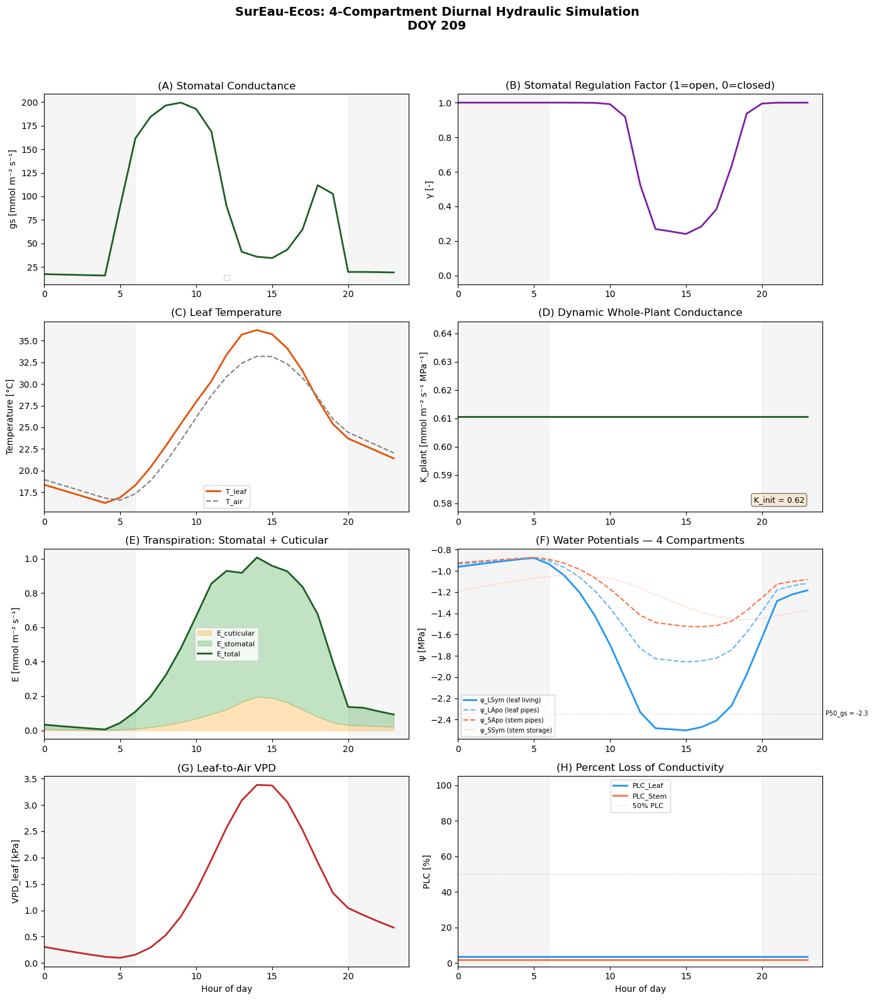

<!-- WARNING: THIS FILE WAS AUTOGENERATED! DO NOT EDIT! -->

## Load modules

::: {#00deb99d .cell}
``` {.python .cell-code}
from plotnine import *
import numpy as np, pandas as pd
from itables import to_html_datatable
from IPython.display import HTML, display
```
:::


::: {#3aea328b .cell}
``` {.python .cell-code}
from plant_hydraulics.run_sureau import run_sureau
from plant_hydraulics.sureau_climate import *  
from plant_hydraulics.utils import potential_PAR
from plant_hydraulics.parameter_classes import (
    SurEauVegetationParams,
    SurEauSoilParams,
    SurEauModelOptions,
)

from plant_hydraulics.utils import (
    load_example_data,
)
```
:::


# Object initialization

::: {#fc94ce6e .cell}
``` {.python .cell-code}
# Model options
opts = SurEauModelOptions(
    
    # Richmond
    latitude=-33.5996,
    
    # ← metres above sea level
    elevation = 24,
    
    # net radiation model: "Linacre" (only option currently)
    Rn_formulation="Linacre",
    
    # PET model: "PT" (Priestley-Taylor) or "PM" (Penman-Monteith)
    ETP_formulation="PM",
    
    # True → forces a fixed doy=116 (sunny day template)
    constant_climate = False,
    # which hours to output (0–23 → full day)
    time_steps=np.arange(24),
    
    # Print progress to console
    print_progress=True,
    
    year_start=2016,
    year_end=2016
)
```
:::


::: {#41736044 .cell}
``` {.python .cell-code}
# Vegetation parameters
veg_params = SurEauVegetationParams()
```
:::


::: {#6644693f .cell}
``` {.python .cell-code}
# Leaf area index (m²/m²). Higher = more transpiration.
veg_params.LAI_max = 4.5     
  
veg_params.foliage = "Evergreen"  

veg_params.transpiration_model = "Medlyn"

# Params from Drake 
veg_params.vcmax25 = 34
veg_params.vcmaxha = 51780
veg_params.vcmaxhd = 2e5
veg_params.vcmaxse = 640

veg_params.jmax25 = 60
veg_params.jmaxha = 21640
veg_params.jmaxhd = 2e5
veg_params.jmaxse = 633

veg_params.g1_medlyn = 2.9
veg_params.g0_medlyn = 0.003


# ψ at 50% loss of leaf conductance (MPa) 
veg_params.P50_VC_leaf = -3.4

# ψ at 50% loss of stem conductance (MPa)   
veg_params.P50_VC_stem = -3.4

# Steepness of vulnerability sigmoid (%/MPa)   
veg_params.slope_VC_leaf = 60   

# ψ at 12% stomatal closure (MPa)
veg_params.P12_gs = -2.07

# ψ at 88% stomatal closure (MPa)       
veg_params.P88_gs = -2.62       

# Whole-plant conductance (mmol/m²/s/MPa)
veg_params.k_plant_init = 0.62  

# At 20°C (mmol/m²/s)
veg_params.gmin20 = 4.0

# Temperature where cuticle melts (°C)         
veg_params.TPhase_gmin = 37.5

# Q10 above TPhase    
veg_params.Q10_2_gmin = 4.8
```
:::


::: {#3789b8ee .cell}
``` {.python .cell-code}
soil_params = SurEauSoilParams()
```
:::


## Climate

SurEau takes daily climatic data and then creates a hourly dataset 

::: {#138dbcf3 .cell}
``` {.python .cell-code}
print(climate_df[["DATE", "DOY"]].to_string())
```

::: {.cell-output .cell-output-stdout}
```
         DATE  DOY
0  2016-10-31  305
1  2016-11-01  306
2  2016-11-02  307
3  2016-11-03  308
```
:::
:::


::: {#1f8aa1e4 .cell}
``` {.python .cell-code}
climate_df = load_example_data("sureau_medlyn_daily_climate.csv", sep=",")
html_str = to_html_datatable(climate_df)
display(HTML(html_str))
```

::: {.cell-output .cell-output-display}
```{=html}
<!--| quarto-html-table-processing: none -->
<table id="itables_3330c966_7dc6_483d_8b38_2e7bfa56eb9a">
  <tbody>
    <tr>
      <td style="vertical-align:middle; text-align:left"><a href=https://mwouts.github.io/itables/><svg class="main-svg" xmlns="http://www.w3.org/2000/svg" xmlns:xlink="http://www.w3.org/1999/xlink"
width="64" viewBox="0 0 500 400" style="font-family: 'Droid Sans', sans-serif;">
    <g style="fill:#d9d7fc">
        <path d="M100,400H500V357H100Z" />
        <path d="M100,300H400V257H100Z" />
        <path d="M0,200H400V157H0Z" />
        <path d="M100,100H500V57H100Z" />
        <path d="M100,350H500V307H100Z" />
        <path d="M100,250H400V207H100Z" />
        <path d="M0,150H400V107H0Z" />
        <path d="M100,50H500V7H100Z" />
    </g>
    <g style="fill:#1a1366;stroke:#1a1366;">
   <rect x="100" y="7" width="400" height="43">
    <animate
      attributeName="width"
      values="0;400;0"
      dur="5s"
      repeatCount="indefinite" />
      <animate
      attributeName="x"
      values="100;100;500"
      dur="5s"
      repeatCount="indefinite" />
  </rect>
        <rect x="0" y="107" width="400" height="43">
    <animate
      attributeName="width"
      values="0;400;0"
      dur="3.5s"
      repeatCount="indefinite" />
    <animate
      attributeName="x"
      values="0;0;400"
      dur="3.5s"
      repeatCount="indefinite" />
  </rect>
        <rect x="100" y="207" width="300" height="43">
    <animate
      attributeName="width"
      values="0;300;0"
      dur="3s"
      repeatCount="indefinite" />
    <animate
      attributeName="x"
      values="100;100;400"
      dur="3s"
      repeatCount="indefinite" />
  </rect>
        <rect x="100" y="307" width="400" height="43">
    <animate
      attributeName="width"
      values="0;400;0"
      dur="4s"
      repeatCount="indefinite" />
      <animate
      attributeName="x"
      values="100;100;500"
      dur="4s"
      repeatCount="indefinite" />
  </rect>
        <g style="fill:transparent;stroke-width:8; stroke-linejoin:round" rx="5">
            <g transform="translate(45 50) rotate(-45)">
                <circle r="33" cx="0" cy="0" />
                <rect x="-8" y="32" width="16" height="30" />
            </g>

            <g transform="translate(450 152)">
                <polyline points="-15,-20 -35,-20 -35,40 25,40 25,20" />
                <rect x="-15" y="-40" width="60" height="60" />
            </g>

            <g transform="translate(50 352)">
                <polygon points="-35,-5 0,-40 35,-5" />
                <polygon points="-35,10 0,45 35,10" />
            </g>

            <g transform="translate(75 250)">
                <polyline points="-30,30 -60,0 -30,-30" />
                <polyline points="0,30 -30,0 0,-30" />
            </g>

            <g transform="translate(425 250) rotate(180)">
                <polyline points="-30,30 -60,0 -30,-30" />
                <polyline points="0,30 -30,0 0,-30" />
            </g>
        </g>
    </g>
</svg>
</a>
        Loading ITables v2.8.1 from the internet...
        (need <a href=https://mwouts.github.io/itables/troubleshooting.html>help</a>?)
      </td>
    </tr>
  </tbody>
</table>
<link href="https://www.unpkg.com/dt_for_itables@2.5.5/dt_bundle.css" rel="stylesheet">
<script type="module">
    import { ITable, jQuery as $ } from 'https://www.unpkg.com/dt_for_itables@2.5.5/dt_bundle.js';

    document.querySelectorAll("#itables_3330c966_7dc6_483d_8b38_2e7bfa56eb9a:not(.dataTable)").forEach(table => {
        if (!(table instanceof HTMLTableElement))
            return;

        let dt_args = {
          "classes": ["display", "nowrap", "compact"],
          "columnDefs": [{"render": "function (data, type, row, meta) { return type === 'sort' || type === 'type' ? data[1] : data[0]; }", "targets": [6, 7, 8, 9, 10, 11, 12, 13, 14]}],
          "data_json": "[[0, \"2016-10-31\", 2016, 305, 31, 10, [\"25.518748\", 25.51874826369701], [\"43.147285\", 43.1472845077515], [\"13.218052\", 13.218052307764664], [\"53.935986\", 53.935985816029216], [\"68.834596\", 68.83459564824898], [\"43.711676\", 43.71167632717755], [\"21.237586\", 21.237585714285714], [\"0.0\", 0.0], [\"2.0\", 2.0]], [1, \"2016-11-01\", 2016, 306, 1, 11, [\"24.538532\", 24.53853201634355], [\"43.321539\", 43.321539402008085], [\"11.559534\", 11.559533635775251], [\"58.624663\", 58.62466338743184], [\"76.932580\", 76.93257971236761], [\"38.805203\", 38.80520251869937], [\"22.283031\", 22.283031428571427], [\"0.0\", 0.0], [\"2.0\", 2.0]], [2, \"2016-11-02\", 2016, 307, 2, 11, [\"26.874244\", 26.874243713481714], [\"43.284559\", 43.28455946180555], [\"14.650036\", 14.6500355667538], [\"56.231498\", 56.23149841936749], [\"76.952202\", 76.95220211037558], [\"33.007275\", 33.00727536307161], [\"23.161671\", 23.161671428571427], [\"0.0\", 0.0], [\"2.0\", 2.0]], [3, \"2016-11-03\", 2016, 308, 3, 11, [\"28.133112\", 28.13311202355005], [\"43.679960\", 43.679959721035424], [\"15.558231\", 15.558231009377366], [\"57.316386\", 57.31638575664254], [\"79.238667\", 79.23866708246983], [\"34.797509\", 34.79750892380154], [\"22.657393\", 22.657392857142856], [\"0.0\", 0.0], [\"2.0\", 2.0]]]",
          "keys_to_be_evaluated": [["columnDefs", 0, "render"]],
          "layout": {"bottomEnd": null, "bottomStart": null, "topEnd": null, "topStart": null},
          "order": [],
          "style": {"caption-side": "bottom", "margin": "auto", "table-layout": "auto", "width": "auto"},
          "table_html": "<table><thead>\n    <tr style=\"text-align: right;\">\n      \n      <th>Unnamed: 0</th>\n      <th>DATE</th>\n      <th>Year</th>\n      <th>DOY</th>\n      <th>Day</th>\n      <th>Month</th>\n      <th>Tair_mean</th>\n      <th>Tair_max</th>\n      <th>Tair_min</th>\n      <th>RHair_mean</th>\n      <th>RHair_max</th>\n      <th>RHair_min</th>\n      <th>RG_sum</th>\n      <th>PPT_sum</th>\n      <th>WS_mean</th>\n    </tr>\n  </thead></table>",
          "text_in_header_can_be_selected": true
        };
        new ITable(table, dt_args);
    });
</script>
```
:::
:::


### Explore climatic data

::: {#4ea0b3df .cell}
``` {.python .cell-code}
hourly_data_from_daily = []
for each_day in range(len(climate_df)):
    
    # Get date 
    date_str = str(climate_df.iloc[each_day]["DATE"])              
   
    # Calculate climate for that day
    clim = new_climate_day(climate_df, date_str)
    
    # Compute PET for that day
    clim = compute_Rn_and_ETP(clim, veg_params, opts)
    
    # Create hourly climate from daily conditions     
    ch   = new_climate_hourly(clim, opts, veg_params)    
    
    #Show data in ch
    #print("ch.__dict__ keys:", list(vars(ch).keys()))
    
    # Put everything into frame that works for Sureau
    hourly_data_from_daily.append(pd.DataFrame({
        "Doy":    int(climate_df.iloc[each_day]["DOY"]),
        "hour":   np.asarray(ch.time, float),
        "RG":     np.asarray(ch.RG, float), 
        "RH":     np.asarray(ch.RH_air_mean, float),           
        "PAR_d":  np.asarray(ch.PAR, float),
        "Tair_d": np.asarray(ch.T_air_mean, float),
        "VPD_d":  np.asarray(ch.VPD, float),
    }))
hourly_data_from_daily = pd.concat(hourly_data_from_daily, ignore_index=True)
```

::: {.cell-output .cell-output-stdout}
```
ETP_formulation is PM
Remember to adjust the lat/lon
ETP_formulation is PM
Remember to adjust the lat/lon
ETP_formulation is PM
Remember to adjust the lat/lon
ETP_formulation is PM
Remember to adjust the lat/lon
```
:::
:::


## Run the model

::: {#bc1401ed .cell}
``` {.python .cell-code}
results = run_sureau(
    climate_df=climate_df,
    veg_params=veg_params,
    soil_params=soil_params,
    opts=opts,
    
    # Set True to keep deepest layer at field capacity
    deep_water=True,  
)
```

::: {.cell-output .cell-output-stdout}
```
Year 2016 Day 305ETP_formulation is PM
Remember to adjust the lat/lon
Year 2016 Day  11ETP_formulation is PM
Remember to adjust the lat/lon
Year 2016 Day  42ETP_formulation is PM
Remember to adjust the lat/lon
Year 2016 Day  71ETP_formulation is PM
Remember to adjust the lat/lon
Year 2016 complete. 
```
:::
:::


##  Plot results 

::: {#1771f210 .cell}
``` {.python .cell-code}
target_doy = 209
day = results[results["doy"] == target_doy].copy()
hours = day["time"].values
 
print(f"  Plotting DOY {target_doy} (July 28, 1990)")
print(f"  Hours available: {len(hours)}")
print(f"  Min ψ_LSym this day: {day['psi_LSym'].min():.3f} MPa")
print(f"  Min regul_fact: {day['regul_fact'].min():.3f}")
 
# ── Colour scheme ────────────────────────────────────────────────────────
c_LSym = '#2196F3'   # blue — leaf symplasm (living cells)
c_LApo = '#64B5F6'   # light blue — leaf apoplasm (xylem pipes)
c_SApo = '#FF7043'   # orange — stem apoplasm (trunk pipes)
c_SSym = '#FFAB91'   # light orange — stem symplasm (trunk storage)
c_total = '#1B5E20'  # dark green — total / canopy-level
 
def shade_night(ax):
    """Gray shading for nighttime hours (before sunrise, after sunset)."""
    ax.axvspan(0, 6, alpha=0.08, color='gray')
    ax.axvspan(20, 24, alpha=0.08, color='gray')
 
# ── Create the figure ────────────────────────────────────────────────────
fig, axes = plt.subplots(4, 2, figsize=(14, 16))
fig.suptitle('SurEau-Ecos: 4-Compartment Diurnal Hydraulic Simulation\n'
             f'DOY {target_doy}',
             fontsize=14, fontweight='bold', y=0.99)
 
# ── (A) Stomatal Conductance ─────────────────────────────────────────────
# Shows gs_lim (water-limited, solid) vs gs_bound/γ (unstressed, dashed).
# The gap between curves = water stress cost.
ax = axes[0, 0]
gs_regulated = day['gs_lim'].values
#gs_unstressed = gs_regulated / (day['regul_fact'].values + 1e-10)
#ax.fill_between(hours, gs_regulated, gs_unstressed, alpha=0.15, color=c_total)
ax.plot(hours, gs_regulated, color=c_total, lw=2)
#ax.plot(hours, gs_unstressed, color=c_total, lw=1, ls='--', alpha=0.5,
#        label='gs (unstressed)')
shade_night(ax)
ax.set_ylabel('gs [mmol m⁻² s⁻¹]')
ax.set_title('(A) Stomatal Conductance')
ax.legend(fontsize=8)
ax.set_xlim(0, 24)
 
# ── (B) Stomatal Regulation Factor ───────────────────────────────────────
# γ = 1 → stomata fully open. γ = 0 → fully closed.
# Driven by the sigmoid (Eq. 34) applied to ψ_LSym.
ax = axes[0, 1]
ax.plot(hours, day['regul_fact'].values, color='#7B1FA2', lw=2)
shade_night(ax)
ax.set_ylabel('γ [-]')
ax.set_title('(B) Stomatal Regulation Factor (1=open, 0=closed)')
ax.set_ylim(-0.05, 1.05)
ax.set_xlim(0, 24)
 
# ── (C) Leaf Temperature ────────────────────────────────────────────────
# T_leaf > T_air when stomata close (less transpirational cooling).
# Energy balance: Penman-Monteith linearization (compute_T_leaf).
ax = axes[1, 0]
ax.plot(hours, day['leaf_temperature'].values, color='#E65100', lw=2, label='T_leaf')
ax.plot(hours, day['T_air'].values, color='gray', lw=1.5, ls='--', label='T_air')
shade_night(ax)
ax.set_ylabel('Temperature [°C]')
ax.set_title('(C) Leaf Temperature')
ax.legend(fontsize=8)
ax.set_xlim(0, 24)
 
# ── (D) Dynamic Whole-Plant Conductance ──────────────────────────────────
# K_plant = 1/(1/Σk_root + 1/k_stem-leaf + 1/k_leaf-sym) (Eq. 13).
# Decreases as PLC increases from cavitation.
ax = axes[1, 1]
ax.plot(hours, day['k_plant'].values, color=c_total, lw=2)
shade_night(ax)
ax.set_ylabel('K_plant [mmol m⁻² s⁻¹ MPa⁻¹]')
ax.set_title('(D) Dynamic Whole-Plant Conductance')
ax.text(0.95, 0.05, f'K_init = {veg_params.k_plant_init}',
        transform=ax.transAxes, ha='right', fontsize=9,
        bbox=dict(boxstyle='round', facecolor='wheat', alpha=0.5))
ax.set_xlim(0, 24)
 
# ── (E) Transpiration: Stomatal + Cuticular ──────────────────────────────
# E_total = E_lim (stomatal, green) + E_min (cuticular, orange).
# Cuticular transpiration is the "unstoppable leak" that drives mortality.
ax = axes[2, 0]
E_cuticular = day['E_min'].values
E_total = day['E_lim'].values + E_cuticular
ax.fill_between(hours, 0, E_cuticular, alpha=0.4, color='#FFB74D', label='E_cuticular')
ax.fill_between(hours, E_cuticular, E_total, alpha=0.4, color='#66BB6A', label='E_stomatal')
ax.plot(hours, E_total, color=c_total, lw=2, label='E_total')
shade_night(ax)
ax.set_ylabel('E [mmol m⁻² s⁻¹]')
ax.set_title('(E) Transpiration: Stomatal + Cuticular')
ax.legend(fontsize=8)
ax.set_xlim(0, 24)
 
# ── (F) Water Potentials — 4 Compartments ────────────────────────────────
# The heart of SurEau: 4 interconnected water tanks.
#   ψ_LSym (blue) — leaf living cells. Drops most (transpiration pulls here).
#   ψ_LApo (light blue) — leaf xylem pipes. Follows ψ_LSym closely.
#   ψ_SApo (orange) — stem pipes. Drops less (buffered by stem storage).
#   ψ_SSym (light orange) — stem storage. Most buffered of all.
ax = axes[2, 1]
ax.plot(hours, day['psi_LSym'].values, color=c_LSym, lw=2,
        label='ψ_LSym (leaf living)')
ax.plot(hours, day['psi_LApo'].values, color=c_LApo, lw=1.5, ls='--',
        label='ψ_LApo (leaf pipes)')
ax.plot(hours, day['psi_SApo'].values, color=c_SApo, lw=1.5, ls='--',
        label='ψ_SApo (stem pipes)')
ax.plot(hours, day['psi_SSym'].values, color=c_SSym, lw=1, ls=':',
        label='ψ_SSym (stem storage)')
# Mark P50_gs (midpoint of stomatal closure)
P50_gs = (veg_params.P12_gs + veg_params.P88_gs) / 2
ax.axhline(P50_gs, color='gray', ls=':', lw=0.8, alpha=0.5)
ax.text(24.2, P50_gs, f'P50_gs = {P50_gs:.1f}', fontsize=7, va='center')
shade_night(ax)
ax.set_ylabel('ψ [MPa]')
ax.set_title('(F) Water Potentials — 4 Compartments')
ax.legend(fontsize=7, loc='lower left')
ax.set_xlim(0, 24)
 
# ── (G) Leaf-to-Air VPD ─────────────────────────────────────────────────
# The driving force for transpiration. Includes Kelvin equation
# correction for reduced water activity at negative ψ.
ax = axes[3, 0]
ax.plot(hours, day['VPD'].values, color='#C62828', lw=2)
shade_night(ax)
ax.set_ylabel('VPD_leaf [kPa]')
ax.set_title('(G) Leaf-to-Air VPD')
ax.set_xlabel('Hour of day')
ax.set_xlim(0, 24)
 
# ── (H) Percent Loss of Conductivity ────────────────────────────────────
# PLC from the sigmoidal vulnerability curve (Eq. 15).
# Irreversible: once pipes burst, they stay broken.
# Low PLC (~2%) here because ψ_LApo stays well above P50_VC (-3.4 MPa).
ax = axes[3, 1]
ax.plot(hours, day['PLC_leaf'].values, color=c_LSym, lw=2, label='PLC_Leaf')
ax.plot(hours, day['PLC_stem'].values, color=c_SApo, lw=2, label='PLC_Stem')
ax.axhline(50, color='gray', ls=':', lw=0.8, alpha=0.5, label='50% PLC')
shade_night(ax)
ax.set_ylabel('PLC [%]')
ax.set_title('(H) Percent Loss of Conductivity')
ax.legend(fontsize=8)
ax.set_ylim(-2, 105)
ax.set_xlabel('Hour of day')
ax.set_xlim(0, 24)
 
plt.tight_layout(rect=[0, 0, 1, 0.96])
```

::: {.cell-output .cell-output-stdout}
```
  Plotting DOY 209 (July 28, 1990)
  Hours available: 24
  Min ψ_LSym this day: -2.503 MPa
  Min regul_fact: 0.241
```
:::

::: {.cell-output .cell-output-stderr}
```
/tmp/ipykernel_85532/4151902588.py:43: UserWarning: No artists with labels found to put in legend.  Note that artists whose label start with an underscore are ignored when legend() is called with no argument.
  ax.legend(fontsize=8)
```
:::

::: {.cell-output .cell-output-display}
{}
:::
:::


